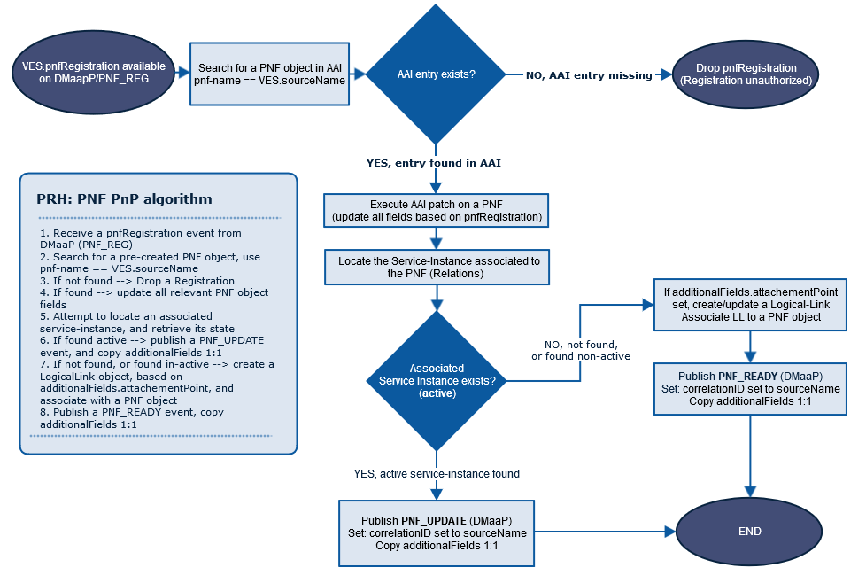

.. This work is licensed under a
   Creative Commons Attribution 4.0 International License.
   http://creativecommons.org/licenses/by/4.0

.. _prh_api:

==============================
PRH (PNF Registration Handler)
==============================

:Date: 2018-09-13

.. contents::
    :depth: 3

Overview
========

Physical Network Function Registration Handler is responsible for registration
of PNF (Physical Network Function) to ONAP (Open Network Automation Platform)
in plug and play manner.

.. csv-table::
   :header: "API name", "Swagger JSON", "Swagger YAML"
   :widths: 10,5,5

   "PNF Registration Handler", ":download:`link <PRH.json>`", ":download:`link <PRH.yaml>`"

.. swaggerv2doc:: PRH.json

Introduction
============

PRH is delivered as one **Docker container** which hosts application server and
can be started by `docker-compose`.

Functionality
=============

Paths
=====

GET /events/unauthenticated.VES_PNFREG_OUTPUT
---------------------------------------------

Description
~~~~~~~~~~~

Reads PNF registration fromD DMaaP (Data Movement as a Platform)

Responses
~~~~~~~~~

+-----------+-------------------------------------------+
| HTTP Code | Description                               |
+===========+===========================================+
| **200**   | successful response                       |
+-----------+-------------------------------------------+

PATCH /aai/v12/network/pnfs/{pnf-name}
--------------------------------------

Description
~~~~~~~~~~~

Update AAI (Active and Available Inventory) PNF's specific entries:
    - ipv4 to ipaddress-v4-oam
    - ipv6 to ipaddress-v6-oam

Parameters
~~~~~~~~~~

+----------+---------------+---------------------------------+------------------+
| Type     | Name          | Description                     | Schema           |
+==========+===============+=================================+==================+
| **Path** | | **pnf-name**| Name of the PNF.                | string (text)    |
|          | | *required*  |                                 |                  |
+----------+---------------+---------------------------------+------------------+
| **Body** | **patchbody** | Required patch body.            |                  |
+----------+---------------+---------------------------------+------------------+

Responses
~~~~~~~~~

+-----------+-------------------------------------------+
| HTTP Code | Description                               |
+===========+===========================================+
| **200**   | successful response                       |
+-----------+-------------------------------------------+

POST /events/unauthenticated.PNF_READY
--------------------------------------

Description
~~~~~~~~~~~

Publish PNF_READY to DMaaP and set:
    - pnf-id to correlationID
    - ipv4 to ipaddress-v4-oam
    - ipv6 to ipaddress-v6-oam

Parameters
~~~~~~~~~~

+----------+----------------+---------------------------------+------------------+
| Type     | Name           | Description                     | Schema           |
+==========+================+=================================+==================+
| **Body** | | **postbody** | Required patch body.            | `hydratorappput  |
|          | | *required*   |                                 | <#_hydratorapppu |
|          |                |                                 | t>`__            |
+----------+----------------+---------------------------------+------------------+

Responses
~~~~~~~~~

+-----------+-------------------------------------------+
| HTTP Code | Description                               |
+===========+===========================================+
| **200**   | successful response                       |
+-----------+-------------------------------------------+

Compiling PRH
=============

Whole project (top level of PRH directory) and each module (sub module
directory) can be compiled using `mvn clean install` command.

Main API Endpoints
==================

Running with dev-mode of PRH
    - Heartbeat: **http://<container_address>:8100/heartbeat** or **https://<container_address>:8443/heartbeat**
    - Start PRH: **http://<container_address>:8100/start** or **https://<container_address>:8433/start**
    - Stop PRH: **http://<container_address>:8100/stopPrh** or **https://<container_address>:8433/stopPrh**

Maven GroupId:
==============

org.onap.dcaegen2.services

Maven Parent ArtifactId:
========================

dcae-services

Maven Children Artifacts:
=========================

1. prh-app-server: Pnf Registration Handler (PRH) server
2. prh-aai-client: Contains implementation of AAI client
3. prh-dmaap-client: Contains implementation of DmaaP client
4. prh-commons: Common code for whole prh modules
