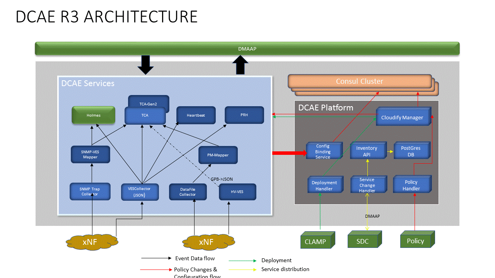

.. This work is licensed under a Creative Commons Attribution 4.0 International License.
.. http://creativecommons.org/licenses/by/4.0

Architecture
============

Data Collection Analytics and Events (DCAE) is the data collection and analysis subsystem of ONAP.  Its tasks include collecting measurement, fault, status, configuration, and other types of data from network entities and infrastructure that ONAP interacts with, applying analytics on collected data, and generating intelligence (i.e. events) for other ONAP components such as Policy, APPC, and SDNC to operate upon; hence completing the ONAP's close control loop for managing network services and applications.

The design of DCAE separates DCAE Services from DCAE Platform so that the DCAE system is flexible, elastic, and expansive enough for supporting the potentially infinite number of ways of constructing intelligent and automated control loops on distributed and heterogeneous infrastructure. 

DCAE Service components are the virtual functional entities that realize the collection and analysis needs of ONAP control loops.  They include the collectors for various data collection needs, the analytics that assess collected data, and various auxiliary microservices that assist data collection and analytics, and support other ONAP functions.  Service components and DMaaP buses form the "data plane" for DCAE, where DCAE collected data is transported among different DCAE service components.

On the other hand DCAE Platform components enable model driven deployment of service components and middleware infrastructures that service components depend upon, such as special storage and computation platforms.  That is, when triggered by an invocation call,  DCAE Platform follows the TOSCA model of the control loop that is specified by the triggering call, interacts with the underlying networking and computing infrastructure such as OpenSatck installations and Kubernetes clusters to deploy and configure the virtual apparatus (i.e. the collectors, the analytics, and auxiliary microservices) that are needed to form the control loop, at locations that are requested by the requirements of the control loop model.  DCAE Platform also provisions DMaaP topics and manages the distribution scopes of the topics following the prescription of the control loop model by interacting with controlling function of DMaaP.

DCAE service components operate following a service discovery model.  A highly available and distributed service discovery and Key-Value store service, embodied by a Consul cluster, is the foundation for this approach.  DCAE components register they identities and service endpoint access parameters with the Consul service so that DCAE components can locate the API endpoint of other DCAE components by querying Consul with the well know service identities of other components.  

During the registration process, DCAE components also register a health-check API with the Consul so that the operational status of the components are verified.  Consul's health check offers a separate path for DACE and ONAP to learn about module operation status that would still be applicable even when the underlying infrastructure does not provide native health-check methods.

More over, Consul's distributed K-V store service is the foundation for DCAE to distribute and manage component configurations where each key is based on the unique identity of a DACE component, and the value is the configuration for the corresponding component.  DCAE platform creates and updates the K-V pairs based on information provided as part of the control loop blueprint, or received from other ONAP components such as Policy Framework and SDC.  Either through periodically polling or proactive pushing, the DCAE components get the configuration updates in realtime and apply the configuration updates.  DCAE Platform also offers dynamic template resolution for configuration parameters that are dynamic and only known by the DCAE platform, such as dynamically provisioned DMaaP topics.  

DCAE R3 Components
------------------

The following list displays the details of what are included in ONAP DCAE R3.  All DCAE R3 components are offered as Docker containers.  Following ONAP level deployment methods, these components can be deployed as Docker containers running on Docker host VM that is launched by OpenStack Heat Orchestration Template; or as Kubernetes Deployments and Services by Helm.  

- DCAE Platform
    - Core Platform
        - Cloudify Manager: TOSCA model executor.  Materializes TOSCA models of control loop, or Blueprints, into properly configured and managed virtual DCAE functional components.
    - Extended Platform
        - Configuration Binding Service: Agent for service component configuration fetching; providing configuration parameter resolution.
        - Deployment Handler: API for triggering control loop deployment based on control loop's TOSCA model.
        - Policy Handler: Handler for fetching policy updates from Policy engine; and updating the configuration policies of KV entries in Consul cluster KV store for DCAE components.
        - Service Change Handler: Handler for interfacing with SDC; receiving new TOSCA models; and storing them in DCAE's own inventory.
        - DCAE Inventory-API: API for DCAE's TOSCA model store.
    - Platform services
        - Consul: Distributed service discovery service and KV store.
        - Postgres Database: DCAE's TOSCA model store.
        - Redis Database: DCAE's transactional state store, used by TCA for supporting persistence and seamless scaling.

- DCAE Services
    - Collectors
        - Virtual Event Streaming (VES) collector
        - SNMP Trap collector
        - High-Volume VES collector (HV-VES)
        - DataFile collector
    - Analytics
        - Holmes correlation analytics
        - CDAP based Threshold Crosssing Analytics application (tca)
        - Dockerized standalone TCA (tca-gen2)
    - Microservices
        - PNF Registration Handler
        - Missing Heartbeat analytics
        - Universal Data Mapper service

The figure below shows the DCAE R3 architecture and how the components work with each other.  The components on the right constitute the Platform/controller components which are statically deployed. The components on the right represent the services which can be both deployed statically or dynamically (via CLAMP)  

 
Note: PM-Mapper was descoped from R3

Deployment Scenarios
--------------------

Because DCAE service components are deployed on-demand following the control loop needs for managing ONAP deployed services, DCAE must support dynamic and on-demand deployment of service components based on ONAP control loop demands.  This is why all other ONAP components are launched from the ONAP level method, DCAE only deploys a subset of its components during this ONAP deployment process and rest of DCAE components will be deployed either as TOSCA executor launches a series of Blueprints, or deployed by control loop request originated from CLAMP, or even by operator manually invoking DCAE's deployment API call.

For R2, ONAP supports two deployment methodologies: Heat Orchestration Template method, or Helm Chart method. No matter which method, DCAE is deployed following the same flow.  At its minimum, only the TOSCA model executor, the DCAE Cloudify Manager, needs to be deployed through the ONAP deployment process.  Once the Cloudify Manager is up and running, all the rest of DCAE platform can be deployed by a bootstrap script, which makes a number of calls into the Cloudify Manager API with Blueprints for various DCAE components, first the DCAE Platform components, then the service components that are needed for the built-in control loops, such as vFW/vDNS traffic throttling.  It is also possible that additional DCAE components are also launched as part of the ONAP deployment process using the ONAP level method instead of TOSCA model based method.

More details of the DCAE R3 deployment will be covered by the Installation section.

Usage Scenarios
---------------

For ONAP R3 DCAE participates in the following use cases.

- vDNS:  VES collector, TCA analytics

- vFW:  VES collector, TCA analytics

- vCPE:  VES collector, TCA analytics

- vVoLTE:  VES collector, Holmes analytics

- OSAM/PNF: VES Collector, PRH

In addition, DCAE supports on-demand deployment and configuration of service components via CLAMP.  In such case CLAMP invokes the deployment and configuration of additional TCA instances.

