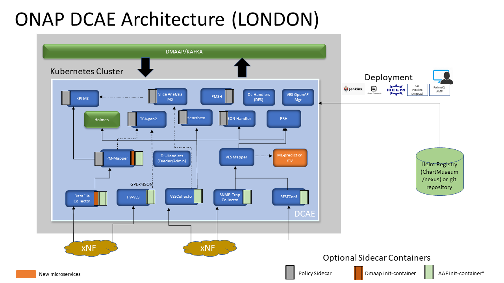

.. This work is licensed under a Creative Commons Attribution 4.0 International License.
.. http://creativecommons.org/licenses/by/4.0

Architecture
============

DCAE project provides intelligence for ONAP to support automation (via open-loop and CL) by performing network data collections, analytics & correlation and trigger actionable rootcause events.

Prior to Jakarta release, DCAE architecture comprised of DCAE Platform and DCAE Service components; DCAE Platform supported the functions to deploy, host and perform LCM applications of Service components. With Jakarta release, these DCAE Platform components centered around Cloudify have been removed and all Microservice orchestration and lifecycle management are supported through Helm/Kubernetes.

The DCAE services components includes all the microservices - collectors, analytics and event processor which supports active data-flow  and processing as required by ONAP usecases. These Service components are the functional entities that realize the various 
data collection needs, event processors for data standardization, analytics that assess collected data, and various auxiliary microservices that assist automated closed loop flows.

The architecture of DCAE with Helm transformation is more flexible, microservice oriented and supports model based component design and deployment through DCAE-MOD. Also with migration to helm, DCAE microservice deployments can be handled independently, dependencies are captured under its helm charts.

All Microservice configuration are currently resolved through files mounted via Configmap created part of dcae-services helm chart deployment. 

DCAE Components
---------------

The following lists the components included in ONAP DCAE.  All DCAE components are offered as Docker containers.  Following ONAP level deployment methods, these components can be deployed as Kubernetes Deployments and Services.  

- DCAE Services
    - Collectors
        - Virtual Event Streaming (VES) collector
        - SNMP Trap collector
        - High-Volume VES collector (HV-VES)
        - DataFile collector
        - RESTConf collector
    - Analytics
        - Holmes correlation analytics
        - CDAP based Threshold Crosssing Analytics application (tca)
        - Docker based Threshold Crosssing Analytics
        - Heartbeat Services
        - SON-Handler Service
        - Slice Analysis
    - Event processors
        - PNF Registration Handler
        - VES Mapper Service
        - PM-Mapper Service
        - PM Subcription Handler
        - DataLake Handlers (DL-Admin, DL-Feeder, DES)
    - Misc Services
        - VES OpenApi Manager (Optional validator of VES_EVENT type artifacts executed during Service distributions)
        

The figure below shows the DCAE architecture and how the components work with each other.  The components on the right constitute the Platform/controller components which are statically deployed. The components on the right represent the services which can be both deployed statically or dynamically (via CLAMP)

..
  The following diagram has been created on https://app.diagrams.net/. There is an editable version of the diagram
  in repository under path docs/sections/images/architecture_diagram. Import this file to mentioned page to edit diagram.

 

Deployment Scenarios
--------------------

Because DCAE service components are deployed on-demand following the control loop needs for managing ONAP deployed services, DCAE must
support dynamic and on-demand deployment of service components based on ONAP control loop demands.  

With DCAE Transformation to Helm completed in Jakarta/R10 release, all DCAE components deployment are supported only via helm. 
 Charts for individual MS are available under **dcaegen2-services** directory under OOM project
 (https://git.onap.org/oom/tree/kubernetes/dcaegen2-services/components). To keep the ONAP footprint minimal, only minimal set of MS 
 (required for ONAP Integration usecases) are enabled by default on ONAP/DCAE deployment, which includes four DCAE services (HV VES
 collector, VES collector, PNF Registration Handler, and TCA (Gen2) analytics service).

More details of the DCAE deployment can be found under Installation section.

Architectural Reference
-----------------------

 - `ARC DCAE Component Description <https://wiki.onap.org/display/DW/ARC+DCAE+Component+Description+-+Kohn-R11>`_
 - `R11 M2 ARC Proposal <https://wiki.onap.org/display/DW/DCAE+R11+Kohn+M2+Architecture+Review>`_

Usage Scenarios
---------------

For ONAP  DCAE participates in the following use cases.

- vDNS:  VES collector, TCA analytics

- vFW:  VES collector, TCA analytics

- vCPE:  VES collector, TCA analytics

- vVoLTE:  VES collector, Holmes analytics

- CCVPN :  RestConf Collector, Holmes

- PNF Registration: VES Collector, PRH

- 5G Bulk PM : DataFile Collector, PM-Mapper, HV-VES, PMSH

- 5G OOF SON: VES collector, SON-Handler

- 5G E2E Network Slicing: VES collector, Slice Analysis, DES, PM-Mapper, DFC, Datalake feeder

- IBN/CCVPN : VES collector, Slice Analysis, DES,  Datalake feeder
 

DCAE supports on-demand deployment and configuration of all its microservices via helm charts. As components can also be onboarded
 through MOD, the flow output is distributed as helm charts which can be installed on-demand also by the operators. 

Policy/CLAMP K8S participant is another ONAP client which can trigger deployment of DCAE Microservice charts.
