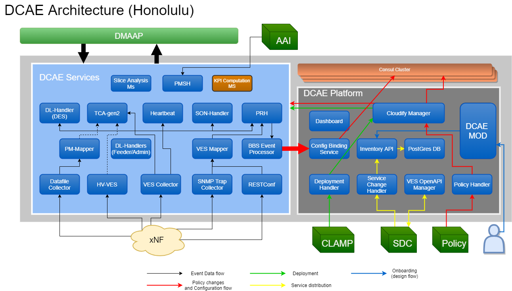

.. This work is licensed under a Creative Commons Attribution 4.0 International License.
.. http://creativecommons.org/licenses/by/4.0
.. _architecture:

Architecture
============

Data Collection Analytics and Events (DCAE) is the primary data collection and analysis system of ONAP. DCAE architecture comprises of DCAE Platform and 
DCAE Service components making DCAE flexible, elastic, and expansive enough for supporting the potentially infinite number of ways of constructing intelligent 
and automated control loops on distributed and heterogeneous infrastructure. 

DCAE Platform supports the functions to deploy, host and perform LCM applications of Service components. DCAE Platform components enable model driven deployment of 
service components and middleware infrastructures that service components depend upon, such as special storage and computation platforms.  When triggered by an 
invocation call (such as CLAMP or via DCAE Dashboard),  DCAE Platform follows the TOSCA model of the control loop that is specified by the triggering call, 
interacts with the underlying networking and computing infrastructure such as OpenSatck installations and Kubernetes clusters to deploy and configure the virtual 
apparatus (i.e. the collectors, the analytics, and auxiliary microservices) that are needed to form the control loop, at locations that requested.  
DCAE Platform also provisions DMaaP topics and manages the distribution scopes of the topics following the prescription of the control loop model by interacting 
with controlling function of DMaaP.

DCAE Service components are the  functional entities that realize the collection and analytics needs of ONAP control loops.  They include the collectors for various 
data collection needs, event processors for data standardization,  analytics that assess collected data, and various auxiliary microservices that assist data 
collection and analytics, and support other ONAP functions.  Service components and DMaaP buses form the "data plane" for DCAE, where DCAE collected data is 
transported among different DCAE service components.

DCAE use Consul's distributed K-V store service to manage component configurations where each key is based on the unique identity of a DCAE component (identified by ServiceComponentName), and the value is the configuration for the corresponding component. The K-V store for each service components is created during deployment. DCAE platform creates and updates the K-V pairs based on information provided as part of the control loop blueprint deployment, or through a notification/trigger received from other ONAP components such as Policy Framework and CLAMP.  Either through periodically polling or proactive pushing, the DCAE  components get the configuration updates in realtime and apply the configuration updates.  DCAE Platform also offers dynamic template resolution for configuration parameters that are dynamic and only known by the DCAE platform, such as dynamically provisioned DMaaP topics. This approach standardizes component deployment and configuration management for DCAE service components in multi-site deployment.

DCAE Components
---------------

The following lists the components included in ONAP DCAE .  All DCAE components are offered as Docker containers.  Following ONAP level deployment methods, these components can be deployed as Kubernetes Deployments and Services.  

- DCAE Platform
    - Core Platform
        - Cloudify Manager: TOSCA model executor.  Materializes TOSCA models of control loop, or Blueprints, into properly configured and managed virtual DCAE functional components.
        - Plugins (K8S, Dmaap, Policy, Clamp, Postgres)
    - Extended Platform
        - Configuration Binding Service: Agent for service component configuration fetching; providing configuration parameter resolution.
        - Deployment Handler: API for triggering control loop deployment based on control loop's TOSCA model.
        - Policy Handler: Handler for fetching policy updates from Policy engine; and updating the configuration policies of KV entries in Consul cluster KV store for DCAE components.
        - Service Change Handler: Handler for interfacing with SDC; receiving new TOSCA models; and storing them in DCAE's own inventory.
        - DCAE Inventory-API: API for DCAE's TOSCA model store.
        - VES OpenApi Manager: Optional validator of VES_EVENT type artifacts executed during Service distributions.
    - Platform services
        - Consul: Distributed service discovery service and KV store.
        - Postgres Database: DCAE's TOSCA model store.
        - Redis Database: DCAE's transactional state store, used by TCA for supporting persistence and seamless scaling.

- DCAE Services
    - Collectors
        - Virtual Event Streaming (VES) collector
        - SNMP Trap collector
        - High-Volume VES collector (HV-VES)
        - DataFile collector
        - RESTConf collector
    - Analytics
        - Holmes correlation analytics
        - CDAP based Threshold Crosssing Analytics application (tca)
        - Docker based Threshold Crosssing Analytics
        - Heartbeat Services
        - SON-Handler Service
        - Slice Analysis
    - Event processors
        - PNF Registration Handler
        - VES Mapper Service
        - PM-Mapper Service
        - BBS-EventProcessor Service
        - PM Subcription Handler
        - DataLake Handlers (DL-Admin, DL-Feeder, DES)
        

The figure below shows the DCAE architecture and how the components work with each other.  The components on the right constitute the Platform/controller components which are statically deployed. The components on the right represent the services which can be both deployed statically or dynamically (via CLAMP)

..
  The following diagram has been created on https://app.diagrams.net/. There is an editable version of the diagram
  in repository under path docs/sections/images/architecture_diagram. Import this file to mentioned page to edit diagram.

 

Deployment Scenarios
--------------------

Because DCAE service components are deployed on-demand following the control loop needs for managing ONAP deployed services, DCAE must support dynamic and on-demand deployment of service components based on ONAP control loop demands.  This is why all other ONAP components are launched from the ONAP level method, DCAE only deploys a subset of its components during this ONAP deployment process and rest of DCAE components will be deployed on-demand based on usecase needs triggered by control loop request originated from CLAMP, or even by operator manually invoking DCAE's deployment API call.

ONAP supports deployment through OOM Helm Chart currently (Heat deployment support is discontinued since R3). Hence all DCAE Platform components are deployed via Helm charts - this includes Cloudify Manager, ConfigBinding service, ServiceChange Handler, Policy Handler, Dashboard and Inventory, each with corresponding Helm charts under OOM (https://git.onap.org/oom/tree/kubernetes/dcaegen2/components).   Once DCAE platform components are up and running, rest of DCAE service components required for ONAP  flow are deployed via bootstrap POD, which invokes Cloudify Manager API with Blueprints for various DCAE components that are needed for the built-in collections and control loops flow support.  

To keep the ONAP footprint minimal, only minimal set of MS (required for ONAP Integration usecases) are deployed via bootstrap pod. Rest of service blueprints are available for operator to deploy on-demand as required. 

More details of the DCAE deployment can be found under Installation section.

Usage Scenarios
---------------

For ONAP  DCAE participates in the following use cases.

- vDNS:  VES collector, TCA analytics

- vFW:  VES collector, TCA analytics

- vCPE:  VES collector, TCA analytics

- vVoLTE:  VES collector, Holmes analytics

- CCVPN :  RestConf Collector, Holmes

- BBS : VES Collector, PRH, BBS-Event Processor, VES-Mapper, RESTConf Collector

- 5G Bulk PM : DataFile Collector, PM-Mapper, HV-VES

- 5G OOF SON: VES collector, SON-Handler

- 5G E2E Network Slicing: VES collector, Slice Analysis, DES, PM-Mapper, DFC, Datalake feeder
 

In addition, DCAE supports on-demand deployment and configuration of service components via CLAMP.  In such case CLAMP invokes the deployment and configuration of additional TCA instances.
