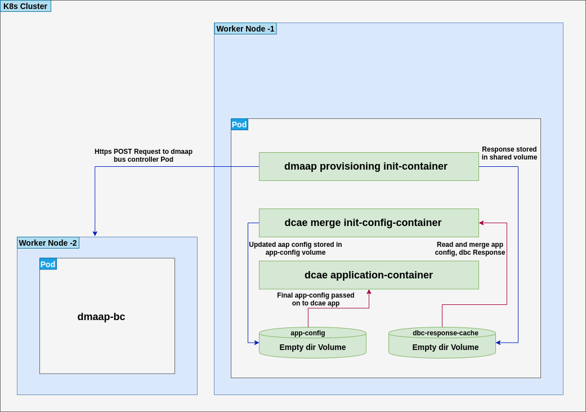

.. This work is licensed under a Creative Commons Attribution 4.0 International License.
.. http://creativecommons.org/licenses/by/4.0

Using Helm to deploy DCAE Microservices
=======================================

Background
----------

Prior to the ONAP Honolulu release, DCAE microservices were deployed
using the Cloudify orchestration tool. Each microservice had a Cloudify
*blueprint* containing the information needed for Cloudify to deploy the
microservice. The DCAE team provided a Cloudify plugin that used the
Kubernetes API to create the Kubernetes resources (including a
Kubernetes Deployment and a Kubernetes Service) that make up a running
instance of the microservice.

In the Honolulu release, DCAE began migrating to a new approach for
deploying DCAE microservices.  Instead of using Cloudify with a
Cloudify blueprint for each microservice, DCAE began using Helm to
deploy microservices.  This migration is now complete, and all
DCAE microservices have a Helm chart instead of a Cloudify blueprint.

DCAE Service Templates - Introduction
-------------------------------------

It would be possible to write a Helm chart for each microservice, each
completely unrelated. We are taking a different approach. We are
providing shared Helm templates that (approximately) create the same
Kubernetes resources that the Cloudify plugin created when it processed
a blueprint. Creating a Helm chart for a microservice involves setting
up a Helm chart directory, which can be done by copying the chart
directory for an existing microservice and changing the ``Chart.yaml``
file (to set the name, description, and version of the chart) and the
``values.yaml`` file (to customize the templates for the target
microservice).

Once a chart for a microservice has been created, the chart can be used
to deploy the microservice, on demand, into a running instance of ONAP
and DCAE. This is similar to how we deployed microservices on demand
using a Cloudify blueprint and the Cloudify Manager (or the DCAE
deployment handler).

The bulk of this document describes the different parameters that can be
set in the ``values.yaml`` file. There are two sets of parameters. One
set comes from the ONAP OOM common templates used by all of the ONAP
components that deployed via Helm. The other set consists of parameters
that are specific to the DCAE shared templates.

DCAE Service Templates - Location and content
---------------------------------------------
The DCAE shared Helm charts for microservices are maintained in the
OOM repository, in the ``oom/kubernetes/dcaegen2-services/common/dcaegen2-services-common``
directory.  In this directory subtree are:

- ``Chart.yaml``: the usual Helm chart definition file.
- ``requirements.yaml``: the dependencies for the chart.  Only the OOM "common" chart is needed.
- ``values.yaml``: the file is present for completion, but there are no locally-defined values.
- ``templates/_configmap.tpl``: a template that sets up a configMap containing the microservices initial configuration and,
   if needed, a configMap for filebeat logging configuration.
- ``templates/_deployment.tpl``: a template that sets up a Kubernetes Deployment for the microservice.
- ``templates/_filebeat-config.tpl``: a template containing the standard filebeat configuration for microservices that use filebeat logging.
    It's used in the ``templates/_configmap.tpl`` template.
- ``templates/_job.tpl``: a template that creates a Kubernetes Job that runs when a microservice is deleted.  The job brings up a container
   that removes the microservice configuration information from Consul.

Setting variables in ``values.yaml`` for individual microservices
-----------------------------------------------------------------

Variables used by ONAP OOM common templates
~~~~~~~~~~~~~~~~~~~~~~~~~~~~~~~~~~~~~~~~~~~

**image**:

Name and tag of the Docker image for the microservice.
Required. The image repository is set using the OOM common
``repositoryGenerator.repository`` template. Normally this points to the
ONAP image repository, but it can be overridden on a global basis or a
per-chart basis. See the OOM documentation for more details.

Example:

::

   image: onap/org.onap.dcaegen2.services.prh.prh-app-server:1.5.6

**imageRepositoryOverride**:

Alternative repository for the Docker image for the microservice.
Optional.  If this value is set, the Docker image for the microservice
will be pulled from the repository specified by this value, instead of
from the repository set by ``repositoryGenerator.repository``.  Note that
this alternative repository is used only for the microservice image and
not for other images (such as images for initContainers).  Note also that
the alternative repository must not use any form of authentication,
because there is no way to provide credentials for the repository.

Example:

::

  imageRepositoryOverride: "myrepo.example.org:5000"

**global.pullPolicy** and **pullPolicy**:

These settings control when
the image is pulled from the repository. ``Always`` means the image is
always pulled from the repository when a container is created from the
image, while ``IfNotPresent`` means that the image is pulled from the
repository only if the image is not already present on the host machine
where the container is being created. Typical ONAP OOM practice is to
set ``pullPolicy`` to ``Always`` in the chart. During development and
testing, this can be overriden during the Helm install with
``global.pullPolicy`` set to ``IfNotPresent``, to speed up deployment by
reducing the number of times images are pulled from the repository.

Example:

::

   pullPolicy: Always

**readinessCheck**:

Many microservices depend on having other services
up and running in the DCAE and ONAP environment–services like AAF to get
certificates or DMaaP to communicate with other services.
``readinessCheck.wait_for`` is a list of the *containers* that the
microservice needs to have available. If this parameter is present, an
initContainer will run and wait for all of the listed containers to
become ready. (Unfortunately, it’s necessary to know the name of a
*container*; it isn’t sufficient to list the name of a service.)

Example:

::

   readinessCheck:
     wait_for:
       - dcae-config-binding-service
       - aaf-cm

**readiness**:

If this parameter is present, a Kubernetes readiness
probe will be configured for the microservice. The template supports
either an HTTP(S) readiness probe or a script-based readiness probe. The
parameter has the following fields that apply to both types:

1. ``initialDelaySeconds``: The number of seconds to wait after container startup before attempting the first readiness probe. *[Optional, default 5]*
2. ``periodSeconds``: The number of seconds between readiness probes. *[Optional, default 15]*
3. ``timeoutSeconds``: The number of seconds to wait for a connection to the container before timing out. *[Optional, default 1]*
4. ``probeType``: The type of readiness probe–``httpGet`` for an HTTP probe or ``exec`` for a script-based probe. *[Optional, default ``httpGet``]*

For HTTP(S) readiness probes, the following fields are *required*:

1. ``scheme``: ``HTTP`` or ``HTTPS``
2. ``path``: the path to the readiness probe API endpoint on the container
3. ``port``: the *container port* on which the microservice is listening for readiness probe requests.
   (This is the *internal* port, not a NodePort or Ingress port.)

For script-based readiness probe, the following field is *required*:
 1. ``command``: an array consisting of the command to be executed to run
    the readiness probe and any command arguments that are needed.

Example (HTTP probe):

::

   readiness:
     initialDelaySeconds: 5
     periodSeconds: 15
     path: /heartbeat
     scheme: HTTP
     port: 8100

Example (script-based probe):

::

   readiness:
     type: exec
     initialDelaySeconds: 5
     periodSeconds: 15
     timeoutSeconds: 2
     command:
     - /opt/ves-hv-collector/healthcheck.sh

Variables used by the DCAE services common templates
~~~~~~~~~~~~~~~~~~~~~~~~~~~~~~~~~~~~~~~~~~~~~~~~~~~~

**applicationConfig:**

*[Optional]*. Initial configuration for
microservice. Pushed into Consul for retrieval by config-binding-service
and mapped to a file mounted at ``/app-config``. This is a YAML object
with keys and values as needed for the specific microservice. It will be
converted to JSON before being pushed to Consul or mounted as a file. If
not present, defaults to an empty object ({}).

**applicationEnv:**

Microservice-specific environment variables to be
set for the microservice’s container. Environment variables can be set
to literal string values or a value from a Kubernetes Secret that has
been set up using the ONAP OOM common secret template.

For a literal string value, use the environment variable name as the
key, and the desired string as the value:

::

   applicationEnv:
     EXAMPLE_ENV_VAR: "example variable content"

For a value taken from a secret, use the environment variable name as
the key and set the value to an object with the following fields:

1. ``secretUid``: *[Required]* The ``uid`` of the secret (set up with the
   ONAP OOM common secret template) from which the value will be taken.
2. ``key``: *[Required]* The key within the secret that holds the desired value.
   (A secret can contain several values, each with its own key. One frequently
   used form of secrets contains login credentials, with keys for username
   and password.)

Example of an environment variable set from a secret:

::

   applicationEnv:
     EXAMPLE_PASSWORD:
       secretUid: example-secret
       key: password

The ``applicationEnv`` section of ``values.yaml`` can contain an
arbitrary number of environment variables and can contain both literal
values and values from secrets. ``applicationEnv`` is optional. If it is
not present in the ``values.yaml`` file, no microservice-specific
environment variables will be set for the microservice’s container.

Note that ``applicationEnv`` is a YAML object (or “dictionary”), not an
array.

**externalVolumes:**

Controls microservice-specific volumes and volume
mounts. Allows a microservice to access an externally-created data
store. Currently only configMaps are supported. ``externalVolumes`` is a
YAML array of objects. Each object has three required fields and two
optional fields:

1. ``name``: *[Required]* The Kubernetes name of the configMap to be mounted.
   The value is a case sensitive string. Because the names of configMaps are
   sometimes set at deployment time (for instance, to prefix the Helm release to
   the name), the string can be a Helm template fragment that will be expanded
   at deployment time.
2. ``type``: *[Required]* For now, this is always ``configMap``. This is a
   case-insensitive string.
3. ``mountPath``: *[Required]* The path to the mount point for the volume
   in the container file system. The value is a case-sensitive string.
4. ``readOnly``: *[Optional]* Boolean flag. Set to ``true`` to mount the volume
   as read-only. Defaults to ``false``.
5. ``optional``: *[Optional]* Boolean flag. Set to ``true`` to make the
   configMap optional (i.e., to allow the microservice’s pod to start even
   if the configMap doesn’t exist). If set to ``false``, the configMap must
   be present in order for the microservice’s pod to start. Defaults to
   ``true``. *Note that this default is the opposite of the Kubernetes
   default. We’ve done this to be consistent with the behavior of the DCAE
   Cloudify plugin for Kubernetes (``k8splugin``), which always set
   ``optional`` to ``true`` and did not allow for overriding this value.*

Example of an ``externalVolumes`` section:

::

   externalVolumes:
     - name: my-example-configmap
       type: configmap
       mountPath: /opt/app/config
     - name: '{{ include "common.release" . }}-another-example'
       type: configmap
       mountPath: /opt/app/otherconfig

The dcaegen2-services-common deployment template will set up a volume
pointing to the specific configMap in the microservice’s pod and a
volume mount (mounted at ``mountPath`` on the microservice’s container.)

The ``externalVolumes`` section is optional. If it is not present, no
external volumes will be set up for the microservice.

**certDirectory:**

Path to the directory in the microservice’s
container file system where TLS-certificate information from CMPv2 should
be mounted. This is an optional field. When it is present, the
dcaegen2-services-common deployment template will set up an
initContainer that retrieves the certificate information into a shared
volume, which will then be mounted at the path specified by
``certDirectory``.

Example:

::

   certDirectory: /etc/ves-hv/ssl

**logDirectory:**

Path to the directory where the microservice writes
its log files. ``logDirectory`` is optional. If ``logDirectory`` is
present, the dcaegen2-services-common deployment template will deploy a
sidecar container that forwards the log file content to a log server.

Example:

::

   logDirectory: /var/log/ONAP/dcae-hv-ves-collector

Note that ONAP is moving away from the sidecar approach and encouraging
applications (including DCAE microservices) to write log information to
``stdout`` and ``stderr``.

**policies:**

If present, the dcaegen2-services-common deployment
template will deploy a sidecar container that polls the ONAP policy
subsystem for policy-driven configuration information.

``policies`` is a YAML object (“dictionary”) that can contain the
following keys:

1. ``policyID``: *[Optional]* A string representation of a JSON array of policy ID
   values that the sidecar should monitor.   Default ‘[]’.
2. ``filter``: *[Optional]* A string representation of a JSON array of regular
    expressions that match policy IDs that the sidecar should monitory. Default ‘[]’.
3. ``duration``: *[Optional]* The interval (in seconds) between polling requests
   made by the sidecar to the policy subsystem. Default: 2600.

Example:

::

   policies:
     policyID: |
       '["onap.vfirewall.tca","abc"]'
     filter: |
       '["DCAE.Config_vfirewall_.*"]'
     duration: 300

**dcaePolicySyncImage:**

Name and tag of the policy sidecar image to be
used. Required if the policy sidecar is being used. The image repository
is set using the OOM common ``repositoryGenerator.repository`` template.
Normally this points to the ONAP image repository, but it can be
overridden on a global basis or a per-chart basis. See the OOM
documentation for more details.

Example:

::

   dcaePolicySyncImage: onap/org.onap.dcaegen2.deployments.dcae-services-policy-sync:1.0.1

**certProcessorImage:**

Name and tag of the CMPv2 certificate
initialization image to be used. Required if the microservice is
configured to act as a TLS client and/or server using CMPv2
certificates. This image runs in an initContainer and sets up trust
stores and keystores for CMPv2 use. The image repository is set using
the OOM common ``repositoryGenerator.repository`` template. Normally
this points to the ONAP image repository, but it can be overridden on a
global basis or a per-chart basis. See the OOM documentation for more
details.

Example:

::

   onap/org.onap.oom.platform.cert-service.oom-certservice-post-processor:2.1.0

Deploying multiple instances of a microservice
----------------------------------------------
The dcaegen2-services-common charts can be used to deploy multiple instances of the same microservice.  To do this successfully,
it's necessary to make sure that any Kubernetes service that the microservice exposes has different service names for each instance and,
if the service is exposed outside the Kubernetes cluster, a different external port assignment.  This can be done by overriding the default
settings in the ``values.yaml`` file.

As an example, consider the DCAE VES collector (``dcae-ves-collector``).  One instance of the VES collector is deployed by default when DCAE is installed using the ONAP installation
process.  It exposes a service with the name ``dcae-ves-collector`` which is also exposed outside the Kubernetes cluster on NodePort 30417.

To deploy a second instance of the VES collector, we can create a YAML override file to define the service exposed by the second instance.  The following
override file (``ves2.yaml``) will name the service as ``dcae-ves-collector-2`` and expose it on port 30499:

::

  service:
    name: dcae-ves-collector-2
    ports:
      - name: http
        port: 8443
        plain_port: 8080
        port_protocol: http
        nodePort: 99
        useNodePortExt: true

In the directory containing the ``dcae-ves-collector`` chart and the file ``ves.yaml``, running the following command will deploy a second instance
of the VES collector:

``helm install -n onap --set global.masterPassword=whatever --set pullPolicy=IfNotPresent -f ves2.yaml ves2 .``

This creates a new Helm release called ``ves2``.   The instance can be removed with:

``helm delete -n onap ves2``

Note that if a component is using TLS with an AAF certificate, the DCAE certificate would need to include the new service name.
If a component is using an external certificate (CMPv2), the override file would need to supply the proper parameters to get a certificate with
correct common name/SAN.

Also note that if the chart for ``dcae-ves-collector`` has been pushed into a Helm repository, the ``helm install`` command can refer to the
repository (for instance, ``local/dcae-ves-collector``) instead of using the chart on the local filesystem.

Dynamic Topic and Feed Provisioning
-----------------------------------
This section introduces details on creation of dynamic Dmaap Topics in Message Router and Feeds in Data Router via DCAE helm charts.

Provisioning support through DCAE common-service template
~~~~~~~~~~~~~~~~~~~~~~~~~~~~~~~~~~~~~~~~~~~~~~~~~~~~~~~~~

When using DCAE common-service template in microservice chart ``deployment.yaml`` file it is required to include ``dcaegen2-services-common.microserviceDeployment`` template.
The dcaegen2-services-common include necessary ``common.dmaap.provisioning.initContainer`` template which provisions topics and feeds on Dmaap Message Router and Data Router.

Example : Including ``dcaegen2-services-common.microserviceDeployment`` template in ``deployment.yaml``.

::

  {{ include "dcaegen2-services-common.microserviceDeployment" . }}

The ``common.dmaap.provisioning.initContainer`` template included in DCAE ``dcaegen2-services-common.microserviceDeployment`` makes use of
dmaap-bc client image to create Topics on Message Router and Feeds on Data Router microservice, with the help of ``dbc-client.sh`` script,
it uses Bus Controller REST API to create resources.

If the resource creation is successful via script, the response is logged in file with appropriate naming convention.

.. note::
  The configuration provided via ``values.yaml`` file, is consumed by ``common.dmaap.provisioning.initContainer`` template which runs two
  init-container, First named init-dmaap-provisioning for creating resources on Dmaap, Second named init-merge-config which updates application config
  with response generated as an outcome of operation by init-dmaap-provisioning container.

The figure below shows Dmaap Topics, Feeds Provisioning architecture via dcae-service-common helm charts.

..
  The following diagram has been created on https://app.diagrams.net/. There is an editable version of the diagram
  in repository under path docs/sections/images/dmaap_provisioning_architecture_diagram.drawio, import file to update diagram.

Configuration to be added in ``values.yaml`` file.

.. note::
  For more information on attributes that are set in ``values.yaml`` for Data Router Feed, Publisher and Subscriber, Message Router Topic creation,
  you can refer DMaaP Bus Controller API documentation at: https://docs.onap.org/projects/onap-dmaap-buscontroller/en/latest/apis/api.html

Dmaap Data Router Feeds creation input can be provided in below format. It consumes list of Feeds.

.. note::
  For DR Feed creation except ``feedName``, ``feedDescription``, ``feedVersion`` avoid update on other attributes.
  All other attributes are mandatory, contains required default values.

::

  drFeedConfig:
    - feedName: bulk_pm_feed
      owner: dcaecm
      feedVersion: 0.0
      asprClassification: unclassified
      feedDescription: DFC Feed Creation

Once the Feeds creation is successful we can attach Publisher and Subscriber to Feeds.

Dmaap Data Router Publisher config:

.. note::
  For DR Publisher creation except ``feedName`` avoid update on other attribute.
  All other attributes are mandatory, contains required default values.

::

  drPubConfig:
    - feedName: bulk_pm_feed
      dcaeLocationName: loc00

Dmaap Data Router Subscriber config:

.. note::
  For DR Subscriber creation except ``feedName`` avoid update on other attributes.
  Attribute username, userpwd will be updated via init-merge-config init-container of ``common.dmaap.provisioning.initContainer`` template.
  In case dcae-pm-mapper microservice is not the Subscriber, attribute deliveryURL need to be updated and privilegedSubscriber can be updated to False.
  All other attributes are mandatory, contains required default values.

::

  drSubConfig:
    - feedName: bulk_pm_feed
      decompress: True
      username: ${DR_USERNAME}
      userpwd: ${DR_PASSWORD}
      dcaeLocationName: loc00
      privilegedSubscriber: True
      deliveryURL: https://dcae-pm-mapper:8443/delivery

Dmaap Message Router Topics creation input can be provided in below format. It consumes list of Topics.
Also we can attach Message Router Publisher and Subscriber at same time while creation of Topic.

.. note::
  For Message Router Topic creation except ``topicName`` and ``topicDescription``  avoid update on other attributes.
  All other attributes are mandatory, contains required default values.

::

  mrTopicsConfig:
    - topicName: PERFORMANCE_MEASUREMENTS
      topicDescription: Description about Topic
      owner: dcaecm
      tnxEnabled: false
      clients:
        - dcaeLocationName: san-francisco
          clientRole: org.onap.dcae.pmPublisher
          action:
            - pub
            - view

Volume configuration for configMap to be provided in ``values.yaml`` file.

::

  volumes:
    - name: feeds-config
      path: /opt/app/config/feeds
    - name: drpub-config
      path: /opt/app/config/dr_pubs
    - name: drsub-config
      path: /opt/app/config/dr_subs
    - name: topics-config
      path: /opt/app/config/topics

For example directory containing ``dcae-datafile-collector``, ``dcae-pm-mapper`` chart under
dcaegen2-services in OOM repository we can find examples for Feed and Topic creation.

Provisioning support through DCAE When using custom deployment.yaml
~~~~~~~~~~~~~~~~~~~~~~~~~~~~~~~~~~~~~~~~~~~~~~~~~~~~~~~~~~~~~~~~~~~

When using custom ``deployment.yaml`` it is required explicitly to include ``common.dmaap.provisioning.initContainer`` template in
initContainer specs of ``deployment.yaml`` file.

Example : Including ``common.dmaap.provisioning.initContainer`` template in ``deployment.yaml`` file.

::

  {{- include "common.dmaap.provisioning.initContainer" . | nindent XX }}

Note also need to take care of the ``Volumes`` that are required to be mounted on Application Pod in ``deployment.yaml``.

::

  {{- include "common.dmaap.provisioning._volumes" . | nindent XX -}}

Configuration to be added in ``values.yaml`` file is similar to described in ``Provisioning support through DCAE common-service template``.

Removal of Data Router Feed, Publisher and Subscriber Or Message Router Topic
~~~~~~~~~~~~~~~~~~~~~~~~~~~~~~~~~~~~~~~~~~~~~~~~~~~~~~~~~~~~~~~~~~~~~~~~~~~~~

DCAE does not support automatic removal of Feed, Publisher and Subscriber from Data Router or Topic from Message Router at present.
So it is the responsibility of operator to manually remove Feeds and associated Publisher or Subscriber from Data Router and Topics
from Message Router after uninstalling microservice charts which created resources on installation.

Reference to DMAAP Bus Controller API documentation to figure out steps for manual removal of resources.
https://docs.onap.org/projects/onap-dmaap-buscontroller/en/latest/apis/api.html
