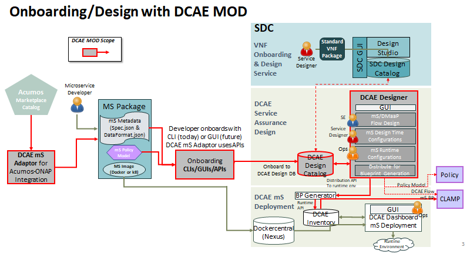
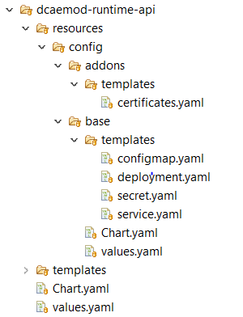

.. This work is licensed under a Creative Commons Attribution 4.0 International License.
.. http://creativecommons.org/licenses/by/4.0

=====================
DCAE MOD Architecture
=====================

DCAE MOD is composed of a mix of components developed in ONAP and other
components taken from the Apache Nifi project and modified for
appropriate use. The MOD architecture and design was intended to simplify the onboarding
and design experience in ONAP addressing below goals. 

.. toctree::
   :maxdepth: 1

   ./DCAE-MOD-goals.rst
   
   
MOD aims to streamline the construction, management,
and evolution of DCAE flows from role to role, from environment to
environment, and from release to release. MOD is composed of three functional areas: onboarding, design, and
distribution and caters to different `user group <./Roles>`__

The below illustrations describe the architecture of DCAE-MOD and show the
usage flow in DCAE MOD

|image0|

|image1|

Onboarding API
--------------

It is a component developed to onboard
models/components/microservices (spec files) into DCAE MOD.

Genprocessor
------------

It has been developed in Java. This project is a tool to
experiment with generating a Nifi Processor POJO from a DCAE component
spec.

Nifi Web UI
-----------

It is a component taken from the Apache Nifi Project but modified for
use in the MOD project.

Apache NiFi is a dataflow system based on the concepts of flow-based
programming. It supports powerful and scalable directed graphs of data
routing, transformation, and system mediation logic. NiFi has a
web-based user interface for design, control, feedback, and monitoring
of dataflows. It is highly configurable along several dimensions of
quality of service, such as loss-tolerant versus guaranteed delivery,
low latency versus high throughput, and priority-based queuing. NiFi
provides fine-grained data provenance for all data received, forked,
joined cloned, modified, sent, and ultimately dropped upon reaching its
configured end-state.

The NiFi UI provides mechanisms for creating automated dataflows, as
well as visualizing, editing, monitoring, and administering those
dataflows. The UI can be broken down into several segments, each
responsible for different functionality of the application. This section
provides screenshots of the application and highlights the different
segments of the UI. Each segment is discussed in further detail later in
the document.

The users of Apache Nifi will find that it is used very differently than
intended to serve our purpose in the DCAE-MOD project.

Registry API
------------

This component taken from the Apache Nifi project, is a REST API that
provides an interface to a registry with operations for saving,
versioning, reading NiFi flows and components.

Distributor API
---------------

It is a component developed using the Flask framework in Python.
It is a HTTP API to manage distribution targets for DCAE design.
Distribution targets are DCAE runtime environments that have been
registered and are enabled to accept flow design changes that are to be
orchestrated in that environment.

Flow Based Programming (FBP)
----------------------------

NiFi’s fundamental design concepts closely relate to the main ideas of
Flow Based
Programming `[fbp] <https://nifi.apache.org/docs/nifi-docs/html/overview.html#fbp>`__.

For more information on how some of the main NiFi concepts map to FBP,
check out https://nifi.apache.org/docs/nifi-docs/html/overview.html

Runtime API
-----------

It is developed in Java’s Spring Boot framework. It
is a HTTP API to support runtime environment for DCAE-MOD. It has two
major functionalities:

1. It accepts changes on the flow-graph via fbp protocol

2. It generates and distributes helm charts OR blueprints based on the change made on
   the flow-graph

Build Updates
~~~~~~~~~~~~~

New Java module - Helmgenerator-core was introduced for Helm charts
generation. MOD/Runtime has been enhanced to include this new dependency
(inaddition to Bp-generator for supporting cloudify blueprints flows).

Below is snippet from -
https://github.com/onap/dcaegen2-platform/blob/master/mod/runtimeapi/runtime-core/pom.xml

::

        <dependency>
            <groupId>org.onap.dcaegen2.platform</groupId>
            <artifactId>helmchartgenerator-core</artifactId>
            <version>1.0.3</version>
        </dependency>

Chart Updates
~~~~~~~~~~~~~

MOD/Runtime Charts has been modified to include under resources, common
base templates, Charts.yaml, add-on templates and Values.yaml with
placeholder.

|image3|

The Helmgenerator-core modules uses these template to pull the required
dependencies and generate new chart for MS onboarded. The parameters in
component-spec provided during onboarding is used for final Values.yaml
file generation.

Deployment
~~~~~~~~~~

The MOD/RuntimeAPI introduces new configuration to identify distribution
mechanism. Supported artifactType are **BLUEPRINT** or **HELM. **

Blueprint – Distribution to Inventory/Dashboard

Helm – Distribution to ChartMuseum

For Jakarta release, the charts configuration has been set to support
HELM distribution by default and configured for ONAP-internal
chart-museum registry.  RuntimeAPI Chart updates
https://github.com/onap/oom/blob/master/kubernetes/dcaemod/components/dcaemod-runtime-api/values.yaml

::

  artifactType: "HELM"
  registryBaseurl: http://chart-museum:80
  basehelmchartlocation: /helm-gen/

Blueprint Generator
-------------------

This tool allows the user to create a blueprint from a component spec json file.
This tool is used by the runtime api when artifactType is set to **BLUEPRINT** under 
`RuntimeAPI charts
   deployment <https://git.onap.org/oom/tree/kubernetes/dcaemod/components/dcaemod-runtime-api/values.yaml#n44>`__ 

Helm Generator
--------------

This tool allows the user to create a DCAE Services helm chart from a component spec json file.
This tool is used by the runtime api when artifactType is set to **HELM** under 
`RuntimeAPI charts
   deployment <https://git.onap.org/oom/tree/kubernetes/dcaemod/components/dcaemod-runtime-api/values.yaml#n44>`__ 

Inventory API
-------------

.. note::
   Used only under BLUEPRINT mode

DCAE Inventory is a web
service that provides the following:

1. Real-time data on all DCAE services and their components

2. Comprehensive details on available DCAE service types

DCAE Inventory is a composite API that relies on other APIs to obtain
resources on underlying components and uses these resources to compose a
DCAE service resource. In addition, DCAE Inventory will store data that
is unique to the DCAE service level including:

1. DCAE service metadata

2. DCAE service type description and composition details

3. Relationships between DCAE service and DCAE service types and their
   respective VNF and VNF types

DCAE Inventory has a REST interface to service client requests. It has a
well-defined query interface that would filter result sets based upon
resource attributes.

Here, think of it as a back end API for the DCAE dashboard. The runtime
posts Cloudify Blueprints to this API so they show up in the DCAE
dashboard.

DCAE Dashboard
--------------

.. note::
   Used only under BLUEPRINT mode

The DCAE dashboard provides visibility into running DCAE services for
operational purposes. It queries the DCAE Inventory for aggregate
details on all the running DCAE services and for getting up-to-date
status information on DCAE services and their components.

End-to-End Flow
---------------

A model/component/microservice can be onboarded by a ms Developer by
posting a spec file on the onboarding API. Alternatively, an Acumos
model can be onboarded using the Acumos Adapter. Once successfully
onboarded, the genprocessor converts converts them to jars and onboards
them into Nifi i.e DCAE MOD. These artifacts are now available to use
from the Modified Nifi Web UI i.e DCAE Designer.

The registry api offers version control and retrieval for flows. The
distributor api can be used to set distribution targets. Once a flow is
designed and distributed, it goes to the distributor api which is
supposed to post graph changes (in accordance with fbp) to the runtime
api. The runtime api generates and distributes deployment artifacts (either 
blueprints or helm charts) based on the
change made on the flow-graph. The generated blueprints are received by the DCAE
inventory can then be viewed and deployed from the DCAE dashboard. On helm mode, 
charts generated are pushed into configured Chartmuseum registry. 

.. |image0| image:: ../images/DCAE-Mod-Architecture.png

.. |image2| image:: ../images/nifi-toolbar-components.png

