.. This work is licensed under a Creative Commons Attribution 4.0 International License.
.. http://creativecommons.org/licenses/by/4.0

.. _moduserguide:

===================
DCAE MOD User Guide
===================

-  `Types of Users and Usage
   Instructions: <#DCAEMODUserGuide(draft)-TypesofUsersand>`__

-  `1.    Deployment of DCAE MOD components via Helm
   charts <#DCAEMODUserGuide(draft)-1.DeploymentofD>`__

   -  `Using DCAE MOD without an Ingress
      Controller <#DCAEMODUserGuide(draft)-UsingDCAEMODwit>`__

-  `2.    Configuring DCAE
   mod <#DCAEMODUserGuide(draft)-2.ConfiguringDC>`__

-  `3.    Design & Distribution
   Flow <#DCAEMODUserGuide(draft)-3.Design&Distri>`__

Types of Users and Usage Instructions:
======================================

+-------+-----------------------------+-----------------------------+
| Sr.No | User                        | Usage Instructions          |
+=======+=============================+=============================+
| 1.    | Developers who are looking  | -        Access the Nifi    |
|       | to onboard their mS         | Web UI url provided to you  |
|       |                             |                             |
|       |                             | -        Follow steps  2.c  |
|       |                             | to 2.f                      |
|       |                             |                             |
|       |                             | -        You should be able |
|       |                             | to see your microservices   |
|       |                             | in the Nifi Web UI by       |
|       |                             | clicking and dragging       |
|       |                             | ‘Processor’ on the canvas,  |
|       |                             | and searching for the name  |
|       |                             | of the                      |
|       |                             | micros                      |
|       |                             | ervice/component/processor. |
+-------+-----------------------------+-----------------------------+
| 2.    | Designers who are building  | -        Access the Nifi    |
|       | the flows through UI and    | Web UI url provided to you  |
|       | triggering distribution     |                             |
|       |                             | -        Follow steps 3 to  |
|       |                             | the end of the document     |
+-------+-----------------------------+-----------------------------+
| 3.    | Infrastructure/ Admins who  | -        Follow start to    |
|       | want to stand up DCAE Mod   | the end                     |
|       | and validate it             |                             |
+-------+-----------------------------+-----------------------------+

1.    Pre-requisite for DCAE MOD Deployment
===========================================

With complete of DCAE Helm tranformation in Jakarta release, DCAE MOD has been enhanced
to support Helm chart generation for microservices onboarded.
In order to support the HELM flow through MOD, following dependency should be met

-  An accessible ChartMuseum registry (internal or external)

-  As the provided registry is used both to pull required dependencies
   and push new generated charts, all common charts used by DCAE
   components must be available in this registry.

.. note:: 
   By default, MOD charts are set to use local chartmuseum registry. This can be modified by 
   updating the `RuntimeAPI charts
   deployment <https://git.onap.org/oom/tree/kubernetes/dcaemod/components/dcaemod-runtime-api/values.yaml#n44>`__ 
   

ONAP deployments (gating) will include Chartmuseum installation within
ONAP cluster  (charts hosted here
- https://github.com/onap/oom/tree/master/kubernetes/platform/components/chartmuseum). 

Dependent charts such as - dcaegen2-services-common, readinessCheck,
common, repositoryGenerator, postgres, mongo, serviceAccount,
certInitializer should be preloaded into this registry as MOD retrieves
them during new MS helm charts creation and linting.  To support the
registry initialization, following scripts has been introduced. 

-  https://github.com/onap/oom/blob/master/kubernetes/contrib/tools/registry-initialize.sh

-  https://github.com/onap/oom/blob/master/kubernetes/robot/demo-k8s.sh

Note:  Chartmuseum being a platform component, it has to be enabled
on-demand and not available with generic ONAP installation.  

Follow below steps to setup chartmuseum and pre-load required charts.

Chartmuseum Installation
------------------------

Clone OOM repository and deploy optional Chartmuseum component

**Chartmuseum Deployment**

::

    # git clone -b <BRANCH> http://gerrit.onap.org/r/oom --recurse-submodules
    cd  ~/oom/kubernetes/platform/components/chartmuseum
    helm install -name dev-chartmuseum -n onap . -f ~/onap-1-override.yaml  --set global.masterPassword=test1 --set global.pullPolicy=IfNotPresent

.. note:: 
   This instance of chartmuseum registry is deployed internal to ONAP cluster and 
   is different from the registry setup done part `OOM
   deployment <https://docs.onap.org/projects/onap-oom/en/latest/oom_quickstart_guide.html>`__ 
   where local helm server is setup for serving chart and to pull/push the
   charts generated make process

Chartmuseum initialization 
--------------------------

As noted earlier, there are two scripts available for pre-load. The
`registry-initialize.sh <https://github.com/onap/oom/blob/master/kubernetes/contrib/tools/registry-initialize.sh>`__
retrieves the Chartmuseum credential from secret and load the charts
individually based on parameter (default no parameters, will load all
DCAE service charts and its dependencies).  And
`demo-k8s.sh <https://github.com/onap/oom/blob/master/kubernetes/robot/demo-k8s.sh>`__
is wrapper script used in gating, which invokes
`registry-initialize.sh <https://github.com/onap/oom/blob/master/kubernetes/contrib/tools/registry-initialize.sh>`__
with required parameters.

**Chartmuseum initialization via demo-k8s.sh**

::

    cd ~/oom/kubernetes/robot
    ./demo-k8s.sh onap registrySynch

OR 

**Chartmuseum initialization via registry-initialize script**

::

    cd ~/oom/kubernetes/contrib/tools   
    ./registry-initialize.sh -d ../../dcaegen2-services/charts/ -n onap -r dev-chartmuseum
    ./registry-initialize.sh -d ../../dcaegen2-services/charts/ -n onap -r dev-chartmuseum -p common
    ./registry-initialize.sh -h repositoryGenerator  -n onap -r dev-chartmuseum
    ./registry-initialize.sh -h readinessCheck   -n onap -r dev-chartmuseum
    ./registry-initialize.sh -h dcaegen2-services-common  -n onap -r dev-chartmuseum
    ./registry-initialize.sh -h postgres   -n onap -r dev-chartmuseum
    ./registry-initialize.sh -h serviceAccount   -n onap -r dev-chartmuseum
    ./registry-initialize.sh -h certInitializer  -n onap -r dev-chartmuseum
    ./registry-initialize.sh -h mongo -n onap -r dev-chartmuseum

2.    Deployment of DCAE MOD components via Helm charts
=======================================================

The DCAE MOD components are deployed using the standard ONAP OOM
deployment process.   When deploying ONAP using the helm deploy command,
DCAE MOD components are deployed when the dcaemod.enabled flag is set to
true, either via a --set option on the command line or by an entry in an
overrides file.  In this respect, DCAE MOD is no different from any
other ONAP subsystem.

The default DCAE MOD deployment relies on an nginx ingress controller
being available in the Kubernetes cluster where DCAE MOD is being
deployed.   The Rancher RKE installation process sets up a suitable
ingress controller.   In order to enable the use of the ingress
controller, it is necessary to override the OOM default global settings
for ingress configuration.   Specifically, the installation needs to set
the following configuration in an override file
::
 
  ingress:
    enabled: true
    virtualhost:
      baseurl: "simpledemo.onap.org"

When DCAE MOD is deployed with an ingress controller, several endpoints
are exposed outside the cluster at the ingress controller's external IP
address and port.   (In the case of a Rancher RKE installation, there is
an ingress controller on every worker node, listening at the the
standard HTTP port (80).)  These exposed endpoints are needed by users
using machines outside the Kubernetes cluster.

+--------------+--------------------------------------------------+--------------------------+
| **Endpoint** | ** Routes to (cluster                            | **Description**          |
|              | internal address)**                              |                          |
+==============+==================================================+==========================+
| /nifi        | http://dcaemod-designtool:8080/nifi              | Design tool Web UI       |
|              |                                                  |                          |
+--------------+--------------------------------------------------+--------------------------+
| /nifi-api    | http://dcaemod-designtool:8080/nifi-api          | Design tool API          |
|              |                                                  |                          |
+--------------+--------------------------------------------------+--------------------------+
| /nifi-jars   | http://dcaemod-nifi-registry:18080/nifi-jars     | Flow registry listing of |
|              |                                                  | JAR files built from     |
|              |                                                  | component specs          |
+--------------+--------------------------------------------------+--------------------------+
| /onboarding  | http://dcaemod-onboarding-api:8080/onboarding    | Onboarding API           |
|              |                                                  |                          |
+--------------+--------------------------------------------------+--------------------------+
| /distributor | http://dcaemod-distributor-api:8080/distributor  | Distributor API          |
|              |                                                  |                          |
+--------------+--------------------------------------------------+--------------------------+

| To access the design Web UI, for example, a user would use the URL :
  http://*ingress_controller_address:ingress_controller_port*/nifi.
| *ingress_controller_address* is the the IP address or DNS FQDN of the
  ingress controller and
| *ingress_controller_port* is the port on which the ingress controller
  is listening for HTTP requests.  (If the port is 80, the HTTP default,
  then there is no need to specify a port.)

There are two additional *internal* endpoints that users need to know,
in order to configure a registry client and a distribution target in the
design tool's controller settings.

+------------------------+--------------------------------------------+
| **Configuration Item** | **Endpoint URL**                           |
+========================+============================================+
| Registry client        | http://dcaemod-nifi-registry:18080         |
+------------------------+--------------------------------------------+
| Distribution target    | http://dcaemod-runtime-api:9090            |
+------------------------+--------------------------------------------+

With Guilin release, OOM/ingress template has been updated to enable virtual host by default. 
All MOD API's and UI access via ingress should use dcaemod.simpledemo.onap.org.  

In order to access Design UI from local, add an entry for dcaemod.simpledemo.onap.org in /etc/hosts with the correct IP (any K8S node IP can be specified).

Example below using generic override

**Deploy MOD**

::

    helm install dev-dcaemod local/dcaemod --namespace onap  -f ~/onap-override.yaml --set global.masterPassword=test1 --set global.pullPolicy=IfNotPresent  

Using DCAE MOD without an Ingress Controller

Not currently supported

3.    Configuring DCAE mod
==========================

**a. Configure Nifi Registry url**

Next check Nifi settings by selecting the Hamburger button in the Nifi
UI. It should lead you to the Nifi Settings screen

|image16|

|image3|

Add a registry client. The Registry client url will be
http://dcaemod-nifi-registry:18080

|image4|

**b. Add distribution target which will be the runtime api url**

Set the distribution target in the controller settings

|image17|

Distribution target URL will be
`http://dcaemod-runtime-api:9090 <http://dcaemod-runtime-api:9090/>`__

Now let’s access the Nifi (DCAE designer) UI - http://dcaemod.simpledemo.onap.org/nifi

IPAddress is the host address or the DNS FQDN, if there is one, for one of the Kubernetes nodes.

|image0|

**c. Get the artifacts to test and onboard.**

MOD components has been upgraded to use v3 specification for Helm flow support 

VESCollector
~~~~~~~~~~~~

**Component Spec for DCAE-VES-Collector :** https://git.onap.org/dcaegen2/collectors/ves/tree/dpo/spec/vescollector-componentspec-v3.json

**VES 5.28.4 Data Format :** https://git.onap.org/dcaegen2/collectors/ves/tree/dpo/data-formats/VES-5.28.4-dataformat.json

**VES 7.30.2.1 Data Format :** https://git.onap.org/dcaegen2/collectors/ves/tree/etc/CommonEventFormat_30.2.1_ONAP.jsonormat.json

**VES Collector Response Data Format :** https://git.onap.org/dcaegen2/collectors/ves/tree/dpo/data-formats/ves-response.json

TCAGen2
~~~~~~~

**Component Spec for DCAE-TCAgen2 :** https://git.onap.org/dcaegen2/collectors/ves/tree/dpo/spec/vescollector-componentspec.json

**TCA CL Data Format :** https://git.onap.org/dcaegen2/analytics/tca-gen2/tree/dcae-analytics/dpo/dcaeCLOutput.json

**TCA DMAAP Format :** https://git.onap.org/dcaegen2/analytics/tca-gen2/tree/dcae-analytics/dpo/dmaap.json

**TCA AAI Data Format :** https://git.onap.org/dcaegen2/analytics/tca-gen2/tree/dcae-analytics/dpo/aai.json

For the purpose of onboarding, a Sample Request body should be of the type -::

  { "owner": "<some value>", "spec": <some json object> }

where the json object inside the spec field can be a component spec json.

Request bodies of this type will be used in the onboarding requests you make using curl or the onboarding swagger interface.

**The prepared Sample Request body for a component dcae-ves-collector looks like
so –**

See :download:`VES Collector Spec <./Sample-Input-Files/Request-body-of-Sample-Component_v3.json>`

**The prepared Sample request body for a sample data format  looks like so -**

See :download:`VES data Format <./Sample-Input-Files/Request-body-of-Sample-Data-Format.json>`

Similar updates should be done for other specification and data-formats files

**d. Onboard data format and component-spec**

Each component has a description that tells what it does.

These requests would be of the type

curl -X POST http://<onboardingapi host>/onboarding/dataformats     -H "Content-Type: application/json" -d
@<filepath to request>

curl -X POST http://<onboardingapi host>/onboarding/components     -H "Content-Type: application/json" -d
@<filepath to request>

In our case,

curl -X POST http://dcaemod.simpledemo.onap.org/onboarding/dataformats     -H "Content-Type: application/json" -d @<filepath to request>

curl -X POST http://dcaemod.simpledemo.onap.org/onboarding/components    -H "Content-Type: application/json" -d @<filepath to request>

**Onboard Specs and DF**

::

    HOST=dcaemod.simpledemo.onap.org
    curl -X POST http://$HOST/onboarding/dataformats     -H "Content-Type: application/json" -d @ves-4.27.2-df.json
    curl -X POST http://$HOST/onboarding/dataformats     -H "Content-Type: application/json" -d @ves-5.28.4-df.json
    curl -X POST http://$HOST/onboarding/dataformats     -H "Content-Type: application/json" -d @ves-response-df.json
    curl -X POST http://$HOST/onboarding/dataformats     -H "Content-Type: application/json" -d @VES-7.30.2_ONAP-dataformat_onboard.json
    curl -X POST http://$HOST/onboarding/components -H "Content-Type: application/json" -d @vescollector-componentspec-v3-mod.json

    curl -X POST  http://$HOST/onboarding/dataformats     -H "Content-Type: application/json" -d @dcaeCLOutput-resp.json
    curl -X POST  http://$HOST/onboarding/dataformats     -H "Content-Type: application/json" -d @aai-resp.json
    curl -X POST  http://$HOST/onboarding/components -H "Content-Type: application/json" -d @tcagen2-componentspec-v3-mod.json

You can download the Component Specification and Data Formats used for
the demo from here - `demo.zip <https://wiki.onap.org/download/attachments/128713665/demo.zip?version=1&modificationDate=1646673042000&api=v2>`__

**e. Verify the resources were created using**

curl -X GET http://dcaemod.simpledemo.onap.org/onboarding/dataformats

curl -X GET http://dcaemod.simpledemo.onap.org/onboarding/components

**f. Verify the genprocessor (which polls onboarding periodically to convert component specs to nifi processor), converted the component**

Open http://dcaemod.simpledemo.onap.org/nifi-jars in a browser.

These jars should now be available for you to use in the nifi UI as
processors

|image1|

4.    Design & Distribution Flow
================================

**a**. To start creating flows, we need to create a process group first. The
name of the process group will be the name of the flow. Drag and Drop on
the canvas, the ‘Processor Group’ icon from the DCAE Designer bar on the
top.

|image2|

Now enter the process group by double clicking it,

You can now drag and drop on the canvas ‘Processor’ icon from the top
DCAE Designer tab. You can search for a particular component in the
search box that appears when you attempt to drag the ‘Processor’ icon to
the canvas.

|image5|

If the Nifi registry linking worked, you should see the “Import” button
when you try to add a Processor or Process group to the Nifi canvas,
like so-

|image6|

By clicking on the import button, we can import already created saved
and version controlled flows from the Nifi registry, if they are
present.

|image7|

We can save created flows by version controlling them like so starting
with a 'right click' anywhere on the canvas-

|image8|

Ideally you would name the flow and process group the same, because
functionally they are similar.

|image9|

When the flow is checked in, the bar at the bottom shows a green
checkmark

|image10|

Note: Even if you move a component around on the canvas, and its
position on the canvas changes, it is recognized as a change, and it
will have to recommitted.

You can add additional components in your flow and connect them.

DcaeVesCollector connects to DockerTcagen2.

|image11|

|image12|

|image13|

Along the way you need to also provide topic names in the settings
section. These can be arbitrary names.

|image14|

To recap, see how DcaeVesCollector connects to DockerTcagen2. Look at
the connection relationships. Currently there is no way to validate
these relationships. Notice how it is required to name the topics by
going to Settings.

The complete flow after joining our components looks like so

|image15|

**b. Submit/ Distribute the flow:**

Once your flow is complete and saved in the Nifi registry, you can
choose to submit it for distribution.

|image18|

If the flow was submitted successfully to the runtime api, you should
get a pop up a success message like so -

|image19|

At this step, the design was packaged and sent to Runtime api.

The runtime is supposed to generate the Helmchart for components
involved in the flow and push them to registry configured. The
RuntimeAPI logs should looks like below for successful distribution (can
be viewed through kubectl log -f command)

**MOD/RuntimeAPI Console logs**

::

    2022-03-07 18:13:25.865  INFO 1 --- [nio-9090-exec-8] o.o.d.r.web.controllers.GraphController  : org.onap.dcae.runtime.web.models.GraphRequest@65efc9d3
    2022-03-07 18:13:26.119  INFO 1 --- [nio-9090-exec-1] o.o.d.r.web.controllers.GraphController  : [org.onap.dcae.runtime.web.models.Action@335a6cff, org.onap.dcae.runtime.web.models.Action@291687dd, org.onap.dcae.runtime.web.models.Action@36d57691]
    2022-03-07 18:13:26.142  INFO 1 --- [nio-9090-exec-1] o.o.d.platform.helmchartgenerator.Utils  : cloning dir/file at : /tmp/chart17927059362260733428
    2022-03-07 18:13:26.158  INFO 1 --- [nio-9090-exec-1] o.o.d.p.h.chartbuilder.HelmClientImpl    : running: helm dep up /tmp/chart17927059362260733428
    Hang tight while we grab the latest from your chart repositories...
    ...Successfully got an update from the "local" chart repository
    Update Complete. ⎈Happy Helming!⎈
    Saving 7 charts
    Downloading common from repo http://chart-museum:80
    Downloading repositoryGenerator from repo http://chart-museum:80
    Downloading readinessCheck from repo http://chart-museum:80
    Downloading dcaegen2-services-common from repo http://chart-museum:80
    Downloading postgres from repo http://chart-museum:80
    Downloading serviceAccount from repo http://chart-museum:80
    Downloading mongo from repo http://chart-museum:80
    Deleting outdated charts
    2022-03-07 18:13:26.273  INFO 1 --- [nio-9090-exec-1] o.o.d.p.h.chartbuilder.HelmClientImpl    : running: helm lint /tmp/chart17927059362260733428
    2022-03-07 18:13:30.641  INFO 1 --- [nio-9090-exec-1] o.o.d.p.h.chartbuilder.HelmClientImpl    : ==> Linting /tmp/chart17927059362260733428
    2022-03-07 18:13:30.642  INFO 1 --- [nio-9090-exec-1] o.o.d.p.h.chartbuilder.HelmClientImpl    : [INFO] Chart.yaml: icon is recommended
    2022-03-07 18:13:30.642  INFO 1 --- [nio-9090-exec-1] o.o.d.p.h.chartbuilder.HelmClientImpl    :
    2022-03-07 18:13:30.642  INFO 1 --- [nio-9090-exec-1] o.o.d.p.h.chartbuilder.HelmClientImpl    : 1 chart(s) linted, 0 chart(s) failed
    2022-03-07 18:13:30.646  INFO 1 --- [nio-9090-exec-1] o.o.d.p.h.chartbuilder.HelmClientImpl    : running: helm package -d /tmp/chart13832736430918913290 /tmp/chart17927059362260733428
    2022-03-07 18:13:30.737  INFO 1 --- [nio-9090-exec-1] o.o.d.p.h.chartbuilder.HelmClientImpl    : Successfully packaged chart and saved it to: /tmp/chart13832736430918913290/dcae-ves-collector-1.10.1.tgz
    2022-03-07 18:13:30.836  INFO 1 --- [nio-9090-exec-1] o.o.d.p.h.d.ChartMuseumDistributor       : {"saved":true}
    2022-03-07 18:13:30.857  INFO 1 --- [nio-9090-exec-1] o.o.d.platform.helmchartgenerator.Utils  : cloning dir/file at : /tmp/chart7638328545634423550
    2022-03-07 18:13:30.870  INFO 1 --- [nio-9090-exec-1] o.o.d.p.h.chartbuilder.HelmClientImpl    : running: helm dep up /tmp/chart7638328545634423550
    Hang tight while we grab the latest from your chart repositories...
    ...Successfully got an update from the "local" chart repository
    Update Complete. ⎈Happy Helming!⎈
    Saving 7 charts
    Downloading common from repo http://chart-museum:80
    Downloading repositoryGenerator from repo http://chart-museum:80
    Downloading readinessCheck from repo http://chart-museum:80
    Downloading dcaegen2-services-common from repo http://chart-museum:80
    Downloading postgres from repo http://chart-museum:80
    Downloading serviceAccount from repo http://chart-museum:80
    Downloading mongo from repo http://chart-museum:80
    Deleting outdated charts
    2022-03-07 18:13:31.022  INFO 1 --- [nio-9090-exec-1] o.o.d.p.h.chartbuilder.HelmClientImpl    : running: helm lint /tmp/chart7638328545634423550
    2022-03-07 18:13:35.142  INFO 1 --- [nio-9090-exec-1] o.o.d.p.h.chartbuilder.HelmClientImpl    : ==> Linting /tmp/chart7638328545634423550
    2022-03-07 18:13:35.143  INFO 1 --- [nio-9090-exec-1] o.o.d.p.h.chartbuilder.HelmClientImpl    : [INFO] Chart.yaml: icon is recommended
    2022-03-07 18:13:35.143  INFO 1 --- [nio-9090-exec-1] o.o.d.p.h.chartbuilder.HelmClientImpl    :
    2022-03-07 18:13:35.143  INFO 1 --- [nio-9090-exec-1] o.o.d.p.h.chartbuilder.HelmClientImpl    : 1 chart(s) linted, 0 chart(s) failed
    2022-03-07 18:13:35.148  INFO 1 --- [nio-9090-exec-1] o.o.d.p.h.chartbuilder.HelmClientImpl    : running: helm package -d /tmp/chart14389934160290252569 /tmp/chart7638328545634423550
    2022-03-07 18:13:35.238  INFO 1 --- [nio-9090-exec-1] o.o.d.p.h.chartbuilder.HelmClientImpl    : Successfully packaged chart and saved it to: /tmp/chart14389934160290252569/dcae-tcagen2-1.3.1.tgz
    2022-03-07 18:13:35.303  INFO 1 --- [nio-9090-exec-1] o.o.d.p.h.d.ChartMuseumDistributor       : {"saved":true}

5.    Validation & Deployment
=============================

** Verify if the charts are pushed into registry**

Charts distributed by MOD/Runtime can be verified on Chartmuseum
registry  http://chart-museum:80/api/charts

Refer to supported api under `Chartmuseum Docs <https://chartmuseum.com/docs/>`__

Once the charts are retrieved, they can be installed using helm install command.

::

    curl -X GET http://<registry:port>/charts/dcae-tcagen2-1.3.1.tgz -u onapinitializer:demo123456!  -o dcae-tcagen2-1.3.1.tgz
    helm install -name dev-dcaegen2-services -n onap dcae-tcagen2-1.3.1.tgz --set global.masterPassword=test1 --set global.pullPolicy=Always --set mongo.enabled=true

6.  Environment Cleanup
-----------------------

**Demo Env Cleanup**

::

    helm delete -n onap dev-chartmuseum  # To remove Chartmuseum setup completely
    helm delete -n onap dev-dcaegen2-services  # To remove TCAGen2 services
    helm delete -n onap dev-dcaemod # To undeploy DCAEMOD

    # USE DELETE METHOD ON CHARTMUSEUM TO REMOVE ANY SPECIFIC CHART PACKAGE - example below
    curl -X DELETE http://<registry:port>/api/charts/dcae-ves-collector/1.10.1 -u onapinitializer:demo123456!
    curl -X DELETE http://<registry:port>/api/charts/dcae-tcagen2/1.3.1 -u onapinitializer:demo123456!

**Remove also any persistence directory from /dockerdata-nfs/onap/ associated to chartmuseum and dcaemod**

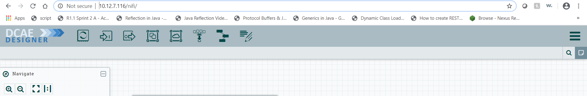
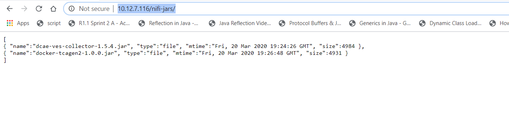
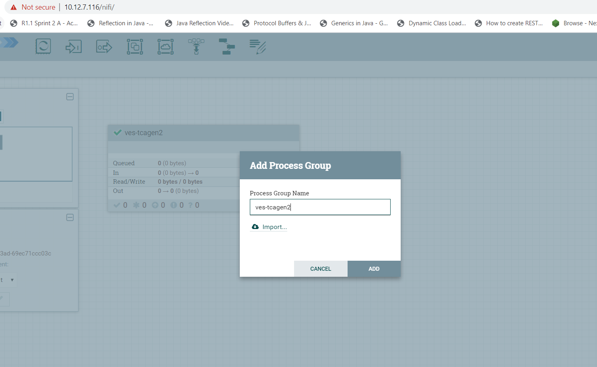
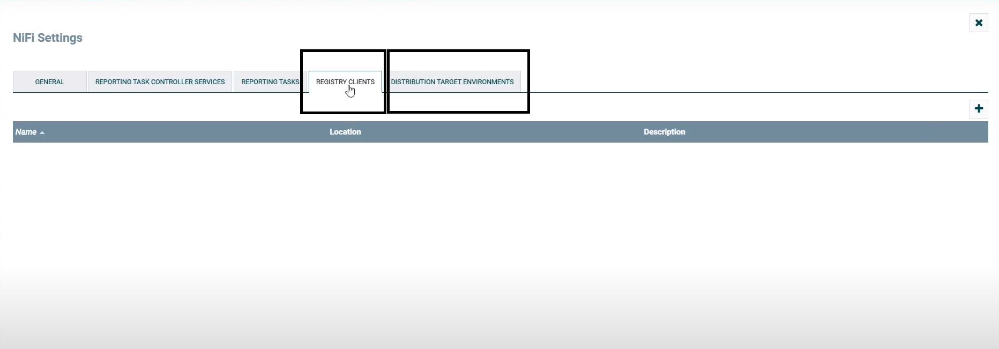
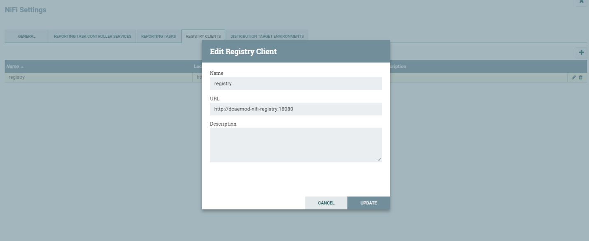
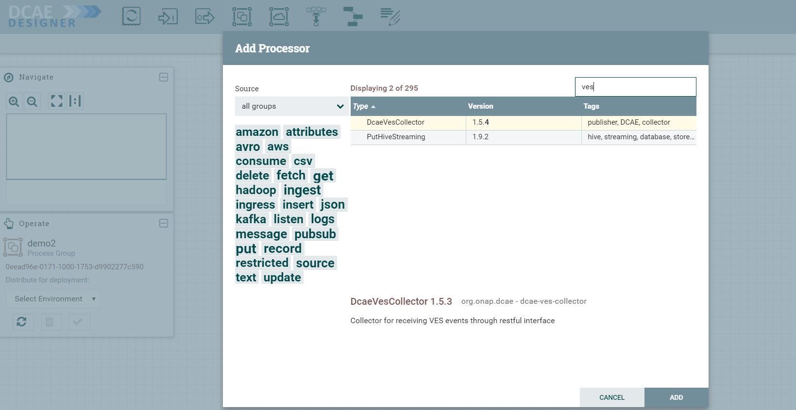
.. |image6| image:: ../images/7.png
   :width: 4.91667in
   :height: 2.25in
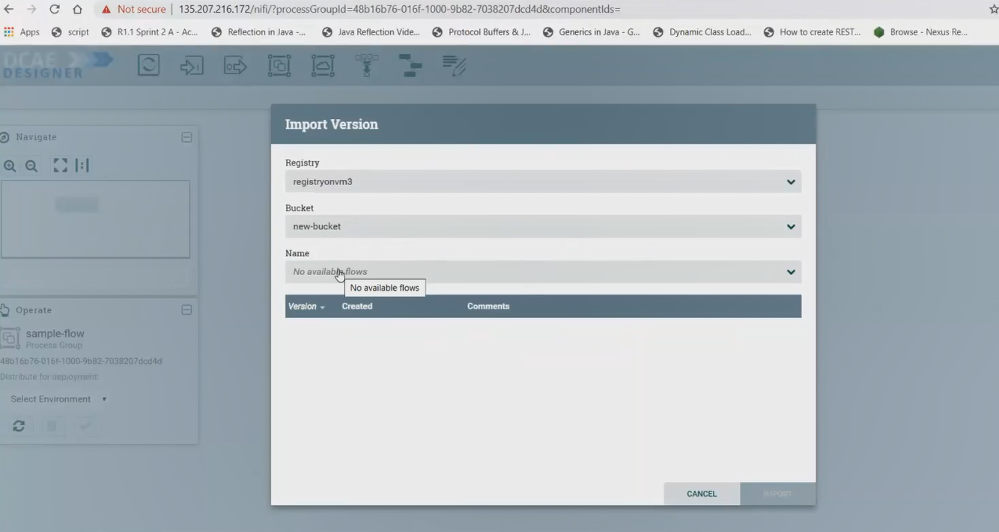
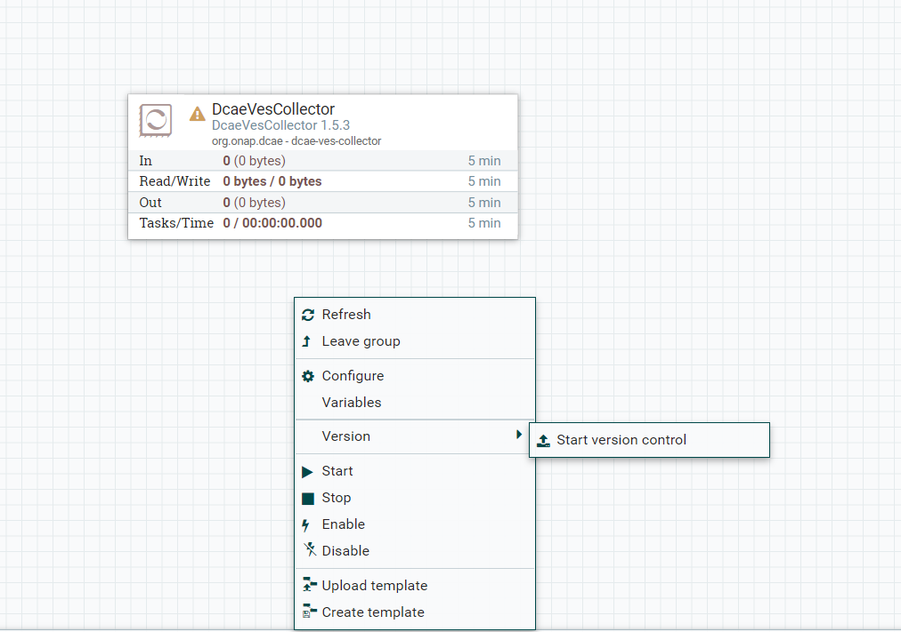
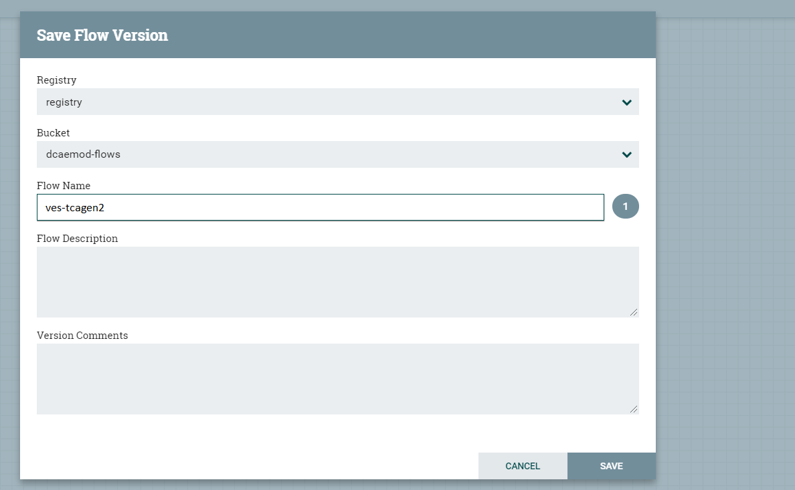
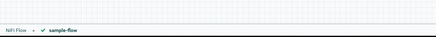
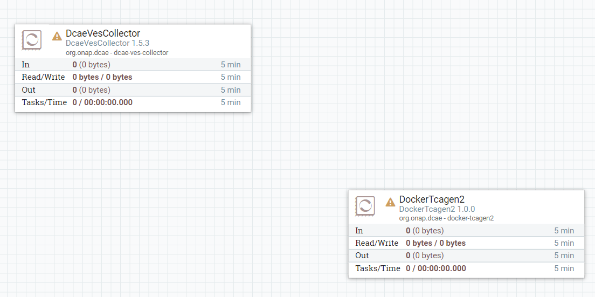
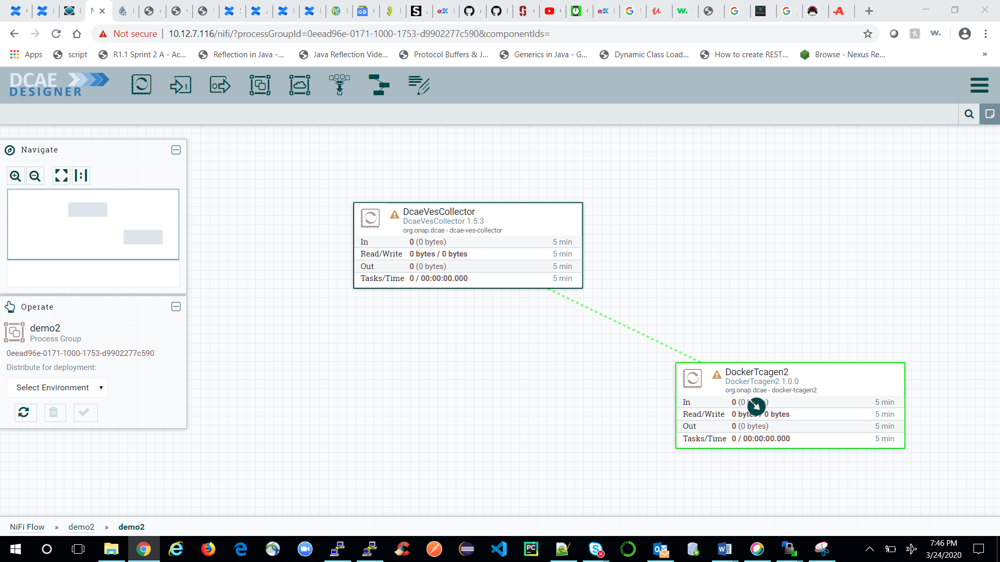
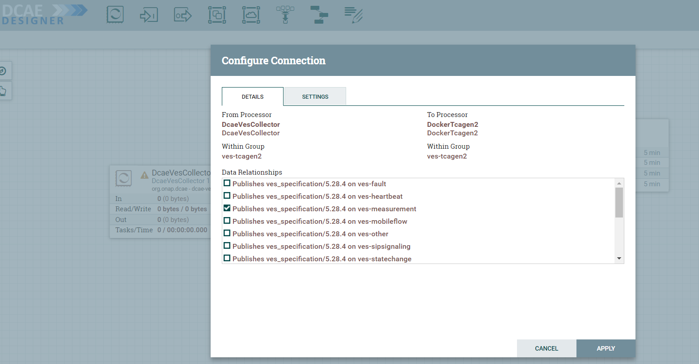
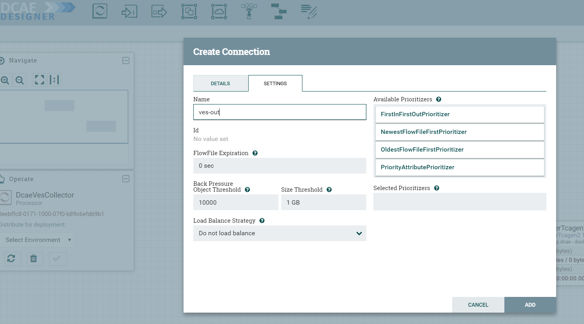
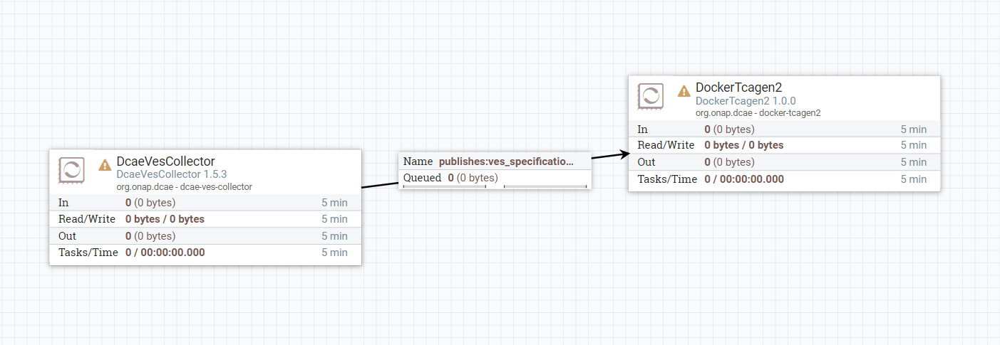
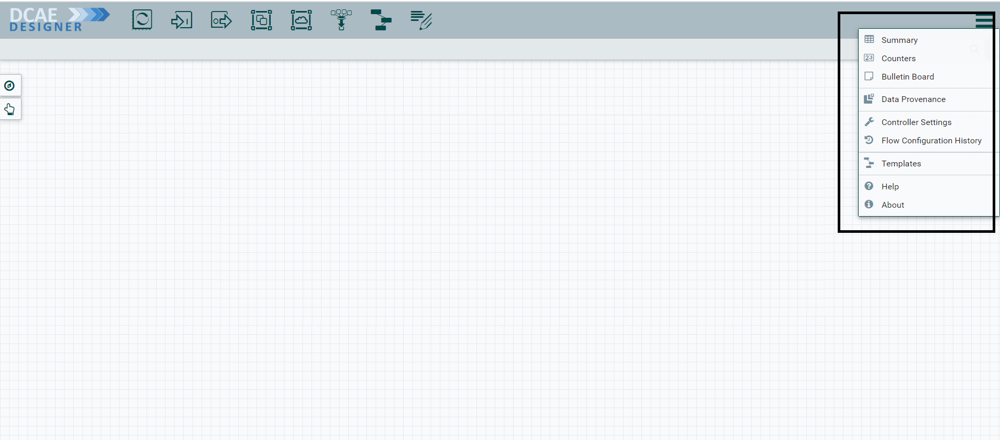
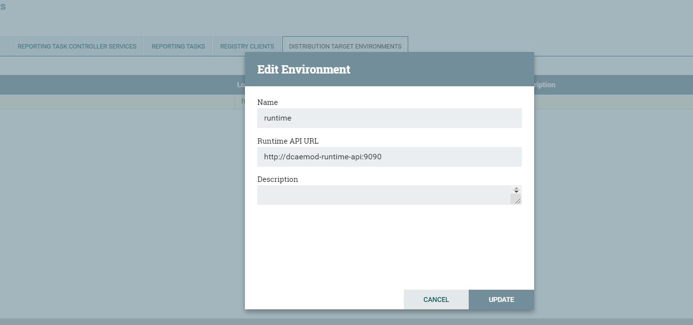
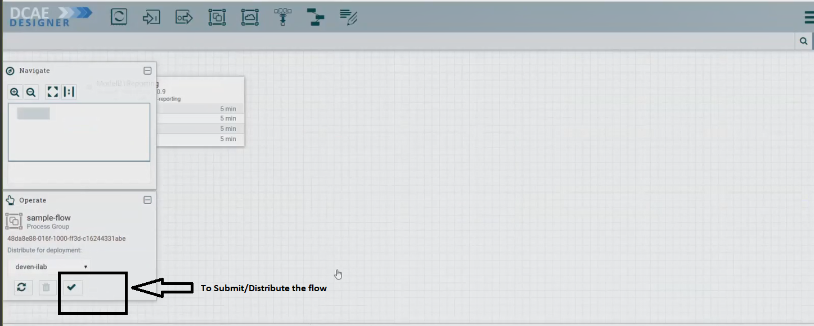
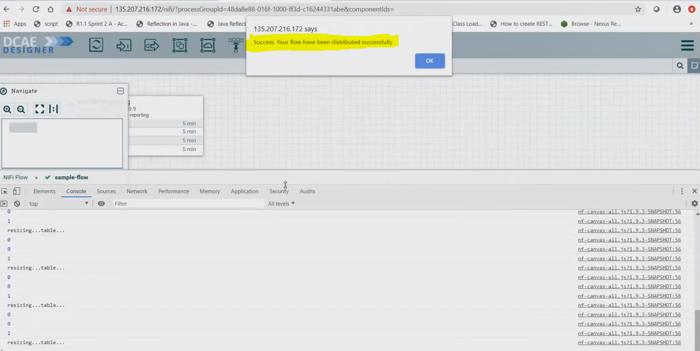

  
