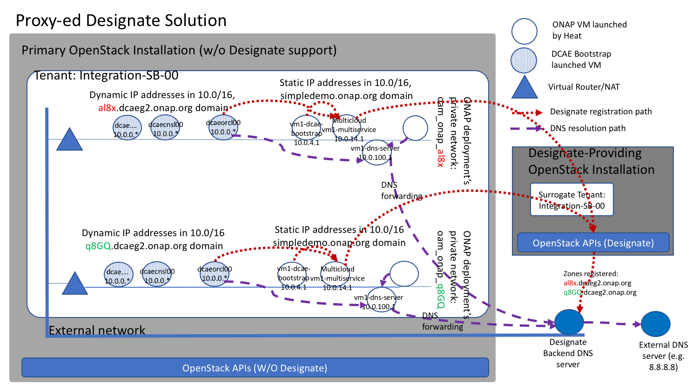

OpenStack Heat Template Based ONAP Deployment
=============================================

For ONAP R1, ONAP is deployed using OpenStack Heat template.  DCAE is also deployed through this process.  This i document describes the details of the Heat template deployment process and how to configure DCAE related parameters in the Heat template and its parameter file.

ONAP Deployment Overview
------------------------

ONAP supports an OpenStack Heat template based system deployment.  When a new "stack" is created using the template, the following virtual resources will be launched in the target OpenStack tenant:

* A four-character alphanumerical random text string, to be used as the ID of the deployment.  It is denoted as {{RAND}} in the remainder of this document.
* A private OAM network interconnecting all ONAP VMs, named oam_onap_{{RAND}}.
* A virtual router interconnecting the private OAM network with the external network of the OpenStack installation.
* A key-pair named onap_key_{{RAND}}.
* A security group named onap_sg_{{RAND}}.
* A list of VMs for ONAP components. Each VM has one NIC connected to the OAM network and assigned a fixed IP. Each VM is also assigned a floating IP address from the external network. The VM hostnames are name consistently across different ONAP deployments, a user defined prefix, denoted as {{PREFIX}}, followed by a descriptive string for the ONAP component this VM runs, and optionally followed by a sub-function name.  In the parameter env file supplied when running the Heat template, the {{PREFIX}} is defined by the **vm_base_name** parameter.  The VMs of the same ONAP role across different ONAP deployments will always have the same OAM network IP address. For example, the Message Router will always have the OAM network IP address of 10.0.11.1.

    ==============     ==========================    ==========================
    ONAP Role          VM (Neutron) hostname          OAM IP address(s)
    ==============     ==========================    ==========================
    A&AI               {{PREFIX}}-aai-inst1          10.0.1.1
    A&AI               {{PREFIX}}-aai-inst2          10.0.1.2
    APPC               {{PREFIX}}-appc               10.0.2.1
    SDC                {{PREFIX}}-sdc                10.0.3.1
    DCAE               {{PREFIX}}-dcae-bootstrap     10.0.4.1
    SO                 {{PREFIX}}-so                 10.0.5.1
    Policy             {{PREFIX}}-policy             10.0.6.1
    SD&C               {{PREFIX}}-sdnc               10.0.7.1
    VID                {{PREFIX}}-vid                10.0.8.1
    Portal             {{PREFIX}}-portal             10.0.9.1
    Robot TF           {{PREFIX}}-robot              10.0.10.1
    Message Router     {{PREFIX}}-message-router     10.0.11.1
    CLAMP              {{PREFIX}}-clamp              10.0.12.1
    MultiService       {{PREFIX}}-multi-service      10.0.14.1
    Private DNS        {{PREFIX}}-dns-server         10.0.100.1
    ==============     ==========================    ==========================
* Each of the above VMs will also be associated with a floating IP address from the external network.
* A list of DCAE VMs, launched by the {{PREFIX}}-dcae-bootstrap VM.  These VMs are also connected to the OAM network and associated with floating IP addresses on the external network.  What's different is that their OAM IP addresses are DHCP assigned.  The table below lists the DCAE VMs that are deployed for R1 use stories.

    =====================     ============================
    DCAE Role                 VM (Neutron) hostname(s)
    =====================     ============================
    Cloudify Manager          {{DCAEPREFIX}}orcl{00}
    Consul cluster            {{DCAEPREFIX}}cnsl{00-02}
    Platform Docker Host      {{DCAEPREFIX}}dokp{00}
    Service Docker Host       {{DCAEPREFIX}}doks{00}
    CDAP cluster              {{DCAEPREFIX}}cdap{00-06}
    Postgres                  {{DCAEPREFIX}}pgvm{00}
    =====================     ============================

DNS Configurations and Designate
--------------------------------

When DCAE VMs are launched by the dcae-bootstrap VM, they obtain their OAM IP addresses from
the DHCP server running on the OAM network (ONAP private network).  Because these addresses 
are dynamic, DCAE VMs rely on the OpenStack **Designate** DNSaaS API for registering their 
IP-address-to-hostname bindings.

DCAE VMs register their hostnames under a DNS zone.  This zone can be a zone that is exposed 
to the global DNS hierarchy, or a zone that is only known to the ONAP deployment.  The actual
zone name is configurable, by the blueprint input files of the DCAE VMs.  By default they are 
set to be {{DCAE_ZONE}}.{{DOMAIN_NAME}}, where {{DCAE_ZONE}} is set to the {{RANDID}} and the 
domain name is set to "dcaeg2.onap.org".  If DCAE VMs are required to be routable in operator organization or on the Internet, it is expected that the DNS domain is already configured in 
the organizational or global DNS hierarchy.

For OpenStack installations without Designate, there is an alternative "Proxyed-Designate"
solution.  That is, a second OpenStack installation with Designate support is used for 
providing Designate API and DNSaaS for the first OpenStack installation where ONAP is 
deployed.  The Designate API calls from DCAE VMs are proxyed through the MultiCloud 
service running in the same ONAP installation.  The diagram above illustrates the solution.
Such a solution can be utilized by operators who have difficulties enhancing their existing 
OpenStack infrastructure with Designate.  The ONAP Pod25 lab is configured using this 
approach.

To prepare for using the proxyed-Designate solution for an ONAP deployment, a surrogate 
tenant needs to be set up in the Designate-providing OpenStack.  The name of the surrogate
tenant must match with the name of the tenant where the ONAP is deployed.  At DCAE bootstrap
time, the dcae2_vm_init.sh script will first register two records into A&AI, which contain
parameters describing the two OpenStack installations, parameters that are needed by the MultiCloud service when performing the Designate and other API call proxying.

When DCAE VMs make OpenStack API calls, these calls are made to the MultiCloud service
node instead, not to the underlying OpenStack cloud infrastructure.  For non-Designate 
calls, the MultiCloud node proxys them to the same OpenStack installation and the project 
where the ONAP is installed.  For Designate 
calls, the MultiCloud node proxys to the Designate-providing OpenStack installation as if 
such calls are for the surrogate tenant.  The result is that the Designate providing 
OpenStack's backend DNS server will have the new records for DCAE VMs and their IP 
addresses.  

ONAP VMs deployed by Heat template are all registered with the private DNS server under the domain name of **simpledemo.onap.org**.  This domain can not be exposed to any where outside of the ONAP deployment because all ONAP deployments use the same domain name and same address space. Hence these host names remain only resolvable within the same ONAP deployment.  On the
other hand DCAE VMs have host names under the DNS zone of **{{DCAE_ZONE}}.{{DOMAIN_NAME}}**, 
which can be set up to be resolvable within organizational network or even global Internet.

To make the hostnames of ONAP VMs and external servers (e.g. onap.org) resolvable, the 
following DNS related configurations are needed.  

* The ONAP deployment's private DNS server, 10.0.100.1, is the default resolver for all the VMS.  This is necessary to make the **simpledemo.onap.org** hostnames resolvable.
* The ONAP deployment's private DNS server, 10.0.100.1, must have the Designate backend DNS server as the forwarder.  This is necessary to make the **{{DCAE_ZONE}}.{{DOMAIN_NAME}}** hostnames resolvable.
* The Designate backend DNS server needs to be configured so it can resolve all global hostnames.  One exemplary configuration for achieving this is to have an external DNS server such as an organizational or global DNS server, e.g. Google's 8.8.8.8, as the forwarder.

As the result of such configurations, below lists how different hostnames are resolved, as illustrated in the figure above:

* For hostnames within the **simpledemo.onap.org** domain, the private DNS server at 10.0.100.1 has the bindings;
* For hostnames within the **{{DCAE_ZONE}}.{{DOMAIN_NAME}}** domain, the private DNS server forwards to the Designate backend DNS server, which has the bindings;
* For all other hostnames, e.g. ubuntu.org, the private DNS server forwards to the Designate backend DNS server, which then forwards to an external DNS server that has or is able to further forward request to a DNS server that has the bindings.

We wil go over the details of related Heat template env parameters in the next section.

Heat Template Parameters
------------------------

Here we list Heat template parameters that are related to DCAE operation.  Bold values are the default values that should be used "as-is".

* public_net_id: the UUID of the external network where floating IPs are assigned from.  For example: 971040b2-7059-49dc-b220-4fab50cb2ad4.
* public_net_name: the name of the external network where floating IPs are assigned from.  For example: external.
* openstack_tenant_id: the ID of the OpenStack tenant/project that will host the ONAP deployment.  For example: dd327af0542e47d7853e0470fe9ad625.
* openstack_tenant_name: the name of the OpenStack tenant/project that will host the ONAP deployment.  For example: Integration-SB-01.
* openstack_username: the username for accessing the OpenStack tenant specified by openstack_tenant_id/openstack_tenant_name.
* openstack_api_key: the password for accessing the OpenStack tenant specified by openstack_tenant_id/openstack_tenant_name.
* openstack_auth_method: '**password**'.
* openstack_region: '**RegionOne**'.
* cloud_env: '**openstack**'.
* dns_list: This is the list of DNS servers to be configured into DHCP server of the ONAP OAM network.  As mentioned above it needs to have the ONAP private DNS server as the first item, then one or more external DNS servers next, for example:  **["10.0.100.1", "8.8.8.8"]**.  For installations where the private DNS server VM takes too long to be set up, the solution is to use the Designate backend DNS server as the first entry in this list.  Fot example  **["10.12.25.5", "8.8.8.8"]**. 
* external_dns: This is the first external DNS server in the list above.  For example, **"8.8.8.8"**
* dns_forwarder:  This is the DNS forwarder for the ONAP private DNS server.  It must point to the IP address of the Designate backend DNS. For example **'10.12.25.5'** for the Integration Pod25 lab.
* dcae_ip_addr: The static IP address on the OAM network that is assigned to the DCAE bootstraping VM.  **10.0.4.1**.  
* dnsaas_config_enabled: Whether a proxy-ed Designate solution is used. For example: **true**.
* dnsaas_region: The OpenStack region of the Designate-providing OpenStack installation. For example: **RegionOne**.
* dnsaas_tenant_name: The surrogate tenant/project name of the Designate-providing OpenStack. It must match with the *openstack_tenant_name* parameter.  For example Integration-SB-01.  
* dnsaas_keystone_url: The keystone URL of the Designate providing OpenStack.  For example **http://10.12.25.5:5000/v3**.
* dnsaas_username: The username for accessing the surrogate tenant/project in Designate providing OpenStack.  For Pod25 Integration lab, this value is set to **demo**.
* dnsaas_password: The password for accessing surrogate tenant/project in the Designate providing OpenStack.  For Pod25 Integration lab, this value is set to **onapdemo**.
* dcae_keystone_url: This is the keystone API endpoint used by DCAE VMs.  If MultiCloud proxying is used, this parameter needs to provide the service endpoint of the MltiCloud service node: **"http://10.0.14.1/api/multicloud-titanium_cloud/v0/pod25_RegionOne/identity/v2.0"**. Otherwise it shall point to the keystone 2.0 API endpoint of the under-lying OpenStack installation.  
* dcae_centos_7_image: The name of the CentOS-7 image.
* dcae_domain: The domain under which DCAE VMs register their zone. For example: **'dcaeg2.onap.org'**.
* dcae_public_key: the public key of the onap_key_{{RAND}} key-pair.
* dcae_private_key: The private key of the onap_key_{{RAND}} key-pair (with the additions of  literal \n at the end of each line of text). 

Heat Deployment
---------------

Heat template can be deployed using the OpenStack CLI.  For more details, please visit the demo project of ONAP.  All files references in this secton can be found under the **demo** project.

In the Heat template file **heat/ONAP/onap_openstack.yaml** file, there is one block of sepcification towrads the end of the file defines the dcae_bootstrap VM.  This block follows the same approach as other VMs defined in the same template.  That is, a number of parameters within the Heat context, such as the floating IP addresses of the VMs and parameters provided in the user defined parameter env file, are written to disk files under the /opt/config directory of the VM during cloud init time.  Then a script, found under the **boot** directory of the **demo** project, **{{VMNAME}}_install.sh**, is called to prepare the VM.  At the end of running this script, another script **{VMNAME}}_vm_init.sh** is called.

For DCAE bootstrap VM, the dcae2_vm_init.sh script completes the following steps:

* If we use proxy-ed Designate solution, runs:
    * Wait for A&AI to become ready
    * Register MultiCloud proxy information into A&AI
    * Wait for MultiCloud proxy node ready
    * Register the DNS zone for the ONAP installation, **{{RAND}}.dcaeg2.onap.org**
* Runs DCAE bootstrap docker container
    * Install Cloudify locally
    * Launch the Cloudify Manager VM
    * Launch the Consul cluster
    * Launch the platform component Docker host
    * Launch the service component Docker host
    * Launch the CDAP cluster
    * Install Config Binding Service onto platform component Docker host
    * Launch the Postgres VM
    * Install Platform Inventory onto platform component Docker host
    * Install Deployment Handler onto platform component Docker host
    * Install Policy Handler onto platform component Docker host
    * Install CDAP Broker onto platform component Docker host
    * Install VES collector onto service component Docker host
    * Install TCA analytics onto CDAP cluster
    * Install Holmes Engine onto service component Docker host
    * Install Holmes Rules onto service component Docker host
* Starts a Nginx docker container to proxy the healthcheck API to Consul
* Enters a infinite sleep loop to keep the bootstrap container up

Removing Deployed ONAP Deployment
---------------------------------

Because DACE VMs are not deployed directly from Heat template, they need to be deleted using
a separate method.

* Ssh into the dcae-bootstrap VM
* Enter the dcae-bootstrap container by executing: 
    * **sudo docker exec -it boot /bin/bash**
* Inside of the bootstrap container, execute:
    * **bash ./teardown**
    * All DCAE assets deployed by the bootstrap container will be uninstalled in the reverse order that they are installed.
* Exit from the bootstrap container.

After all DCAE assets are deleted, the next step is to delete the ONAP stack, using either the
dashboard GUI or openstack CLI.

When VMs are not terminated in a graceful fashion, certain resources such as ports and floating
IP addresses may not be released promptly by OpenStack.  One "quick-nad-dirty" way to release 
these resources is to use the openstack CLI with the following commands::

    openstack port list |grep 'DOWN' |cut -b 3-38 |xargs openstack port delete
    openstack floating ip list |grep 'None' |cut -b 3-38 |xargs openstack floating ip delete

Tips for Manual Interventions
-----------------------------

During DCAE deployment, there are several places where manual interventions are possible:

* Running dcae2_install.sh
* Running dcae2_vm_init.sh
* Running the dcae bootstrap docker.

All these require ssh-ing into the dcae-botstrap VM, then change directory or /opt and sudo.  
Configurations injected from the Heat template and cloud init can be found under /opt/config.
DCAE run time configuration values can be found under /opt/app/config.  After any parameters are changed, the dcae2_vm_init.sh script needs to be rerun.

Some manual interventions also require interaction with the OpenStack environment.  This can be 
done by using the OpenStack CLI tool.  OpenStack CLI tool comes very handy for various uses in deployment and maintenance of ONAP/DCAE.  

It is usually most convenient to install OpenStack CLI tool in a Python virtual environment.  Here are the steps and commands::

    # create and activate the virtual environment, install CLI
    $ virtualenv openstackcli
    $ . openstackcli/bin/activate
    $ pip install --upgrade pip python-openstackclient python-designateclient python-novaclient python-keystoneclient python-heatclient

    # here we need to download the RC file form OpenStack dashboard: 
    # Compute->Access & Security_>API Aceess->Download OpenStack RC file 

    # activate the environment variables with values point to the taregt OpenStack tenant
    (openstackcli) $ . ./openrc.sh
    
Now we are all set for using OpenStack cli tool to run various commands.  For example::

    # list all tenants
    (openstackcli) $ openstack project list

Designate/DNS related operations::

    # DNS/Designate related commands
    # list all DNS zones
    (openstackcli) $ openstack zone list
    # create a new zone
    (openstackcli) $ openstack zone create ${ZONENAME} --email dcae@onap.org
    # delete an existing zone
    (openstackcli) $ openstack zone delete ${ZONENAME}

Note that depending on OpenStack configuration, there may be a quota for how many zones can be created
under each tenant.  If such limit is reached, further zone creation request will be rejected.  In this case manual deletions for zones no longer needed is one of the ways to reduce outstanding zones.

When VMs are not terminated in a graceful fashion, certain resources such as ports and floating
IP addresses may not be released properly by OpenStack.  One "quick-nad-dirty" way to release
these resources is to use the openstack CLI with the following commands::

    (openstackcli) $ openstack port list |grep 'DOWN' |cut -b 3-38 |xargs openstack port delete
    (openstackcli) $ openstack floating ip list |grep 'None' |cut -b 3-38 |xargs openstack floating ip delete
   

Finally to deactivate from the virtual environment, run::

    (openstackcli) $ deactivate
 

