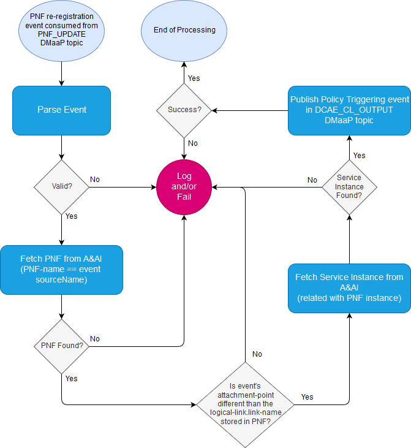
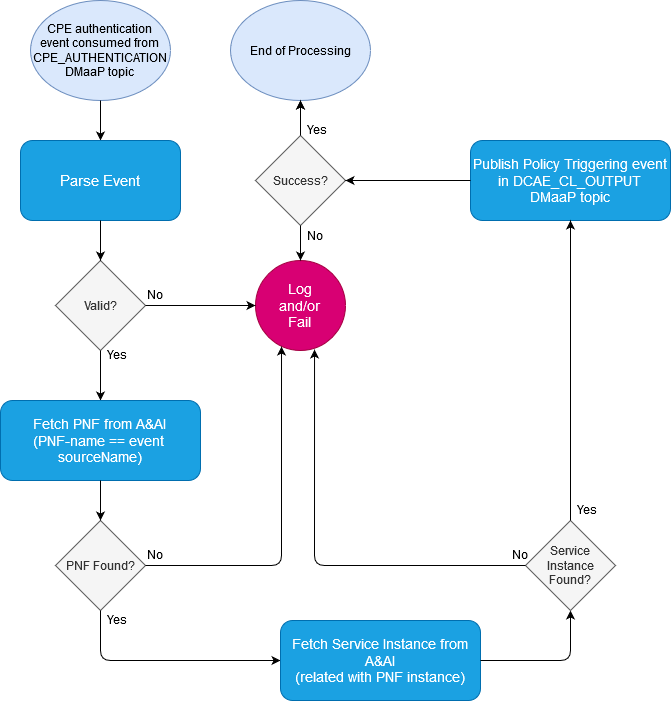

.. This work is licensed under a Creative Commons Attribution 4.0 International License.
.. http://creativecommons.org/licenses/by/4.0

=====================================
BBS-EP (BBS use case event processor)
=====================================

:Date: 2019-04-04

.. contents::
    :depth: 3
..

Overview
========

BBE-ep is responsible for handling two types of events for the BBS use case. 

First are PNF re-registration internal events published by PRH. BBS-ep must process these internal events to understand if they 
actually constitute ONT(CPE) relocation events. In the relocation case, it publishes an event towards unauthenticated.DCAE_CL_OUTPUT 
DMaaP topic to trigger further Policy actions related to BBS use case.

Second type of events are CPE authentication events originally published by the Edge SDN M&C component of BBS use case architecture. 
Through RestConf-Collector or VES-Collector, these events are consumed by BBS-ep and they are forwared towards unauthenticated.DCAE_CL_OUTPUT 
DMaaP topic to trigger further Policy actions related to BBS use case.

BBE-ep periodically polls for the two events. Polling interval is configurable and can be changed dynamically from Consul. Its implementation
is based on Reactive Streams (Reactor library), so it is fully asynchronous and non-blocking.

Installation
============

BBS-ep is delivered as a Spring-Boot application ready to be deployed in Docker (via docker-compose). 

The following docker-compose-yaml file shows a default configuration. The file can be run using `docker compose up` command:

.. code-block:: yaml

version: '3'
services:
  bbs-event-processor:
    image: onap/org.onap.dcaegen2.services.components.bbs-event-processor:latest
    container_name: bbs-event-processor
    hostname: bbs-event-processor 
    ports:
    - 32100:8100
    environment:
      CONFIGS_DMAAP_CONSUMER_RE-REGISTRATION_DMAAPHOSTNAME: 10.133.115.190
      CONFIGS_DMAAP_CONSUMER_RE-REGISTRATION_DMAAPPORTNUMBER: 30227
      CONFIGS_DMAAP_CONSUMER_RE-REGISTRATION_DMAAPTOPICNAME: /events/unauthenticated.PNF_UPDATE
      CONFIGS_DMAAP_CONSUMER_RE-REGISTRATION_CONSUMERGROUP: foo
      CONFIGS_DMAAP_CONSUMER_RE-REGISTRATION_CONSUMERID: bar
      CONFIGS_DMAAP_CONSUMER_CPE-AUTHENTICATION_DMAAPHOSTNAME: 10.133.115.190
      CONFIGS_DMAAP_CONSUMER_CPE-AUTHENTICATION_DMAAPPORTNUMBER: 30227
      CONFIGS_DMAAP_CONSUMER_CPE-AUTHENTICATION_DMAAPTOPICNAME: /events/unauthenticated.CPE_AUTHENTICATION
      CONFIGS_DMAAP_CONSUMER_CPE-AUTHENTICATION_CONSUMERGROUP: foo
      CONFIGS_DMAAP_CONSUMER_CPE-AUTHENTICATION_CONSUMERID: bar
      CONFIGS_DMAAP_PRODUCER_DMAAPHOSTNAME: 10.133.115.190
      CONFIGS_DMAAP_PRODUCER_DMAAPPORTNUMBER: 30227
      CONFIGS_DMAAP_PRODUCER_DMAAPTOPICNAME: /events/unauthenticated.DCAE_CL_OUTPUT
      CONFIGS_AAI_CLIENT_AAIHOST: 10.133.115.190
      CONFIGS_AAI_CLIENT_AAIPORT: 30233
      CONFIGS_APPLICATION_PIPELINESPOLLINGINTERVALSEC: 30
      CONFIGS_APPLICATION_PIPELINESTIMEOUTSEC: 15
      CONFIGS_APPLICATION_RE-REGISTRATION_POLICYSCOPE: policyScope
      CONFIGS_APPLICATION_RE-REGISTRATION_CLCONTROLNAME: controName
      CONFIGS_APPLICATION_CPE-AUTHENTICATION_POLICYSCOPE: policyScope
      CONFIGS_APPLICATION_CPE-AUTHENTICATION_CLCONTROLNAME: controlName
      LOGGING_LEVEL_ORG_ONAP_BBS: TRACE

For Dublin release, it will be a DCAE component that can dynamically be deployed via Cloudify blueprint installation.
Steps to deploy are shown below

- Transfer blueprint component file in DCAE bootstrap POD under /blueprints directory. Blueprint can be found in
  https://gerrit.onap.org/r/gitweb?p=dcaegen2/services.git;a=blob_plain;f=components/bbs-event-processor/dpo/blueprints/k8s-bbs-event-processor.yaml-template;hb=refs/heads/master
- Transfer blueprint component inputs file in DCAE bootstrap POD under / directory. Blueprint inputs file can be found in
  https://gerrit.onap.org/r/gitweb?p=dcaegen2/services.git;a=blob_plain;f=components/bbs-event-processor/dpo/blueprints/bbs-event-processor-input.yaml;h=36e69cf64bee3b46ee2e1b95f1a16380b7046482;hb=refs/heads/master
- Enter the Bootstrap POD
- Validate blueprint
    cfy blueprints validate /blueprints/k8s-bbs-event-processor.yaml-template
- Upload validated blueprint
    cfy blueprints upload -b bbs-ep /blueprints/k8s-bbs-event-processor.yaml-template
- Create deployment
    cfy deployments create -b bbs-ep -i /bbs-event-processor-input.yaml bbs-ep
- Deploy blueprint
    cfy executions start -d bbs-ep install

To undeploy BBS-ep, steps are shown below

- Validate blueprint by running command
    cfy uninstall bbs-ep
- Validate blueprint by running command
    cfy blueprints delete bbs-ep
 
Functionality
=============

PNF re-registration processing logic

CPE authentication processing logic

For more details about the exact flows and where BBS-EP fits in the overall BBS use case flows, visit 
* https://wiki.onap.org/display/DW/BBS+Notifications

Compiling BBS-EP
================

BBS-ep is a sub-project of dcaegen2/services (inside components directory).
To build just the BBS-ep component, run the following maven command from within **components/bbs-event-processor** directory
`mvn clean install`   
s
Main API Endpoints
==================

Running with dev-mode of BBS-EP
    - Heartbeat: **GET http://<container_address>:8100/heartbeat**
    - Start Polling for events: **POST http://<container_address>:8100/start-tasks**
    - Stop Polling for events: **POST http://<container_address>:8100/cancel-tasks**
    - Execute just one polling for PNF re-registration internal events: **POST http://<container_address>:8100/poll-reregistration-events**
    - Execute just one polling for CPE authentication events: **POST http://<container_address>:8100/poll-cpe-authentication-events**
    - Change application logging level: **POST http://<container_address>:8100/logging/{level}**

More detailed API specifications can be found in :doc:`../../apis/swagger-bbs-event-processor`.
 
Maven GroupId:
==============

org.onap.dcaegen2.services.components

Maven Parent ArtifactId:
========================

org.onap.oparen:oparent:1.2.3
