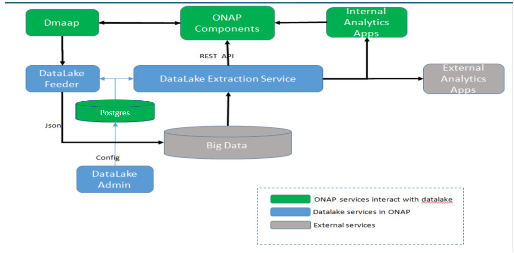

.. This work is licensed under a Creative Commons Attribution 4.0 International License.
.. http://creativecommons.org/licenses/by/4.0

DataLake-Handler MS
==============

**DataLake-Handler MS** is a software component of ONAP that can systematically persist the events from DMaaP into supported Big Data storage systems. 
It has a Admin UI, where a system administrator configures which Topics to be monitored, and to which data storage to store the data. 
It is also used to manage the settings of the storage and associated data analytics tool. 
The second part is the Feeder, which does the data transfer work and is horizontal scalable. 

DataLake-Handler MS overview and functions
------------------------------------------

.. toctree::
    :maxdepth: 1

    ./overview.rst

DataLake-Handler MS Installation Steps and Configurations
---------------------------------------------------------

.. toctree::
    :maxdepth: 1

    ./installation.rst

DataLake-Handler MS Admin UI User Guide
---------------------------------------

.. toctree::
    :maxdepth: 1

    ./userguide.rst 
