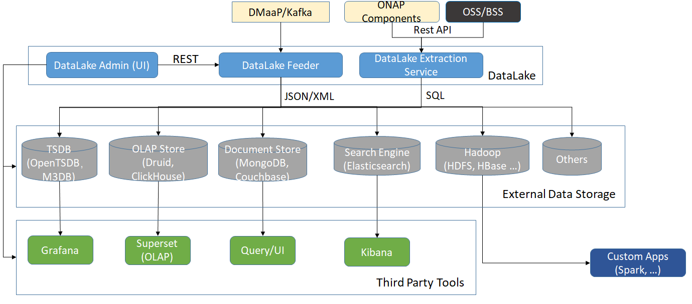

.. This work is licensed under a Creative Commons Attribution 4.0 International License.
   http://creativecommons.org/licenses/by/4.0

.. _docs_Datalake_Handler_MS:

Architecture
------------

Background
~~~~~~~~~~
There are large amount of data flowing among ONAP components, mostly via DMaaP and Web Services.
For example, all events/feed collected by DCAE collectors go through DMaaP.
DMaaP is backed by Kafka, which is a system for Publish-Subscribe,
where data is not meant to be permanent and gets deleted after certain retention period.
Kafka is not a database, means that data there is not for query.
Though some components may store processed result into their local databases, most of the raw data will eventually lost.
We should provide a systematic way to store these raw data, and even the processed result,
which will serve as the source for data analytics and machine learning, providing insight to the network operation.

Relations with Other ONAP Components
~~~~~~~~~~~~~~~~~~~~~~~~~~~~~~~~~~~~
The architecture below depicts the DataLake MS as a part of ONAP. Only the relevant interactions and components are shown.

Note that not all data storage systems in the picture are supported. In R6, the following storage are supported:
  - MongoDB
  - Couchbase
  - Elasticsearch and Kibana
  - HDFS

Depending on demands, new systems may be added to the supported list. In the following we use the term database for the storage,
even though HDFS is a file system (but with simple settings, it can be treats as a database, e.g. Hive.)

Note that once the data is stored in databases, other ONAP components and systems will directly query data from the databases,
without interacting with DataLake Handler.

Description
~~~~~~~~~~~
DataLake Handler's main function is to monitor and persist data flow through DMaaP and provide a query API for other component or external services. The databases are outside of ONAP scope,
since the data is expected to be huge, and a database may be a complicated cluster consisting of thousand of nodes.

Admin UI
~~~~~~~~
A system administrator uses DataLake Admin UI to:
  - Configure external database connections, such as host, port, login.
  - Configure which Topics to monitor, which databases to store the data for each Topic.
  - Pre-configured 3rd Party Tools dashboards and templates.

This UI tool is used to manage all the Dayalake settings stored in postgres. Here is the database schema:

Feeder
~~~~~~
Architecture

Features

   - Read data directly from Kafka for performance.
   - Support for pluggable databases. To add a new database, we only need to implement its corrosponding service.
   - Support REST API for inter-component communications. Besides managing DatAlake settings in postgres, Admin UI also use this API to start/stop Feeder, query Feeder status and statistics.
   - Use postgres to store settings.
   - Support data processing features. Before persisting data, data can be massaged in Feeder. Currently two features are implemented: Correlate Cleared Message (in org.onap.datalake.feeder.service.db.ElasticsearchService)  and Flatten JSON Array (org.onap.datalake.feeder.service.StoreService).
   - Connection to Kafka and DBs are secured

Des
~~~
Architecture

Features

   - Provide a data query API for other components to consume.
   - Integrate with Presto to do data query via sql template.

Links
~~~~~
   - DataLake Development Environment Setup https://wiki.onap.org/display/DW/DataLake+Development+Environment+Setup
   - Des description and deployment steps: https://wiki.onap.org/display/DW/DES
   - Source Code https://gerrit.onap.org/r/gitweb?p=dcaegen2/services.git;a=tree;f=components/datalake-handler;hb=HEAD
