.. This work is licensed under a
   Creative Commons Attribution 4.0 International License.
   http://creativecommons.org/licenses/by/4.0

Admin UI User Guide
-------------------

Introduction
~~~~~~~~~~~~
DataLake Admin UI aims to provide a user-friendly dashboard to easily monitor and
manage DataLake configurations for the involved components, ONAP topics, databases,
and 3rd-party tools. Please refer to the link to access the Admin UI portal
via http://datalake-admin-ui:30479

DataLake Feeder Management
**************************
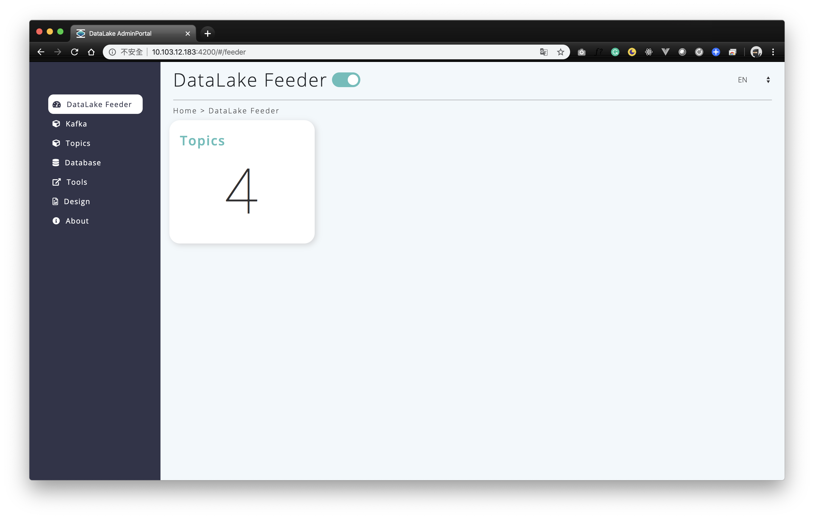

Click the "DataLake Feeder" on the menu bar, and the dashboard will show
the overview DataLake Feeder information, such as the numbers of topics.
Also, you can enable or disable DataLake Feeder process backend process
by using the toggle switch.

Kafka Management
****************
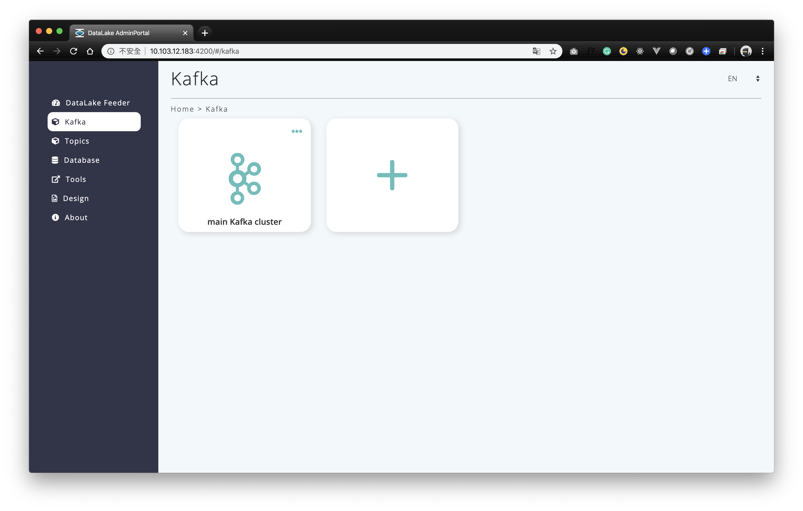

Click the "Kafka" on the menu bar, and it provides the kafka resource settings
including add, modify and delete in the page to fulfill your management demand.

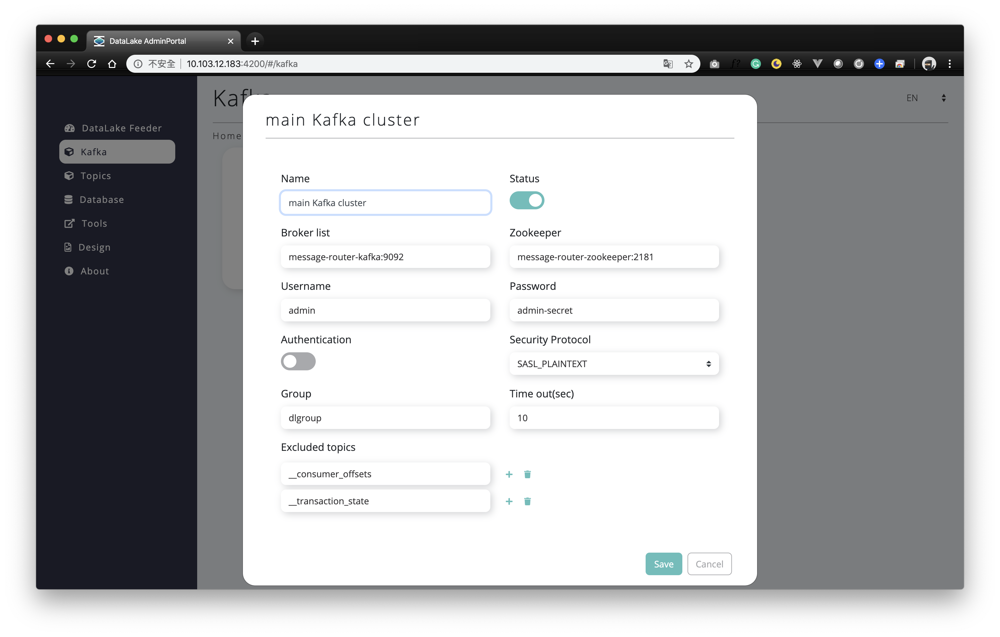

You can modify the kafka resource via clicking the card,
and click the plus button to add a new Kafka resource.
Then, you will need to fill the required information such as identifying name,
message router address and zookeeper address, and so on to build it up.

Topics Management
*****************
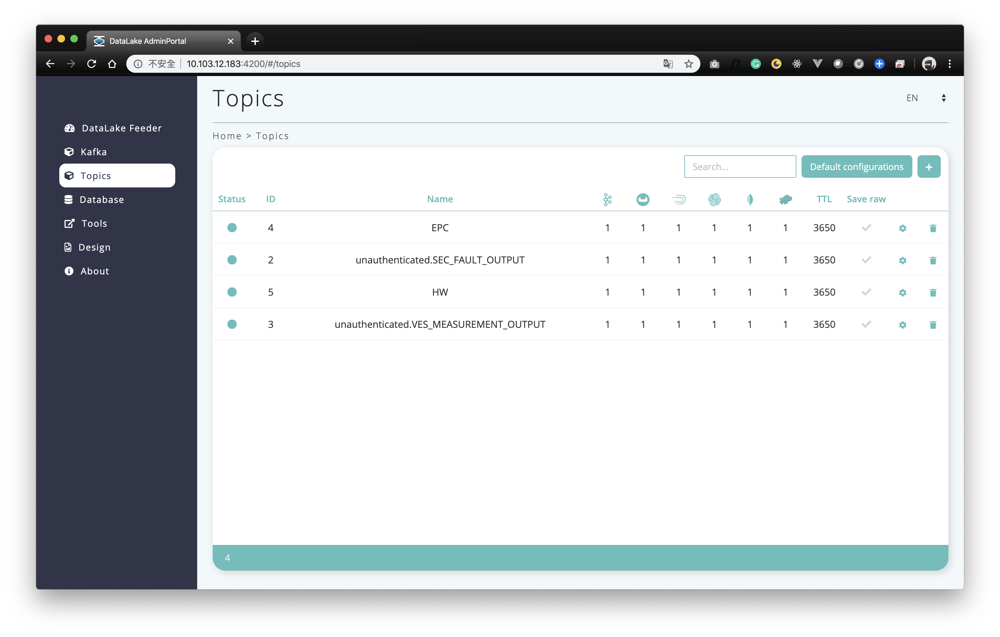
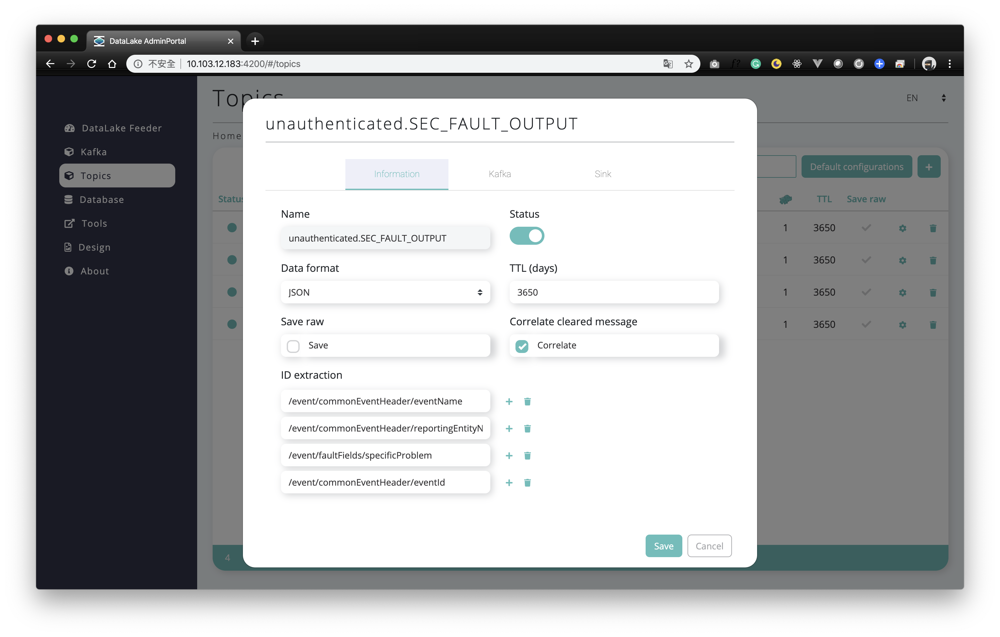
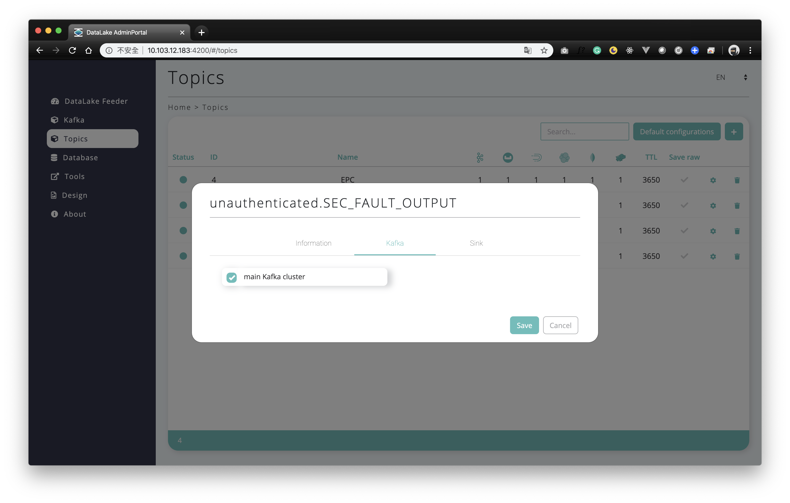
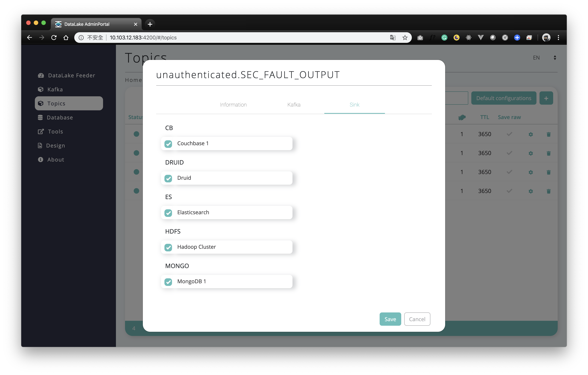

The Topic page lists down all the topics which you have been configured
by topic management. You can edit the topic setting via double click the specific row.
The setting includes DataLake feeder status - catch the topic or not,
data format, and the numbers of time to live for the topic.
And choose one or more Kafka items as topic resource
and define the databased to store topic info are necessary.

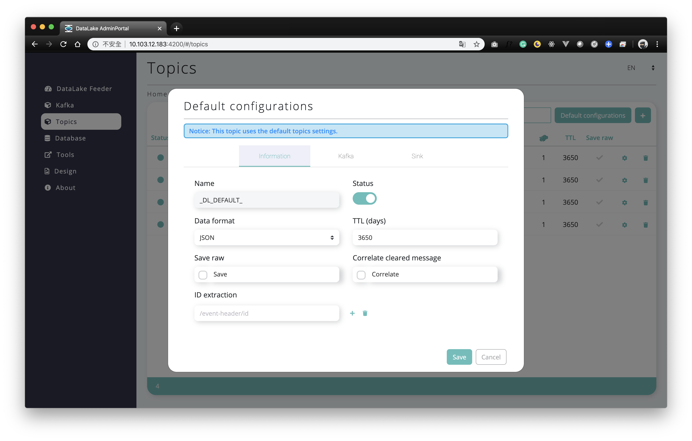

For the default configuration of Topics, you can click the "Default configurations" button
to do the setting. When you add a new topic, these configurations will be filled into the form automatically.

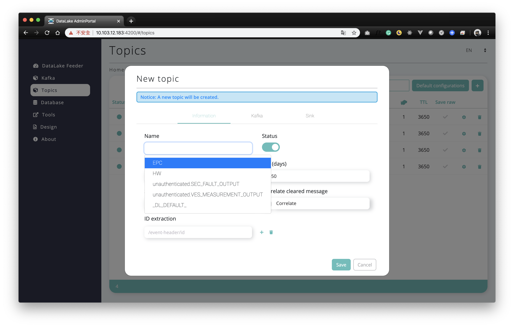

To add a new topic for the DataLake Feeder, you can click the "plus icon" button
to catch the data into the 3rd-party database.
Please be noted that only existing topics in the Kafka can be added.

Database Management
*******************
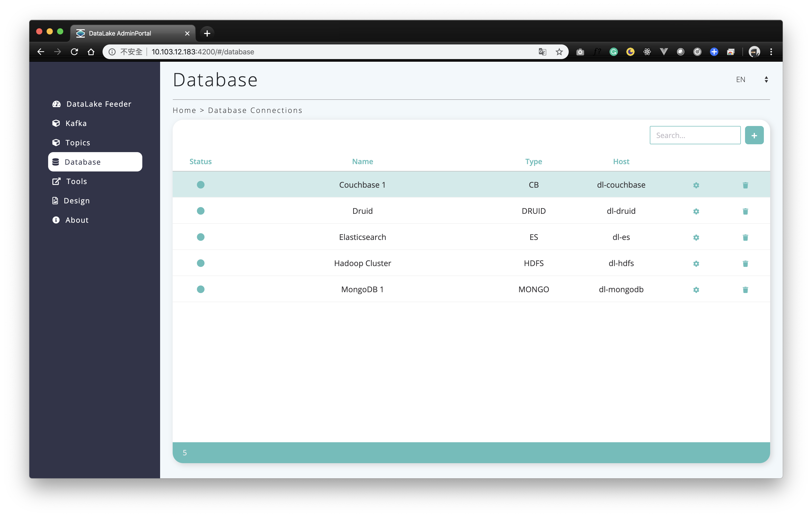
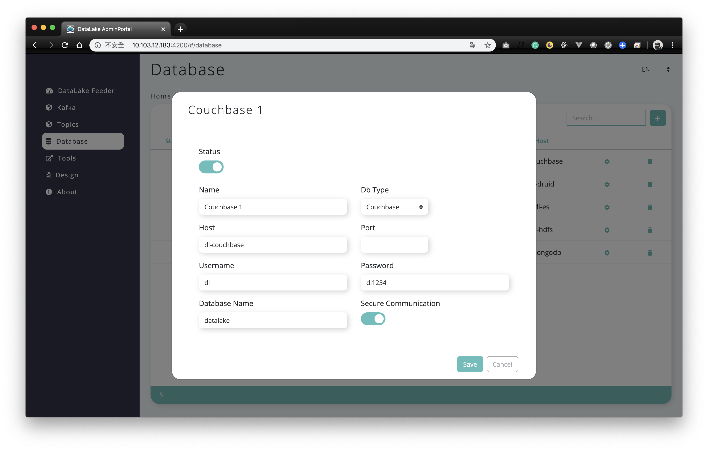

In the Database Management page, it allows you to add, modify and delete the database resources
where the message from topics will be stored.
DataLake supports a bunch of databases including Couchbase DB, Apache Druid, Elasticsearch, HDFS, and MongoDB.

3rd-Party Tools Management
**************************
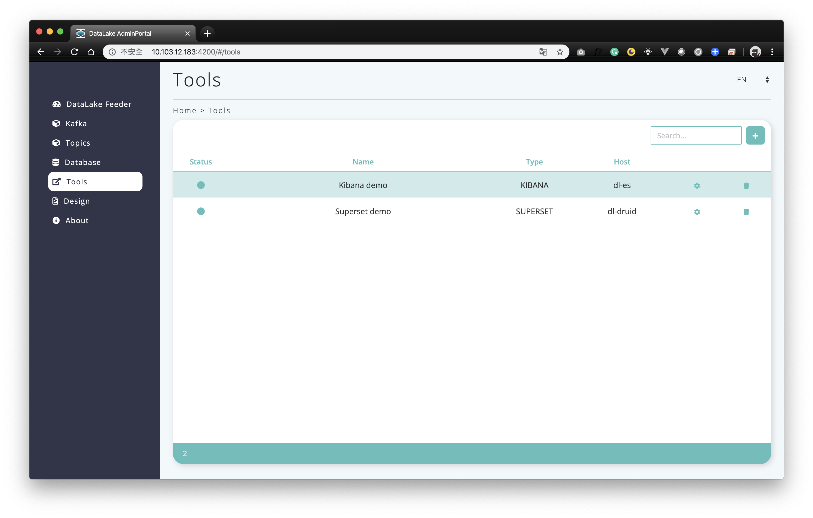

In the Tools page, it allows you to manage the resources of 3rd-party tools for data visualization.
Currently, DataLake supports two Tools which are Kibana and Apache Superset.

3rd-Party Design Tools Management
*********************************
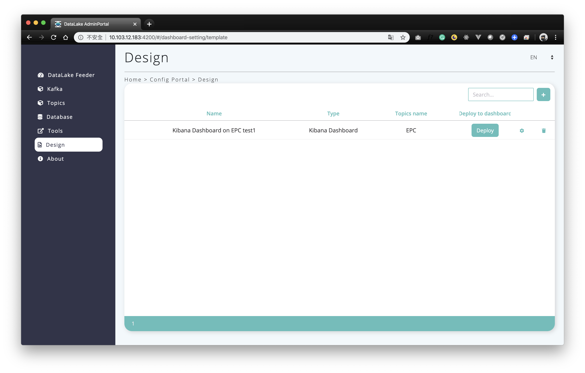
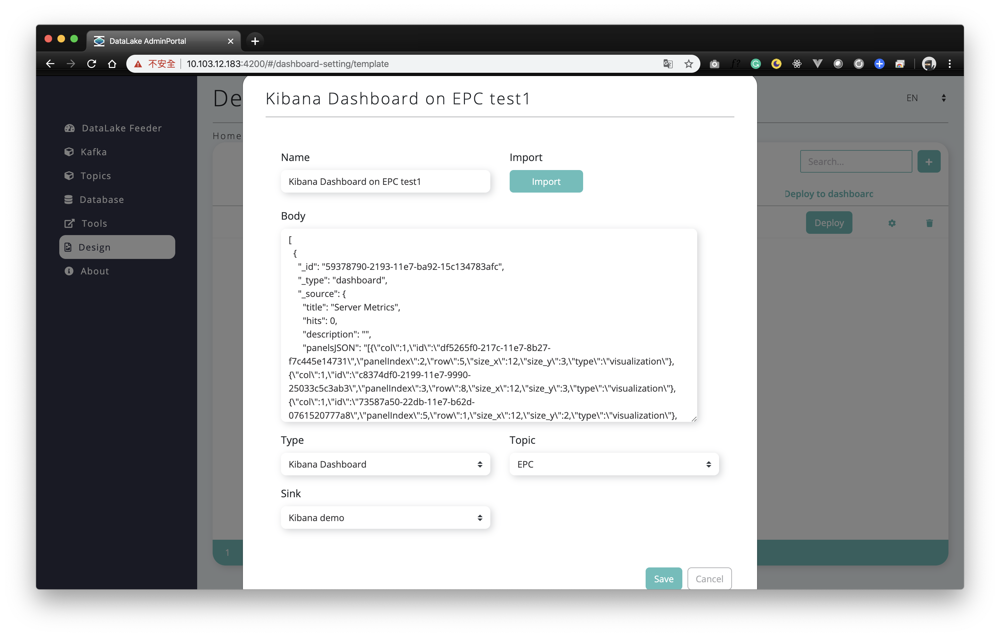

After setting up the 3rd-party tools, you can import the template as the JSON, YAML or other formats
for data exploration, data visualization and dashboarding. DataLake supports Kibana dashboarding,
Kibana searching, Kibana visualization, Elasticsearch field mapping template,
and Apache Druid Kafka indexing service.
