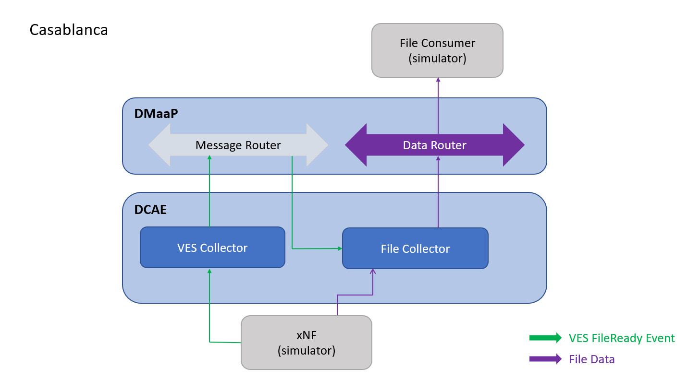

.. This work is licensed under a Creative Commons Attribution 4.0 International License.

Architecture
============

Introduction
""""""""""""
DataFile Collector (DFC) is a part of DCAEGEN2. Some information about DFC and the reasons of its implementation can be found here: `5G bulk PM wiki page`_.

.. _5G bulk PM wiki page: https://wiki.onap.org/display/DW/5G+-+Bulk+PM

DFC will handle the collection of bulk PM data flow:
    1. Subscribes to fileReady DMaaP topic
    2. Collects the file from the xNF
    3. Sends new event to DataRouter with file.

DFC is delivered as one **Docker container** which hosts application server and can be started by `docker-compose`. 
See `Delivery`_ for more information about the docker container.

.. _Delivery: ./delivery.html

Functionality
"""""""""""""

Interaction
"""""""""""
DFC will interact with the DMaaP Message Router and with the Data Router via secured protocol, using json files. 
So far, the implemented protocols are sftp and ftp(e)s.
