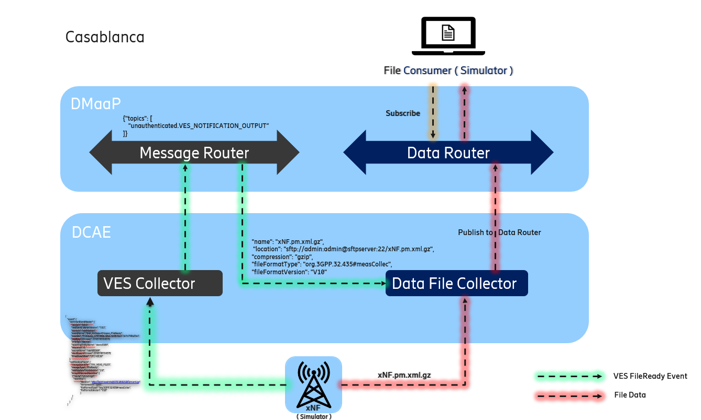

.. This work is licensed under a Creative Commons Attribution 4.0 International License.
.. http://creativecommons.org/licenses/by/4.0

Architecture
============

Introduction
""""""""""""
DataFile Collector (DFC) is a part of DCAEGEN2. Some information about DFC and the reasons of its implementation can be
found here: `5G bulk PM wiki page`_.

.. _5G bulk PM wiki page: https://wiki.onap.org/display/DW/5G+-+Bulk+PM

DFC will handle the collection of bulk PM data flow:
    1. Subscribes to fileReady DMaaP topic
    2. Collects the files from the xNF
    3. Sends the collected files and files' data to DataRouter.

DFC is delivered as one **Docker container** which hosts application server.
See `Delivery`_ for more information about the docker container.

.. _Delivery: ./delivery.html

Functionality
"""""""""""""

Interaction
"""""""""""
DFC will interact with the DMaaP Message Router, using json, and with the Data Router, using metadata in the header and
file in the body, via secured protocol.
So far, the implemented protocols to communicate with xNFs are sftp and ftp(e)s.

Retry mechanism
"""""""""""""""
DFC is designed to retry downloading and publishing of files in order to recover from temporary faults.
Each time an event is received, DFC will try to download it and publish each previously unpublished file in the event.
The event is received from the Message Router (MR), the files are fetched from a PNF and are published to Data Router
(DR).
Both fetching of a file and publishing is retried a number of times with an increasing delay between each attempt.
After a number of attempts, the DFC will log an error message and give up. Failing of processing of one file does not
affect the handling of others.

Generalized  DFC
""""""""""""""""
From version 1.2.1 and onwards, the DFC has more general use. Instead of only managing PM files, any kind of files
are handled. The 'changeIdentifier' parameter in the file ready VES event (which is reported from the PNFs) is used
to define the file type of file to be handled.