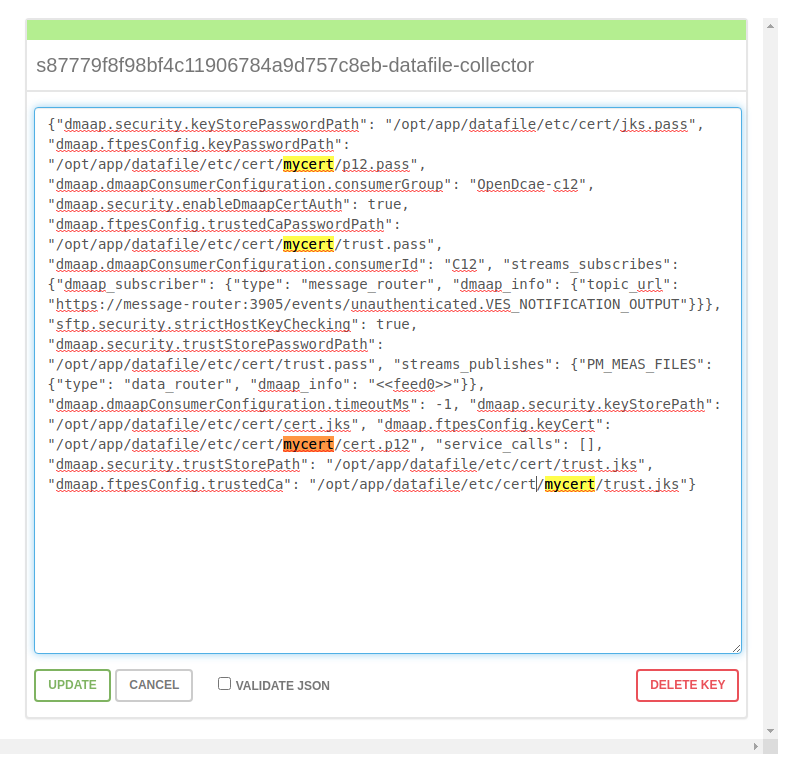

.. This work is licensed under a Creative Commons Attribution 4.0 International License.
.. http://creativecommons.org/licenses/by/4.0

Certificates (From AAF)
=======================
DCAE service components will use common certifcates generated from AAF/test instance and made available during deployment of DCAE TLS init container.

DCAE has a generalized process of certificate distribution as documented here - https://docs.onap.org/projects/onap-dcaegen2/en/latest/sections/tls_enablement.html

The updated certificates are located in https://git.onap.org/dcaegen2/deployments/tree/tls-init-container/tls

Certificates (Manual configuration of self-signed certifcates)
==============================================================

Configuration of Certificates in test environment(For FTP over TLS):

DFC supports two protocols: FTPES and SFTP.
For FTPES, it is mutual authentication with certificates.
In our test environment, we use vsftpd to simulate xNF, and we generate self-signed
keys & certificates on both vsftpd server and DFC.

1. Generate key/certificate with openssl for DFC:
-------------------------------------------------
.. code:: bash

    openssl genrsa -out dfc.key 2048
    openssl req -new -out dfc.csr -key dfc.key
    openssl x509 -req -days 365 -in dfc.csr -signkey dfc.key -out dfc.crt

2. Generate key & certificate with openssl for vsftpd:
------------------------------------------------------
.. code:: bash

   openssl genrsa -out ftp.key 2048
   openssl req -new -out ftp.csr -key ftp.key
   openssl x509 -req -days 365 -in ftp.csr -signkey ftp.key -out ftp.crt

3. Configure java keystore in DFC:
----------------------------------
We have two keystore files, one for TrustManager, one for KeyManager.

**For TrustManager:**

1. First, convert your certificate in a DER format :

 .. code:: bash

   openssl x509 -outform der -in ftp.crt -out ftp.der

2. And after copy existing keystore and password from container:

 .. code:: bash

  kubectl cp <DFC pod>:/opt/app/datafile/etc/cert/trust.jks trust.jks
  kubectl cp <DFC pod>:/opt/app/datafile/etc/cert/trust.pass trust.pass

3. Import DER certificate in the keystore :

 .. code:: bash

   keytool -import -alias ftp -keystore trust.jks -file ftp.der

**For KeyManager:**

1. Import dfc.crt and dfc.key to dfc.jks. This is a bit troublesome.

 Convert x509 Cert and Key to a pkcs12 file

 .. code:: bash

    openssl pkcs12 -export -in dfc.crt -inkey dfc.key -out cert.p12 -name dfc

 Note: Make sure you put a password on the p12 file - otherwise you'll get a null reference exception when you try to import it.

2. Create password files for cert.p12

   .. code:: bash

      printf "[your password]" > p12.pass

4. Update existing KeyStore files
---------------------------------

Copy the new trust.jks and cert.p12 and password files from local environment to the DFC container.

 .. code:: bash

    mkdir mycert
    cp cert.p12 mycert/
    cp p12.pass mycert/
    cp trust.jks mycert/
    cp trust.pass mycert/
    kubectl cp mycert/ <DFC pod>:/opt/app/datafile/etc/cert/

5. Update configuration in consul
-----------------------------------
Change path in consul:
 
 .. code:: bash
 
  dmaap.ftpesConfig.keyCert": "/opt/app/datafile/etc/cert/mycert/cert.p12
  dmaap.ftpesConfig.keyPasswordPath": "/opt/app/datafile/etc/cert/mycert/p12.pass
  dmaap.ftpesConfig.trustedCa": "/opt/app/datafile/etc/cert/mycert/trust.jks
  dmaap.ftpesConfig.trustedCaPasswordPath": "/opt/app/datafile/etc/cert/mycert/trust.pass

Consul's address: http://<worker external IP>:<Consul External Port>

 .. code:: bash
  
    kubectl -n onap get svc | grep consul

6. Configure vsftpd:
--------------------
    update /etc/vsftpd/vsftpd.conf:

  .. code-block:: bash

      rsa_cert_file=/etc/ssl/private/ftp.crt
      rsa_private_key_file=/etc/ssl/private/ftp.key
      ssl_enable=YES
      allow_anon_ssl=NO
      force_local_data_ssl=YES
      force_local_logins_ssl=YES

      ssl_tlsv1=YES
      ssl_sslv2=YES
      ssl_sslv3=YES

      require_ssl_reuse=NO
      ssl_ciphers=HIGH

      require_cert=YES
      ssl_request_cert=YES
      ca_certs_file=/home/vsftpd/myuser/dfc.crt

7. Other conditions
---------------------------------------------------------------------------
   This has been tested with vsftpd and dfc, with self-signed certificates.
   In real deployment, we should use ONAP-CA signed certificate for DFC, and vendor-CA signed certificate for xNF
