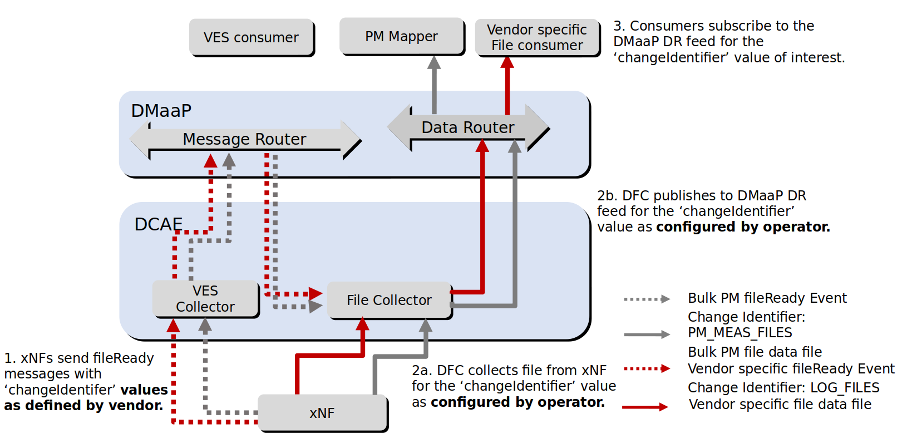

.. This work is licensed under a Creative Commons Attribution 4.0 International License.
.. http://creativecommons.org/licenses/by/4.0

.. _dfc_configuration:

=============================
Configuration and Performance
=============================
The DataFile Collector (DFC) gets fileReady messages from the Message Router (MR) sent from xNFs, via the VES Collector.
These messages contains data about files ready to get from the xNF. DFC then collects these files from the xNF and
publishes them to the DataRouter (DR) on a feed. Consumers can subscribe to the feed from DR and process the file for
its specific purpose. The connection between a file type and the feed it will be published to is the
**changeIdentifier**. DFC can handle multiple **changeIdentifier**/feed combinations, see picture below.

Configuration
^^^^^^^^^^^^^
By default, DFC handles the "PM_MEAS_FILES" change identifier and publishes these files on the "bulk_pm_feed" feed.
But it can also be configured to handle more/other change identifiers and publish them to more/other feeds. The
configuration of DFC is controlled via a blueprint.

The user can also specify which version of DFC to use.

.. code-block:: yaml

    image: onap/org.onap.dcaegen2.collectors.datafile.datafile-app-server:1.9.0

The user can also enable secure communication with the DMaaP Message Router.

.. code-block:: yaml

    dmaap.security.enableDmaapCertAuth: true

DFC can handle multiple stream identifiers. For each stream identifier/feed combination the user must provide the
** stream identifier**, **feed name**, and **feed location**.

**Note!** The **feed name** provided should be used by the consumer/s to set up the subscription to the feed. 

The **stream identifier** shall be defined as an item under the **streams_publishes** tag in the "**applicationConfig**"
section. 

.. code-block:: yaml

  :emphasize-lines: 2,6
      applicationConfig:
		  streams_publishes:
		    PM_MEAS_FILES:
		      dmaap_info:
		        publisher_id: ${DR_FILES_PUBLISHER_ID_0}
		        location: loc00
		        log_url: ${DR_LOG_URL_0}
		        publish_url: ${DR_FILES_PUBLISHER_URL_0}
		        username: ${DR_USERNAME}
		        password: ${DR_PASSWORD}
		      type: data_router
		  streams_subscribes:
		    dmaap_subscriber:
		      dmaap_info:
		        topic_url: "http://message-router:3904/events/unauthenticated.VES_NOTIFICATION_OUTPUT"
		      type: message_router

Under this tag the internal "**feed identifier**" for the feed shall also be added to get the
info about the feed substituted in by CBS (that's what the <<>> tags are for).

The **feed name** and **feed location** are defined as inputs for the user to provide in helm chart values.yaml. An example snapshot on default configuration is provided below. 

.. code-block:: yaml
 
  	# DataRouter Feed Configuration
	drFeedConfig:
	  - feedName: bulk_pm_feed
	    owner: dcaecm
	    feedVersion: "0.0"
	    asprClassification: unclassified
	    feedDescription: DFC Feed Creation
	
	# DataRouter Publisher Configuration
	drPubConfig:
	  - feedName: bulk_pm_feed
	    username: ${DR_USERNAME}
	    userpwd: ${DR_PASSWORD}
	    dcaeLocationName: loc00

.. _strict_host_checking_config:

Turn On/Off StrictHostChecking
------------------------------
**StrictHostChecking** is a SSH connection option which prevents Man in the Middle (MitM) attacks. If it is enabled, client checks HostName and public key provided by server and compares it with keys stored locally. Only if matching entry is found, SSH connection can be established.
By default in DataFile Collector this option is enabled (true) and requires to provide known_hosts list to DFC container.

**Important: DFC requires public keys in sha-rsa KeyAlgorithm** 

**Known_hosts file** is a list in following format:

.. code-block:: bash

  <HostName/HostIP> <KeyAlgorithms> <Public Key>

e.g: 

.. code-block:: bash

  172.17.0.3 ssh-rsa AAAAB3NzaC1yc2EAAAADAQABAAACAQDRibxPenQC//2hzTuscdQDUA7P3gB9k4E8IgwCJxZM8YrJ2vqHomN8boByubebvo0L8+DWqzAtjy0nvgzsoEme9Y3lLWZ/2g9stlsOurwm+nFmWn/RPnwjqsAGNQjukV8C9D82rPMOYRES6qSGactFw4i8ZWLH8pmuJ3js1jb91HSlwr4zbZZd2XPKHk3nudyh8/Mwf3rndCU5FSnzjpBo55m48nsl2M1Tb6Xj1R0jQc5LWN0fsbrm5m+szsk4ccgHw6Vj9dr0Jh4EaIpNwA68k4LzrWb/N20bW8NzUsyDSQK8oEo1dvsiw8G9/AogBjQu9N4bqKWcrk5DOLCZHiCTSbbvdMWAMHXBdxEt9GZ0V53Fzwm8fI2EmIHdLhI4BWKZajumsfHRnd6UUxxna9ySt6qxVYZTyrPvfOFR3hRxVaxHL3EXplGeHT8fnoj+viai+TeSDdjMNwqU4MrngzrNKNLBHIl705uASpHUaRYQxUfWw/zgKeYlIbH+aGgE+4Q1vnh10Y35pATePRZgBIu+h2KsYBAtrP88LqW562OQ6T7VkfoAYwOjx9WV3/y5qonsStPhhzmJHDF22oBh5E5tZQxRcIlQF+5kHmXnFRUZtWshFnQATBh3yhOzJbh66CXn7aPj5Kl8TuuSN48zuI2lulVVqcv7GmTS0tWNpbxpzw==

HostName could also be hashed, e.g:

.. code-block:: bash

  |1|FwSOxXYeJyZMAQM3jREjLSIcxRw=|o/b+CHEeHuED7WZS6sb3Y1IyHjk= ssh-rsa AAAAB3NzaC1yc2EAAAADAQABAAACAQDRibxPenQC//2hzTuscdQDUA7P3gB9k4E8IgwCJxZM8YrJ2vqHomN8boByubebvo0L8+DWqzAtjy0nvgzsoEme9Y3lLWZ/2g9stlsOurwm+nFmWn/RPnwjqsAGNQjukV8C9D82rPMOYRES6qSGactFw4i8ZWLH8pmuJ3js1jb91HSlwr4zbZZd2XPKHk3nudyh8/Mwf3rndCU5FSnzjpBo55m48nsl2M1Tb6Xj1R0jQc5LWN0fsbrm5m+szsk4ccgHw6Vj9dr0Jh4EaIpNwA68k4LzrWb/N20bW8NzUsyDSQK8oEo1dvsiw8G9/AogBjQu9N4bqKWcrk5DOLCZHiCTSbbvdMWAMHXBdxEt9GZ0V53Fzwm8fI2EmIHdLhI4BWKZajumsfHRnd6UUxxna9ySt6qxVYZTyrPvfOFR3hRxVaxHL3EXplGeHT8fnoj+viai+TeSDdjMNwqU4MrngzrNKNLBHIl705uASpHUaRYQxUfWw/zgKeYlIbH+aGgE+4Q1vnh10Y35pATePRZgBIu+h2KsYBAtrP88LqW562OQ6T7VkfoAYwOjx9WV3/y5qonsStPhhzmJHDF22oBh5E5tZQxRcIlQF+5kHmXnFRUZtWshFnQATBh3yhOzJbh66CXn7aPj5Kl8TuuSN48zuI2lulVVqcv7GmTS0tWNpbxpzw==

To provide known_hosts list to DFC, execute following steps:

1. Create file called known_hosts with desired entries.

2. Mount file using Kubernetes Config Map.

.. code-block:: bash

  kubectl -n <ONAP NAMESPACE> create cm <config map name> --from-file <path to known_hosts file>

e.g:

.. code-block:: bash

  kubectl -n onap create cm onap-dcae-dfc-known-hosts --from-file /home/ubuntu/.ssh/known_hosts

3. Mount newly created Config Map as Volume to DFC by editing DFC deployment. **DFC deployment contains 3 containers, pay attention to mount the file to the appropriate container.**

.. code-block:: yaml
  
  ...
  kind: Deployment
  metadata:
  ...
  spec:
    ...
    template:
      ...
      spec:
        containers:
        - image: <DFC image>
          ...
          volumeMounts:
            ...
          - mountPath: /home/datafile/.ssh/
            name: onap-dcae-dfc-known-hosts
            ...
        volumes:
        ...
        - configMap:
            name: <config map name, same as in step 1, e.g. onap-dcae-dfc-known-hosts>
          name: onap-dcae-dfc-known-hosts
      ...

Known_hosts file path can be controlled by Environment Variable *KNOWN_HOSTS_FILE_PATH*. Full (absolute) path has to be provided. Sample deployment with changed known_hosts file path can be seen below.

.. code-block:: yaml
  
  ...
  kind: Deployment
  metadata:
  ...
  spec:
    ...
    template:
      ...
      spec:
        containers:
        - image: <DFC image>
          envs: 
            - name: KNOWN_HOSTS_FILE_PATH
              value: /home/datafile/.ssh/new/path/<known_hosts file name, e.g. my_custom_keys>
          ...
          volumeMounts:
            ...
          - mountPath: /home/datafile/.ssh/new/path
            name: onap-dcae-dfc-known-hosts
            ...
        volumes:
        ...
        - configMap:
            name: <config map name, same as in step 1, e.g. onap-dcae-dfc-known-hosts>
          name: onap-dcae-dfc-known-hosts
      ...

To change mounted known_hosts list, edit existing Config Map or delete and create it again. **The DFC container may refresh changes with a delay.** Pod, nor container restart is NOT required.

To edit Config Map execute:

.. code-block:: bash

  kubectl -n <ONAP NAMESPACE> edit cm <config map name>

e.g:

.. code-block:: bash

   kubectl -n onap edit cm onap-dcae-dfc-known-hosts

To delete and create again Config Map execute: 

.. code-block:: bash

  kubectl -n <ONAP NAMESPACE> delete cm <config map name>
  kubectl -n <ONAP NAMESPACE> create cm <config map name> --from-file <path to known_hosts file>

e.g:

.. code-block:: bash

  kubectl -n onap delete cm onap-dcae-dfc-known-hosts
  kubectl -n onap create cm onap-dcae-dfc-known-hosts --from-file /home/ubuntu/.ssh/known_hosts

To turn off StrictHostChecking, set below option to false. It could be changed in DCAE Config Binding Service (CBS).

**WARNING: such operation is not recommended as it decreases DFC security and exposes DFC to MitM attacks.**

.. code-block:: bash

  "sftp.security.strictHostKeyChecking": false

Disable TLS connection
----------------------
The TLS connection in the external interface is enabled by default. To disable TLS, use the following application property:

.. code-block:: bash

  "dmaap.certificateConfig.enableCertAuth": false

Performance
^^^^^^^^^^^

To see the performance of DFC, see "`Datafile Collector (DFC) performance baseline results`_".

.. _Datafile Collector (DFC) performance baseline results: https://wiki.onap.org/display/DW/Datafile+Collector+%28DFC%29+performance+baseline+results
