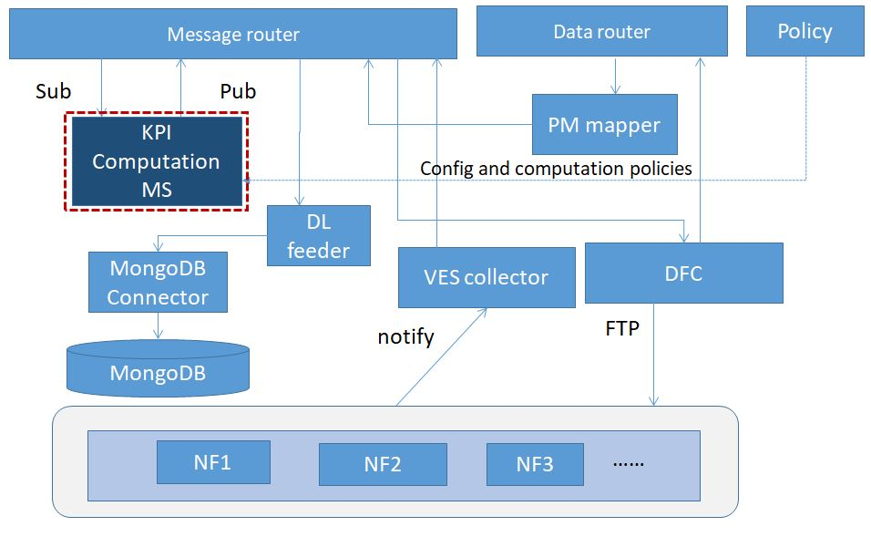

.. This work is licensed under a Creative Commons Attribution 4.0
   International License. http://creativecommons.org/licenses/by/4.0

.. _docs_kpi_computation_ms_overview:

Introduction
""""""""""""
Kpi Computation MS is a part of DCAEGEN2. Some information about this ms can be found here: `KPI-Computation ms`_.

.. _KPI-Computation ms wiki page: https://wiki.onap.org/display/DW/DCAE+R8+KPI-Computation+ms

Architecture
------------
The internal architecture of Kpi Computation MS is shown below.

Functionality
"""""""""""""
Kpi Computation MS will do calculation based on the PM data that is VES format. publish KPI result as VES events on a DMaaP Message Router topic for consumers that prefer such data in VES format.
Kpi Computation MS receives PM data by subscribing to a Message Router topic.

Flows:
1. KPI Computation MS will get PM data VES format from DMaaP
2. Other modules (e.g., SO/OOF/Slice Analysis MS) can also request KPI-MS for KPI calculation (Future scope beyond H-release).
3. KPI Computation MS will support for periodical KPI Computation. Period may be specified by a requestor optionally, if nothing is specified, KPI computation MS will continue computation until an explicit stop trigger is received.
4. The KPI result which genertate by kpi computation will be published to DMaaP.

Interaction
"""""""""""
Kpi Computation MS interacts with the Config Binding Service to get configuration information.