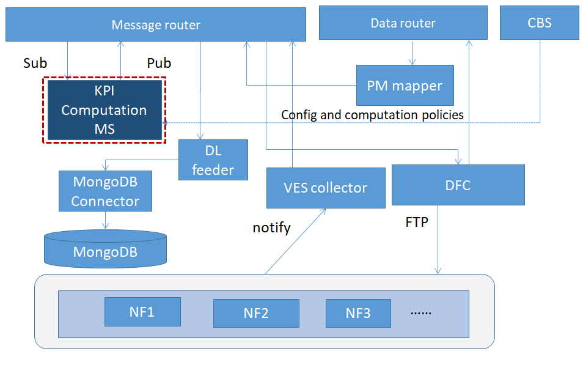

.. This work is licensed under a Creative Commons Attribution 4.0 International License.
   http://creativecommons.org/licenses/by/4.0

.. _docs_kpi_computation_ms_overview:

Introduction
""""""""""""

**Kpi Computation MS** is a software component of ONAP that does calucaltion in accordance with the formula defined dynamically. The service include the features:
    Subscribe original PM data from DMaaP.
    Do KPI computation based on KPI formula which can be got from config policies and the formula can be configued dynamically.
    Publish KPI results on DMaaP.
    Receive request for specific KPI computation (future scope) on specific 'objects' (e.g., S-NSSAI, Service).

Architecture
------------
The internal architecture of Kpi Computation MS is shown below.

Functionality
"""""""""""""
Kpi Computation MS will do calculation based on the PM data that is VES format. publish KPI result as VES events on a DMaaP Message Router topic for consumers that prefer such data in VES format.
Kpi Computation MS receives PM data by subscribing to a Message Router topic.

Flows:
1. KPI Computation MS will get PM data VES format from DMaaP
2. Other modules (e.g., SO/OOF/Slice Analysis MS) can also request KPI-MS for KPI calculation (Future scope beyond H-release).
3. KPI Computation MS will support for periodical KPI Computation. Period may be specified by a requestor optionally, if nothing is specified, KPI computation MS will continue computation until an explicit stop trigger is received.
4. The KPI result which genertate by kpi computation will be published to DMaaP.

Verification
""""""""""""
Publish a file to the PM-Mapper using the following example curl:
    curl -k -X PUT https://dcae-pm-mapper:8443/delivery/<filename> -H 'X-DMAAP-DR-META:{"productName": "AcmeNode","vendorName": "Acme","lastEpochMicrosec": "1538478000000","sourceName": "oteNB5309","startEpochMicrosec": "1538478900000","timeZoneOffset": "UTC+05:00","location": "ftpes://127.0.0.1:22/ftp/rop/A20161224.1045-1100.bin.gz","compression": "gzip","fileFormatType": "org.3GPP.32.435#measCollec","fileFormatVersion": "V9"}' -H "Content-Type:application/xml" --data-binary @<filename> -H 'X-ONAP-RequestID: 12345' -H 'X-DMAAP-DR-PUBLISH-ID: 12345'

Example type A file:

.. code-block:: xml

    <?xml version="1.0" encoding="utf-8"?>
    <measCollecFile xmlns="http://www.3gpp.org/ftp/specs/archive/32_series/32.435#measCollec">
      <fileHeader dnPrefix="www.google.com" vendorName="CMCC" fileFormatVersion="32.435 V10.0">
        <fileSender localDn="some sender name"/>
        <measCollec beginTime="2020-06-02T12:00:00Z"/>
      </fileHeader>
      <measData>
        <managedElement swVersion="r0.1" localDn="UPFMeasurement"/>
        <measInfo measInfoId="UPFFunction0">
          <job jobId="job10"/>
          <granPeriod endTime="2020-06-02T12:15:00Z" duration="PT900S"/>
          <repPeriod duration="PT900S"/>
          <measType p="1">GTP.InDataOctN3UPF.08_010101</measType>
          <measType p="2">GTP.OutDataOctN3UPF.08_010101</measType>
          <measValue measObjLdn="some measObjLdn">
            <r p="1">10</r>
            <r p="2">20</r>
            <suspect>false</suspect>
          </measValue>
        </measInfo>
        <measInfo measInfoId="UPFFunction1">
          <job jobId="job10"/>
          <granPeriod endTime="2020-06-02T12:15:00Z" duration="PT900S"/>
          <repPeriod duration="PT900S"/>
          <measType p="1">GTP.InDataOctN3UPF.08_010101</measType>
          <measType p="2">GTP.OutDataOctN3UPF.08_010101</measType>
          <measValue measObjLdn="some measObjLdn">
            <r p="1">30</r>
            <r p="2">40</r>
            <suspect>false</suspect>
          </measValue>
        </measInfo>
      </measData>
      <fileFooter>
        <measCollec endTime="2020-06-02T12:15:00Z"/>
      </fileFooter>
    </measCollecFile>

Curl the topic on Message Router to retrieve the published event:

    curl -k https://message-router:3905/events/unauthenticated.DCAE_KPI_OUTPUT/$ConsumerGroup/$ID

Example message output:

.. code-block:: json

    {
      "event": {
        "commonEventHeader": {
          "domain": "perf3gpp",
          "eventId": "432fa910-feed-4c64-9532-bd63201080d8",
          "eventName": "perf3gpp_AcmeNode-Acme_pmMeasResult",
          "lastEpochMicrosec": 1591100100000,
          "priority": "Normal",
          "reportingEntityName": "",
          "sequence": 0,
          "sourceName": "oteNB5309",
          "startEpochMicrosec": 1591099200000,
          "version": 4.0,
          "vesEventListenerVersion": "7.1",
          "timeZoneOffset": "UTC+05:00"
        },
        "perf3gppFields": {
          "perf3gppFieldsVersion": "1.0",
          "measDataCollection": {
            "granularityPeriod": 1591100100000,
            "measuredEntityUserName": "",
            "measuredEntityDn": "UPFMeasurement",
            "measuredEntitySoftwareVersion": "r0.1",
            "measInfoList": [{
              "measInfoId": {
                "sMeasTypesList": "SLICE"
              },
              "measTypes": {
                "sMeasTypesList": ["UpstreamThr08_010101"]
              },
              "measValuesList": [{
                "suspectFlag": false,
                "measResults": [{
                  "p": 1,
                  "sValue": "40"
                }]
              }]
            }]
          }
        }
      }
    }

Interaction
"""""""""""
Kpi Computation MS interacts with the Config Binding Service to get configuration information.
