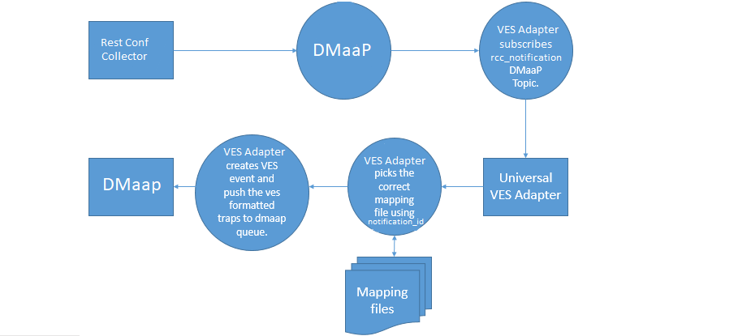
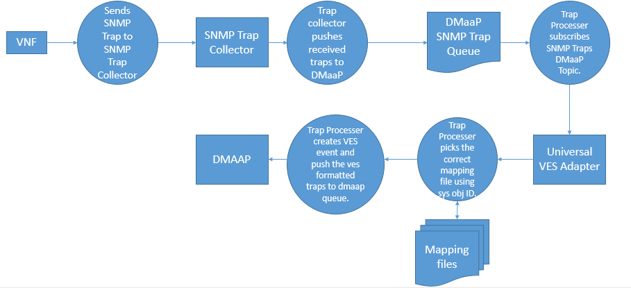

.. This work is licensed under a Creative Commons Attribution 4.0 International License.
.. http://creativecommons.org/licenses/by/4.0
.. Copyright 2018-2019 Tech Mahindra Ltd.

Flow for converting RestConf Collector notification
===================================================
[1] RestConf Collector generates rcc-notication in JSON format and publishes it on DMaaP topic **unathenticated.DCAE_RCC_OUTPUT**
[2] The Universal VES Adapter(UVA) microservice has subscribed to this DMaaP topic.
[3] On receiving an event from DMaaP, the adapter uses the corresponding mapping file and converts the received notification into the VES event. It uses the notification-id from the received notification to find the required mapping file.
[4] Those notifications for which no mapping file is identified, a default mapping file is used with generic mappings to create the VES event.
[5] The VES formatted Event will be then published on DMaaP topic **unauthenticated.VES_PNFREG_OUTPUT**.

Flow for converting SNMP Collector notification
===============================================

[1] VNF submits SNMP traps to the SNMP collector.
[2] Collector converts the trap into JSON format and publishes it on DMaaP topic **unauthenticated.ONAP-COLLECTOR-SNMPTRAP**
[3] The Universal VES Adapter(UVA) microservice has subscribed to this DMaaP topic.
[4] On receiving an event from DMaaP, the adapter uses the corresponding mapping file and converts the received event into the VES event. It uses the enterprise ID from the received event to find the required mapping file.
[5] Those SNMP Traps for which no mapping file is identified, a default mapping file is used with generic mappings to create the VES event.
[6] The VES formatted Event will be then published on DMaaP topic **unauthenticated.SEC_FAULT_OUTPUT**.

