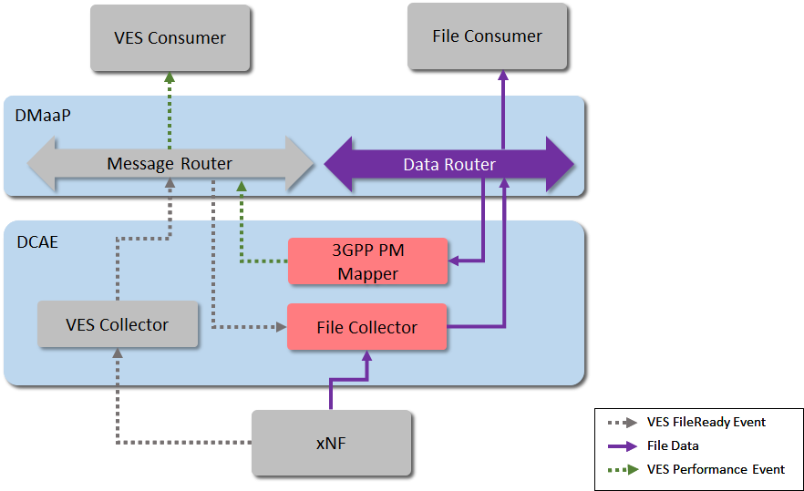
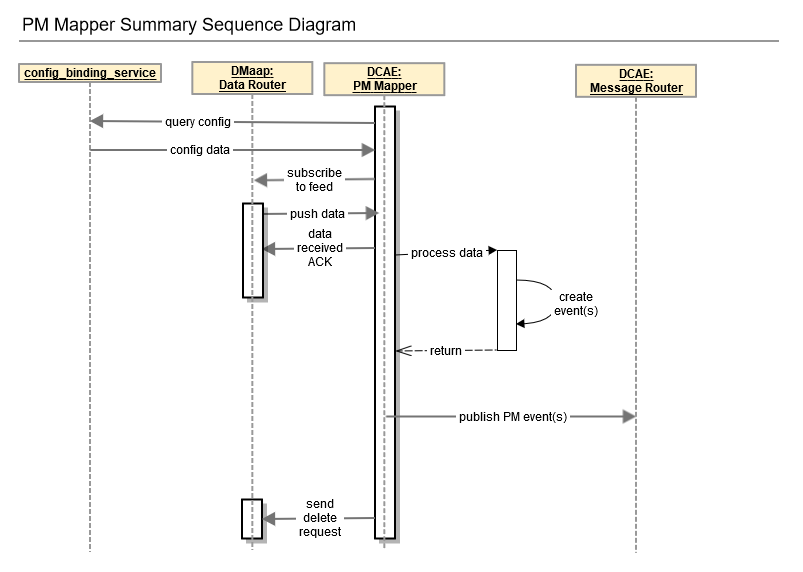

.. This work is licensed under a Creative Commons Attribution 4.0 International License.
.. http://creativecommons.org/licenses/by/4.0

Architecture
============

Introduction
""""""""""""
3GPP PM Mapper is a part of DCAEGEN2. Some information about PM Mapper can be found here: `5G bulk PM wiki page`_.

.. _5G bulk PM wiki page: https://wiki.onap.org/display/DW/5G+-+Bulk+PM

3GPP PM Mapper which will process 3GPP PM XML files to produce VES PM Events.

.. _Delivery: ./delivery.html

Functionality
"""""""""""""
3GPP formatted measurement data and for consumers that prefer such data in VES format, 3GPP PM Mapper micro-service will extract selected measurements from a 3GPP XML file and publish them as VES events on a DMaaP Message Router topic.
The mapper receives the files by subscribing to a Data Router feed.

Interaction
"""""""""""
PM Mapper will interact with the DMaaP Bus Controller for Subscribing to Data Router feeds and publishing to Message Router.
