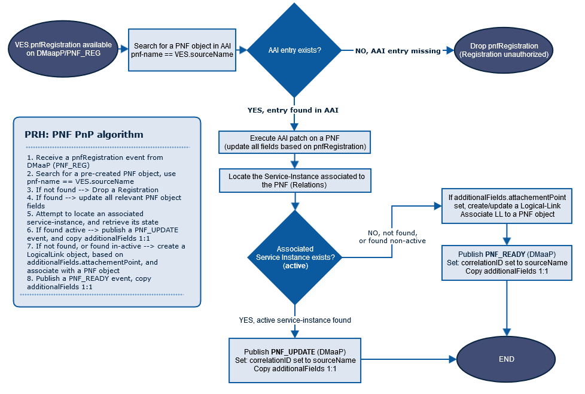

.. This work is licensed under a Creative Commons Attribution 4.0 International License.
.. http://creativecommons.org/licenses/by/4.0

PRH Architecture
===================

**PRH** is a new DCAE micro-service which participates in the Physical Network Function Plug and Play (PNF PnP)
procedure. PNF PnP is used to register PNF when it comes online.

PRH Processing Flow
===================

