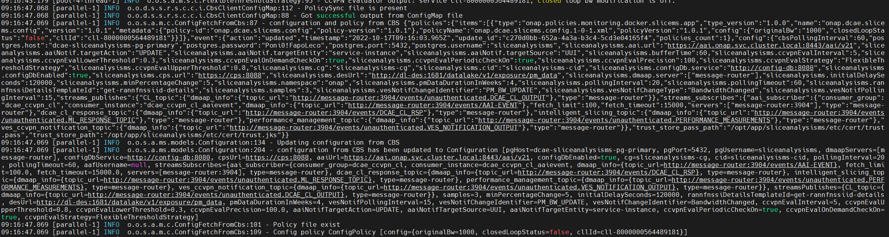

.. This work is licensed under a Creative Commons Attribution 4.0 International License.
.. http://creativecommons.org/licenses/by/4.0

Runtime Configuration
=====================
The Slice Analysis MS provides an easy way to receive runtime configurations through Policy, another ONAP module. Runtime configuration is initially developed to meet the requirements of the ONAP Kohn release IBN use case. If you want to use this function, please also refer to https://wiki.onap.org/pages/viewpage.action?pageId=138872665

This page will explain how runtime configuration works, and how to utilize it. Hopefully this page can help you develop your own runtime configuration to meet your own requirements.

Architecture
------------
The architecture below depicts how runtime configuration works in the Slice MS as a part of DCAE.

Slice Analysis MS provides runtime configuration feature since Kohn Version.

For the Slice Analysis MS, there is a CBS thread running that will continually fetch the latest policies from the XCAML PDP engine. So if you want to pass runtime configuration, you can format your configuration contents in the form of an XCAML policy, then push it into the XCAML PDP engine. The Slice Analysis MS will get updated within seconds.

Prerequisite
~~~~~~~~~~~~
- Using OOM to pull up ONAP environment

Deployment
~~~~~~~~~~
- Enable "dcae-slice-analysis-ms" in oom /oom/kubernetes/dcaegen2-services/values.yaml.

     1. Enable dcae-slice-analysis-ms in values.yaml. When using the helm chart of OOM to pull up the whole onap environment, dcae-slice-analysis-ms will be automatically installed.

            .. code-block:: bash

               dcae-slice-analysis-ms:
                 enabled: true
                 logConfigMapNamePrefix: '{{ include "common.release" . }}-dcaegen2-services'

- Original params set in oom /oom/kubernetes/dcaegen2-services/components/dcae-slice-analysis-ms/values.yaml have to be modified.

     1. Uncomment the following lines. "duration" is the interval of a thread in policy sync container to retrieve latest policy from XCAML PDP engine. The unit of "duration" is seconds.

             .. code-block:: bash

                dcaePolicySyncImage: onap/org.onap.dcaegen2.deployments.dcae-services-policy-sync:1.0.1
                policies:
                  duration:
                         10
                  policyID: |
                    '["onap.dcae.slicems.config"]'

- If the ONAP environment has already been deployed previously, just uninstall and reinstall DCAEGEN2-SERVICES via oom helm charts after the previous 2 modifications.

Workflow
~~~~~~~~

To realize the runtime configuration feature for SliceMS, similarly to SON-Handler, we add a "policy sync" container for Slice MS. There are 3 containers in Slice MS, "dcae-slice-analysis-ms", "dcae-slice-analysis-ms-filebeat" and "policy-sync".

Policy Sync container keeps retrieving latest data (policies) from XCAML PDP Engine through a thread. The interval of the thread is set /oom/kubernetes/dcaegen2-services/components/dcae-slice-analysis-ms/values.yaml. Like in the above example, duration is set to 10, which means the thread will retrieve data from XCAML PDP every 10 seconds.

So if someone wants to pass new configurations to the Slice Analysis MS, do the following steps:
    Prerequisite: Create the policy type. This step only needs to be done once when you deploy the ONAP environment, except for when you redeploy the POLICY module (which causes the policy type to not exist). Then the policy type needs to be recreated. Currently only 1 policy type is supported, which will be attached here.
    1. Undeploy the current policy if exists
    2. Delete the current policy if exists
    3. Create a new policy
    4. Deploy the new policy

Steps to Use Runtime Configuration
~~~~~~~~~~~~~~~~~~~~~~~~~~~~~~~~~~
1. Create the policy type
    command

    .. code-block:: bash

       curl -k -v --user 'username:password' -X POST "https://policyApiIp:6969/policy/api/v1/policytypes" -H "Content-Type:application/json" -H "Accept: application/json" -d @policy_type.json

    request body: policy_type.json

    .. code-block:: bash

       {
          "tosca_definitions_version": "tosca_simple_yaml_1_1_0",
          "policy_types": {
            "onap.policies.monitoring.docker.slicems.app": {
              "version": "1.0.0",
              "description": "Slice MS Policy Type",
              "derived_from": "onap.policies.Monitoring:1.0.0",
                "description": "Runtime Configuration of Slice MS",
              "properties": {
                "cllId": {
                  "type": "string",
                  "required": true,
                  "description": "cll id"
                },
                "closedLoopStatus": {
                  "type": "string",
                  "required": true,
                  "description": "whether provide closed loop assurance for one cll"
                },
                "originalBw": {
                  "type": "string",
                  "required": true,
                  "description": "original bw of one cll"
                }
              }
            }
          }
        }

2. Create the policy
    command: {versionNumber} here needs to match the "policies"-"version" in the request body "slicems_config_policy.json"

    .. code-block:: bash

       curl --silent -k -w %{http_code}  --user 'username:password' -X POST "https://policyApiIp:6969/policy/api/v1/policytypes/onap.policies.monitoring.docker.slicems.app/versions/{versionNumber}}/policies" -H "Accept: application/json" -H "Content-Type: application/json" -d @slicems_config_policy.json

    request body: slicems_config_policy.json

    .. code-block:: bash

        {
          "tosca_definitions_version": "tosca_simple_yaml_1_1_0",
          "topology_template": {
            "policies": [
              {
                "onap.dcae.slicems.config": {
                  "type": "onap.policies.monitoring.docker.slicems.app",
                  "type_version": "1.0.0",
                  "version": "1.0.0",
                  "metadata": {
                    "policy-id": "onap.dcae.slicems.config",
                    "policy-version": 1
                  },
                  "properties": {
                    "originalBw": "1000",
                    "closedLoopStatus": "false",
                    "cllId": "cll-8000000564489181"
                  }
                }
              }
            ]
          }
        }

3. Deploy the policy
    command

    .. code-block:: bash

    curl -w %{http_code} --silent -k --user 'username:password' -X POST "https://policyPAPApi:6969/policy/pap/v1/pdps/policies" -H "Accept: application/json" -H "Content-Type: application/json" -d @push.json

    request body: push.json

.. code-block:: bash

    {
      "policies": [
        {
          "policy-id": "onap.dcae.slicems.config",
           "policy-version": 1
        }
      ]
    }

4. Verify in SliceMS that configurations received

How to Develop Your Own Runtime Configuration
~~~~~~~~~~~~~~~~~~~~~~~~~~~~~~~~~~~~~~~~~~~~~
1. Create your own policy type
2. Create a policy based on your policy type
3. Deploy the policy
4. Verify in SliceMS that configurations received. (Needs to write code in SliceMS to deal with your configurations in advance.)
