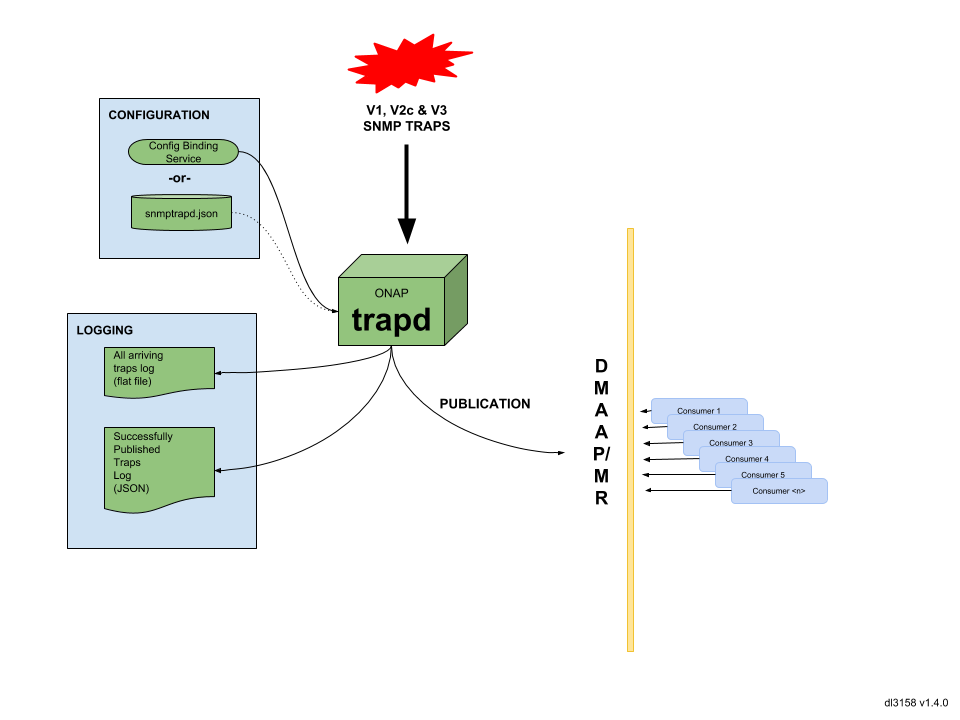

.. This work is licensed under a Creative Commons Attribution 4.0 International License.
.. http://creativecommons.org/licenses/by/4.0

Architecture
============

The ONAP **SNMPTRAP** project (referred to as **"trapd"** - as in "trap daemon" throughout
this documentation) is a network facing ONAP platform component.

The simple network management protocol (or "SNMP", for short) is a pervasive
communication protocol standard used between managed devices and a management system.
It is used to relay data that can be valuable in the operation, fault identification
and planning processes of all networks.

SNMP utilizes a message called a "trap" to inform SNMP managers of abnormal
or changed conditions on a resource that is running a SNMP agent.  These
agents can run on physical or virtual resources (no difference in reporting)
and can notify on anything from hardware states, resource utilization,
software processes or anything else specific to the agent's environment.

Capabilities
------------

**trapd** receives SNMP traps and publishes them to a  message router (DMAAP/MR)
instance based on attributes obtained from configuration binding service ("CBS").

Interactions
------------

Traps are published to DMAAP/MR in a json format.  Once traps are published
to a DMAAP/MR instance, they are available to consumers that are
subscribed to the topic they were published to.

Usage Scenarios
---------------

**trapd** runs in a docker container based on python 3.6.  Running
an instance of **trapd** will result in arriving traps being published
to the topic specified by config binding services.  If CBS is not present,
SNMPTRAP will look for a JSON configuration file specified via the
environment variable CBS_SIM_JSON at startup (see "CONFIGURATION" link for details).
