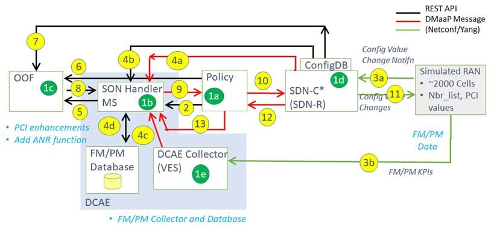

.. This work is licensed under a Creative Commons Attribution 4.0 International License.
.. http://creativecommons.org/licenses/by/4.0

SON-Handler MS
==============

.. Add or remove sections below as appropriate for the platform component.

**SON-Handler MS** is introduced in ONAP for implementing the pre-processing and co-ordination actions of various RAN SON use cases.
PCI optimization and centralized ANR updates are handled in Frankfurt release.

OOF, DCAE - SON Handler MS and VES Collector, Policy, DMaaP and SDN-C (SDN-R) are involved in the realization of this use case.

SON-Handler MS overview and functions
-------------------------------------

.. toctree::
    :maxdepth: 1

    ./son_handler_overview.rst

SON-Handler MS Installation Steps, Configurations, Troubleshooting Tips and Logging
-----------------------------------------------------------------------------------

.. toctree::
    :maxdepth: 1

    ./installation-helm.rst
    ./son_handler_troubleshooting.rst
