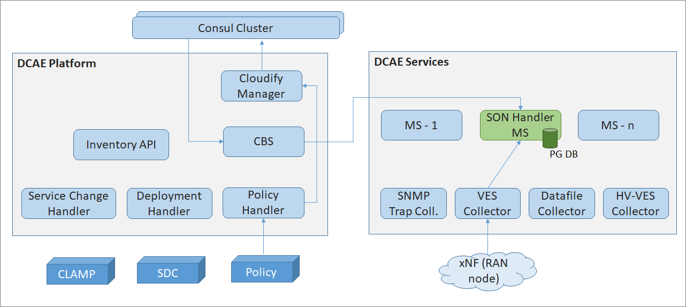
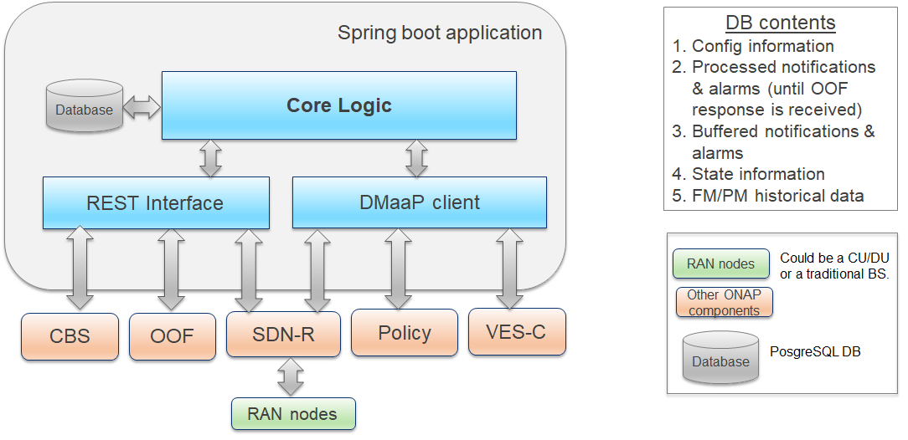

.. This work is licensed under a Creative Commons Attribution 4.0 International License.
   http://creativecommons.org/licenses/by/4.0
   
.. _docs_SON_Handler_MS:

Architecture
------------
The architecture below depicts the SON-Handler MS as a part of DCAE. Only the relevant interactions and components are shown.

The internal architecture of SON-Handler MS is shown below.

Description
~~~~~~~~~~~
The SON-Handler MS has a REST interface towards OOF as well as DMaaP interface towards Policy, VES-Collector and SDN-R. It has a database and core logic.

Core logic
~~~~~~~~~~
The core logic is implemented as 3 threads - main thread, child thread(s) for handling neighbor-list updates and collision/confusion alarms from the RAN (via SDN-R), and a separate child for handling handover measurements (PM) inputs from the RAN (via VES-Collector). The Main Thread is responsible for spawning and terminating the Child Threads. The core logic is responsible for:
(a) Performing all the pre-processing that is required before triggering OOF for PCI as well as PCI/ANR joint-optimization
(b) Autonomously taking actions for ANR updates
(c) Preparing the message contents required by SDN-R to re-configure the RAN nodes with PCI/ANR updates

The logic may not be 100% fool-proof (i.e., cover all possible scenarios and boundary-conditions as in real field deployments), as well as the most efficient one. An attempt has been made to balance the usefulness for a PoC versus the complexity of handling all possible scenarios. It is intended to provide a good base for the community/users to enhance it further as required.

The details of the state machines of all the threads in the core logic are available in https://wiki.onap.org/pages/viewpage.action?pageId=56131985.

In Frankfurt release, adaptive SON functionality was introduced for PCI optimization. While determining the optimum PCI values to resolve PCI collision and confusion, the optimizer also takes into consideration a set of cells whose PCI values may not be changed during the optimization. Such situations could arise, for example, when the PCI value of a cell could not be updated in the past (due to whatever reason), or configuration policy specifies that certain cells’ PCI values should never be changed. So, the SON-Handler MS keeps track of cells whose PCI values cannot be changed. When triggering OOF for PCI optimization, the SON-Handler MS also provides the list of cells whose PCI values cannot be changed.
 

Details of Frankfurt implementation are available in https://wiki.onap.org/display/DW/SON-Handler+MS+%28DCAE%29+Impacts.

Database
~~~~~~~~
This is a PostgreSQL DB, and is intended to persist information such as the following:

- PCI-Handler MS Config information (e.g., thresholds, timer values, OOF algorithm name, etc.)

- Pre-processing results and other related information (e.g., neighbor list)

- Buffered notifications (i.e., notifications not yet processed at all)

- State information

- Association between PNF-name and CellId

- Aggregated PM/FM data

- List of cells whose PCI values are fixed

- Etc.

DMaaP Client
~~~~~~~~~~~~
This is responsible for registering with the DMaaP client for the DMaaP notifications from SDN-R and VES-Collector, and to Policy.

Deployment aspects
------------------
The SON-Handler MS will be deployed on DCAE as an on-demand component. Details of the installation steps are available at ./installation.rst. Further details can be obtained from https://wiki.onap.org/pages/viewpage.action?pageId=76875778 

Known Issues and Resolutions
----------------------------
The scope and scenarios addressed are documented in the SON use case page  - https://wiki.onap.org/display/DW/OOF-PCI+Use+Case+-+Dublin+Release+-+ONAP+based+SON+for+PCI+and+ANR.
The enhancements and limitations in Frankfurt release are documented in the SON use case page for Frankfurt - https://wiki.onap.org/display/DW/OOF+%28SON%29+in+R5+El+Alto%2C+OOF+%28SON%29+in+R6+Frankfurt.
