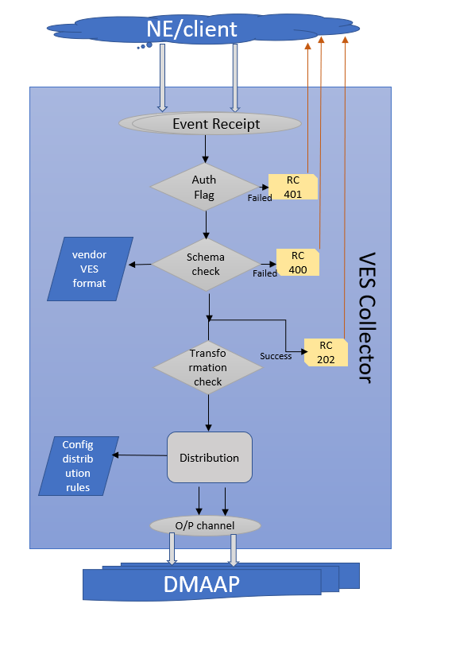

.. This work is licensed under a Creative Commons Attribution 4.0 International License.
.. http://creativecommons.org/licenses/by/4.0

VES Architecture
===================

.. image:: ./ves-deployarch.png

VES Processing Flow
===================

VES Schema Validation
=====================

VES Collector is configured to support below VES Version; the corresponding API uses VES schema definition for event validation.

===========     ================    ==================================
VES Version     API version         Schema Definition
===========     ================    ==================================
VES 1.2         eventListener/v1    CommonEventFormat_Vendors_v25.json   
VES 4.1         eventListener/v4    CommonEventFormat_27.2.json
VES 5.4         eventListener/v5    CommonEventFormat_28.4.1.json
VES 7.0         eventListener/v7    CommonEventFormat_30.0.1.json
===========     ================    ==================================

Schema definition files are contained within VES collector gerrit repo - https://git.onap.org/dcaegen2/collectors/ves/tree/etc

Features Supported
==================
- VES collector deployed as docker containers
- Acknowledged the sender with appropriate response code  (both successful and failure)
- Authentication of the events posted to collector
- Support single or batch JSON events input
- Schema validation (against standard VES definition)
- Multiple schema support and backward compatibility 
- Configurable event transformation
- Configurable suppression 
- Publish events into Dmaap Topic (with/without AAF)

The collector can receive events via standard HTTP port (8080) or secure port (8443).  Depending on the install/configuration – either one or both can be supported (ports are also modifiable).

Dynamic configuration fed into Collector via DCAEPlatform
=========================================================

- Outbound Dmaap/UEB topic 
- Schema version to be validated against
- Authentication account for VNF

POST requests result in standard HTTP status codes:

200-299  Success
400-499  Client request has a problem (data error)
500-599  Collector service has a problem
 

