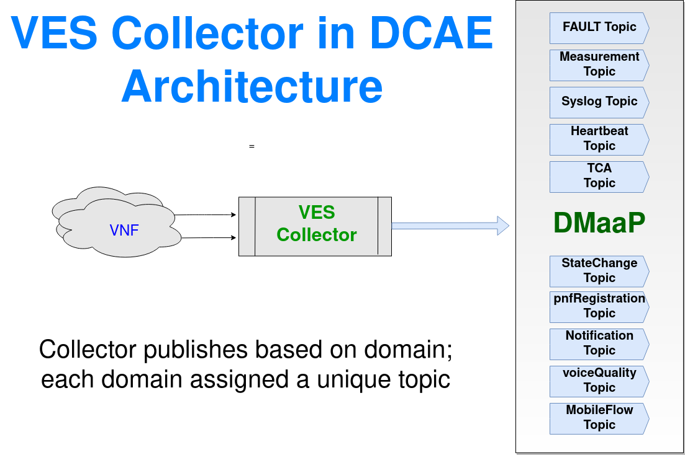
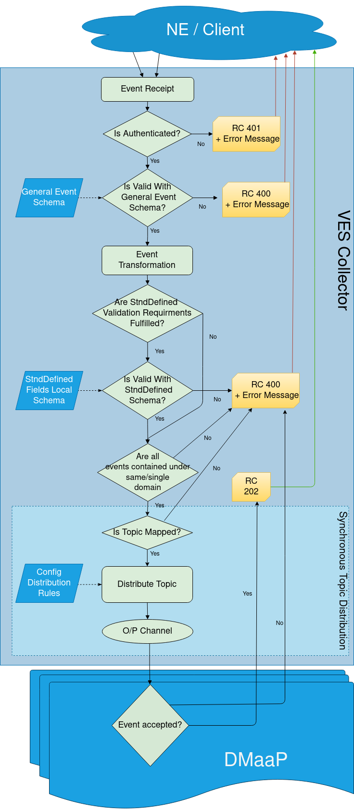

.. This work is licensed under a Creative Commons Attribution 4.0 International License.
.. http://creativecommons.org/licenses/by/4.0
.. _ves-architecture:

VES Architecture
================

VES Processing Flow
-------------------

1. Collector supports different URI based on single or batch event to be received.
2. Post authentication - events are validated against schema. At this point - appropriate return code is sent to client when validation fails.
3. Event Processor checks against transformation rules (if enabled) and handles VES output standardization (e.g. VES 7.x input to VES5.4 output).
4. Optional (activated by flag *collector.externalSchema.checkflag*) post authentication of stndDefined fields - specific fields are validated against schema. At this point - appropriate return code is sent to client when validation fails.
5. If no problems were detected during previous steps, success HTTP code is being returned.
6. Based on domain (or stndDefinedNamespace), events are asynchronously distributed to configurable topics.
    1. If topic mapping does not exist, event distribution is skipped.
    2. Post to outbound topic(s).
    3. If DMaaP publish is unsuccessful, messages will be queued per topic within VESCollector.

Note: As the collector is deployed as micro-service, all configuration parameters (including DMaaP topics) are passed to the collector dynamically. VEScollector refreshes the configuration from CBS every 5 minutes

..  This image has been created using online editor https://app.diagrams.net/ and can be easily edited there.
    Editable file version of this image is located in docs/sections/services/ves-http/ves-processing-flow.drawio
    and might be imported into editor.

VES Schema Validation
---------------------

VES Collector is configured to support below VES Version; the corresponding API uses VES schema definition for event validation.

===========     ================    ==================================
VES Version     API version         Schema Definition
===========     ================    ==================================
VES 1.2         eventListener/v1    `CommonEventFormat_Vendors_v25.json <https://git.onap.org/dcaegen2/collectors/ves/tree/etc/CommonEventFormat_Vendors_v25.json>`_
VES 4.1         eventListener/v4    `CommonEventFormat_27.2.json <https://git.onap.org/dcaegen2/collectors/ves/tree/etc/CommonEventFormat_27.2.json>`_
VES 5.4         eventListener/v5    `CommonEventFormat_28.4.1.json <https://git.onap.org/dcaegen2/collectors/ves/tree/etc/CommonEventFormat_28.4.1.json>`_
VES 7.2.1       eventListener/v7    `CommonEventFormat_30.2.1_ONAP.json <https://git.onap.org/dcaegen2/collectors/ves/tree/etc/CommonEventFormat_30.2.1_ONAP.json>`_
===========     ================    ==================================

Features Supported
------------------

- VES collector deployed as docker containers
- Acknowledgement to sender with appropriate response code  (both successful and failure)
- Authentication of the events posted to collector (support 2 types of authentication setting)
- Support single or batch JSON events input
- General schema validation (against standard VES definition)
- StndDefined fields schema validation
- Mapping of external schemas to local schema files during stndDefined validation
- Multiple schema support and backward compatibility
- Configurable event transformation
- Configurable suppression
- Publish events into Dmaap Topic (with/without AAF)

The collector can receive events via standard HTTP port (8080) or secure port (8443).  Depending on the install/configuration - either one or both can be supported (ports are also modifiable).

Dynamic configuration fed into Collector via DCAEPlatform
---------------------------------------------------------

- Outbound Dmaap/UEB topic
- Schema version to be validated against
- Authentication account for VNF

POST requests result in standard HTTP status codes:

- 200-299  Success
- 400-499  Client request has a problem (data error)
- 500-599  Collector service has a problem
