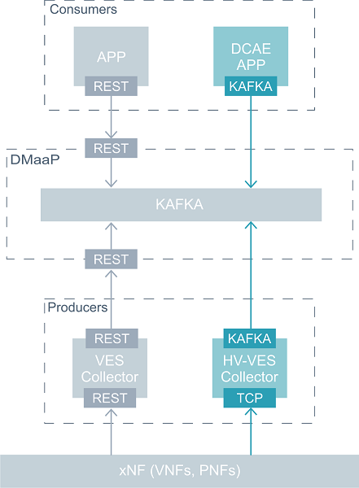

.. This work is licensed under a Creative Commons Attribution 4.0 International License.
.. http://creativecommons.org/licenses/by/4.0

.. _hv-ves-architecture:

High-level architecture of HV-VES
=================================

HV-VES Collector is a part of DCAEGEN2. Its goal is to collect data from xNF (PNF/VNF) and publish it on a given Kafka topic.
High Volume Collector is deployed with DCAEGEN2 via OOM Helm charts and Cloudify blueprints.

Input messages come from TCP interface and Wire Transfer Protocol. Each frame includes Google Protocol Buffers (GPB) encoded payload.
Based on information provided in CommonEventHeader, domain messages are validated and published to specific Kafka topic.

Messages published on the given Kafka topic will be consumed by DCAE analytics application or other ONAP component that require these message.
DMaaP serves direct access to Kafka allowing other analytics applications to utilize its data.
