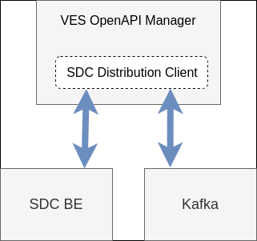

.. This work is licensed under a Creative Commons Attribution 4.0 International License.
.. http://creativecommons.org/licenses/by/4.0

.. _ves-openapi-manager-architecture:

VES OpenAPI Manager architecture
================================
Functionalities of VES OpenAPI Manager require communication with other ONAP components. Because of that, SDC
Distribution Client has been used as a library to achieve such a communication. There are two components required by
application to work: SDC BE and Kafka. SDC Distribution Client provides communication with both of them when
it's properly configured (for application configuration instruction refer to: :ref:`ves-openapi-manager-deployment` ).

.. _ves-openapi-manager-flow:

VES OpenAPI Manager workflow
----------------------------
VES OpenAPI Manager workflow can be split into phases:

1) Listening for Service Model distribution events
2) Optional downloading of artifacts depending on Service Model contents. At least one Service Model resource must contain *VES_EVENT* type artifacts.
3) Optional validation of artifacts depending on content of downloaded artifacts. Artifact must contain stndDefined events declaration.

VES OpenAPI Manager workflow is presented on the diagram below.

