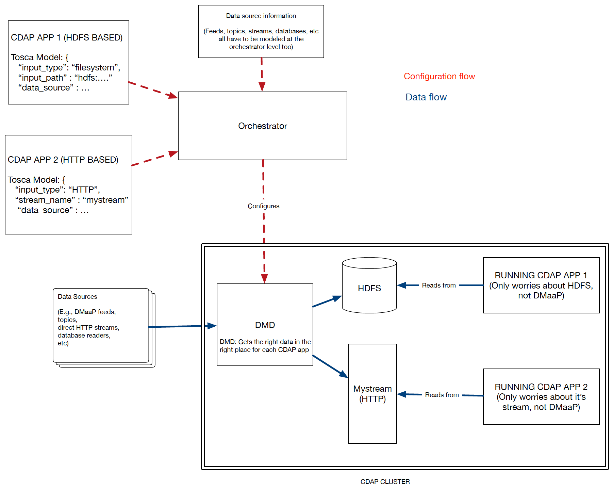
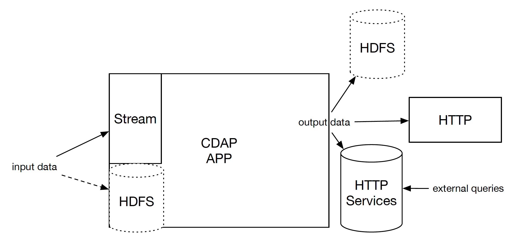

# CDAP Component Requirements/Information

This page contains information about CDAP app development in DCAE. 

## Uploading your Jar File
The DCAE component specification has you input your `jar_url`, the URL on Nexus to your Jar file. This DCAE controller deploys out of Nexus. 
You can upload your jar(s) using the following command, replacing NAME:
```
curl -v --user 'dcae-dev:dev123' http://nexus01.research.att.com:8081/repository/dcae-dev-raw/jar_files/NAME.jar --upload-file NAME.jar
```
During the CLI Tool Usage, in your spec, supply `http://nexus01.research.att.com:8081/repository/dcae-dev-raw/jar_files/NAME.jar` as the JAR artifact URL. 

## Policy Reconfiguration
We support reconfiguration of both AppConfig and AppPreferences.

For AppConfig, we support CDAPs "update" API to [reconfigure an application](http://docs.cask.co/cdap/current/en/reference-manual/http-restful-api/lifecycle.html\#update-an-application}}).

For AppPreferences, we:

1. Stop your programs

2. Set the new preferences

3. Start your programs

At the time of writing, there is no way to update a CDAP application's AppConfig or AppPreferences, without a restart,  *and notify* the application. The latter is a future promised feature by CASK---the ability to update preferences and inform the application that something is changed (so it repulls). 
As CDAP currently stands however, given the above, if you are building a stateful application, you must persist your state often (e.g., to a CDAP dataset), as you may be restarted at any time with an updated configuration, or stopped&started at any time with updated preferences. 

## Metrics
Metrics are pulled from your CDAP application on a periodic basis and (in the future: pushed to a central DCAE metric store, currently: just dropped). 
For this to be useful, your application should provide [metrics](http://docs.cask.co/cdap/current/en/admin-manual/operations/metrics.html).
While nothing in the DCAE runtime enforces that your CDAP application tracks metrics, your metrics (or lack thereof) will be visible in the DCAE dashboard and to operations. 

## Future DMaaP abstraction
Shown below is our _vision_ for how DMaaP is abstracted from component developers:



Today, this is a vision; it is not in place. 
Today, each CDAP app is built with built in assumptions about where they are getting their data from. 
Some CDAP apps have the built in assumption of a UEB feed. Some MR. Some DR. 
This becomes very difficult to orchestrate when each app in the catalog has built in data assumptions.

The goal of this vision is to _decouple_ the data plane from the analytics plane.
Analytics should be agnostic to _how_ they are receiving their data beyond "filesystem" or "HTTP". 
Analytics developers shouldn't have to worry about the data plane, that should be taken care of by the platform. 
They should  be spending their time on the problem at hand---the analytic. 

This also allows each CDAP application to have a standard set of interfaces: HTTP and HDFS:



